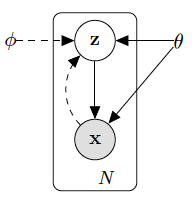

# Notes on Auto-Encoding Variational Bayes

- Graphical model under consideration

The solid lines in the above figure correspond to the generative model $p_{\theta}(z) p_{\theta}(x \vert z)$. The dashed lines correspond to the variational approximation $q_{\phi}(z \vert x)$ of the posterior $p_{\theta}(z \vert x)$, which is intractable. 

### Problem Scenario

Assume that the data generating process involves the sampling of a latent random variable prior $\mathbf{z} \sim p_{\theta^*}(\mathbf{z})$ and the data $\mathbf{x}$ is then generated via $p_{\theta^{*}}(\mathbf{x} \vert \mathbf{z})$. The true parameters $\theta^*$ and latent variables $\mathbf{z}$ are unknown. 

There are several problems to prior approaches:

1. *Intractability*: Cannot compute $p_{\theta}(\mathbf{x}) = \int p_{\theta}(\mathbf{z})p_{\theta}(\mathbf{x} \vert \mathbf{z}) d\mathbf{z}$ for normalization and computation of posterior $p_{\theta}(\mathbf{z} \vert \mathbf{x}) = p_{\theta}(\mathbf{x} \vert \mathbf{z}) / p_{\theta}(\mathbf{x})$. 
2. *Large Datasets*: How to update parameters $\theta$ quickly?

The paper proposes solutions to the following problems:

1. *Efficient Approximate Parameter Estimation*: Efficiently compute $\theta$
2. *Efficient Approximate Posterior Inference*: Compute $\mathbf{z}$ given $\mathbf{x}$ and $\theta$
3. *Efficient Approximate Margin Inference* 

The recognition model $q_{\phi}(\mathbf{z} \vert \mathbf{x})$ approximates $p_{\theta}(\mathbf{z} \vert \mathbf{x})$ and is called the *encoder* since given $\mathbf{x}$ produces a distribution of possible $\mathbf{z}$ that could have generated $\mathbf{x}$. The decoder $p_{\theta}(\mathbf{x} \vert \mathbf{z})$ produces a distribution of possible $\mathbf{x}$ given a latent variable $\mathbf{z}$. 

### The Varational Bound

$$
D_{KL} \left ( q_{\phi}(z \vert x^{(i)}) \Vert p_{\theta} (z \vert x^{(i)}) \right ) = \mathbb{E}_{q_{\phi}(z \vert x)} \left [ \log q_{\phi} (z \vert x^{(i)}) - \log p_{\theta} (z \vert x^{(i)}) \right ] = \\
\mathbb{E}_{q_{\phi}(z \vert x)} \left [ \log q_{\phi} (z \vert x^{(i)}) - \left ( \log p_{\theta} (x^{(i)}, z) - \log p_{\theta}(x^{(i)}) \right ) \right ] = \\
\mathbb{E}_{q_{\phi}(z \vert x)} \left [ \log q_{\phi} (z \vert x^{(i)}) - \log p_{\theta} (x^{(i)}, z) \right ] + \log p_{\theta}(x^{(i)}) \Rightarrow \\
\log p_{\theta}(x^{(i)}) = D_{KL} \left ( q_{\phi}(z \vert x^{(i)}) \Vert p_{\theta} (z \vert x^{(i)}) \right )  + \mathbb{E}_{q_{\phi}(z \vert x)} \left [ -\log q_{\phi} (z \vert x^{(i)}) + \log p_{\theta} (x^{(i)}, z) \right ] = \\
\log p_{\theta}(x^{(i)}) = D_{KL} \left ( q_{\phi}(z \vert x^{(i)}) \Vert p_{\theta} (z \vert x^{(i)}) \right ) + \mathcal{L} \left ( \theta, \phi ; x^{(i)} \right)
$$

where $\mathcal{L} \left ( \theta, \phi ; x^{(i)} \right) = \mathbb{E}_{q_{\phi}(z \vert x)} \left [ -\log q_{\phi} (z \vert x^{(i)}) + \log p_{\theta} (x^{(i)}, z) \right ]$ is called the variationaly lower bound. Since the KL divergence is non-negative, this implies $\log p_{\theta}(x^{(i)}) \geq \mathcal{L} \left ( \theta, \phi ; x^{(i)} \right)$. The lower bound can be re-written as
$$
\mathcal{L} \left ( \theta, \phi ; x^{(i)} \right) = \mathbb{E}_{q_{\phi}(z \vert x)} \left [ -\log q_{\phi} (z \vert x^{(i)}) + \log p_{\theta} (x^{(i)}, z) \right ] = \\
-\mathbb{E}_{q_{\phi}(z \vert x)} \left [\log q_{\phi} (z \vert x^{(i)}) - \log p_{\theta}(z) + \log p_{\theta}(z)- \log p_{\theta} (x^{(i)}, z) \right ] = \\
-\mathbb{E}_{q_{\phi}(z \vert x)} \left [\log q_{\phi} (z \vert x^{(i)}) - \log p_{\theta}(z) + \log p_{\theta}(z)- \log p_{\theta} (x^{(i)}, z) \right ] = \\
-\mathbb{E}_{q_{\phi}(z \vert x)} \left [\log q_{\phi} (z \vert x^{(i)}) - \log p_{\theta}(z) \right ] + \mathbb{E}_{q_{\phi}(z \vert x)} \left [ \log p_{\theta} (x^{(i)}, z) - \log p_{\theta}(z) \right ] = \\
-D_{KL} \left ( q_{\phi}(z \vert x^{(i)}) \Vert p_{\theta}(z)) \right ) + \mathbb{E}_{q_{\phi}(z \vert x)} \left [ \log p_{\theta} (x^{(i)} \vert z) \right ]
$$

