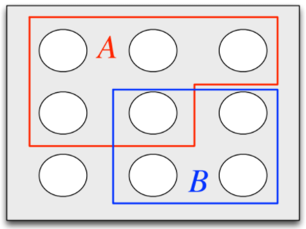
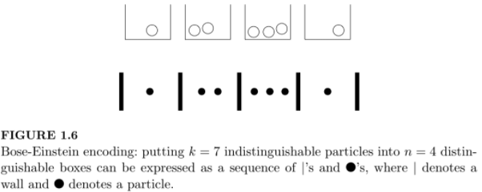

# Introduction to Probability 2nd Edition by Blitzstein and Hwang

## Chapter 1: Probability and Counting

### Sample Spaces

* **Definition**: The *sample space* $\mathcal{S}$ of an experiment is the set of all possible outcomes of the experiment
* **Definition**: An *event* is a subset of the sample space $\mathcal{S}$
* The sample space can be finite, countably infinite, or uncountably infinite
* *De Morgan's Laws*:
  * $(A \cup B)^{c} = A^{c} \cap B^{c}$
    * Saying that it is *not* the case that at least one of $A$ and $B$ occur is the same as saying that $A$ does not occur and $B$ does not occur.
  * $(A \cap B)^{c} = A^{c} \cup B^{c}$
    * Saying that it is *not* the case that both occur is the same as saying that at least one does not occur.
* **Example**: Coin flipping Let $A_{1} = {(1,s_{2}, \ldots, s_{10}):s_{j} \in \{0,1\} \text{ for } 2 \leq j \leq 10}$ be the event that the first coin flip is heads. Likewise, let $A_{j}$ be the event that the $j^{th}$ flip is heads for $j = 2,3,\ldots,10$.
  * Let $B$ be the event that at least one flip was heads: $B = \cup_{j=1}^{10} A_{j}$ 
  * Let $C$ be the event that all flips were heads: $C = \cap_{j=1}^{10}A_{j}$
  * Let $D$ be the event that there were at least two consecutive heads: $D = \cup_{j=1}^{9} (A_{j} \cap A_{j+1})$

### Naive Definition of Probability

* **Definition** (Naive definition of probability): Let $A$ be the event for an experiment with a finite sample space $S$. The *naive probability* of $A$ is
  $$
  P_{naive}(A) = \frac{\vert A \vert}{\vert S \vert} = \frac{\textrm{number of outcomes favorable to }A}{\textrm{total number of outcomes in }S}
  $$

* Note:
  $$
  P_{naive}(A^{c}) = \frac{\vert A^{c} \vert}{\vert S \vert} = \frac{\vert S \vert - \vert A \vert}{\vert S \vert} = 1 - \frac{\vert A \vert}{\vert S \vert} = 1 - P_{naive}(A)
  $$

* *Strategy*: Is it easier to find the probability of an event or of the probability of the complement of the event?

* **Restrictions**: The naive definition of probability assumes:

  * $\vert S \vert$ is finite
  * Each outcome has the same probability

* Naive probability is applicable:

  * symmetry, e.g. symmetry of a coin, cards in a deck
  * by design, e.g. surveys
  * null model

### How to Count

Calculating naive probabilities requires computing $\vert A \vert$ and $\vert S \vert$. 

#### Multiplication Rule

* Theorem (Multiplication rule): Consider a compound experiment consisting of two sub-experiments, Experiment A and Experiment B. Suppose that A has $a$ possible outcomes and for each of those outcomes Experiment B has $b$ possible outcomes. Then the compound experiment has $ab$ outcomes. 
  * View as a tree: $a$ possible options, each with $b$ follow-up options leading to $b+\cdots+b = ab$ options
  * Often easier to think of experiments as being chronological, but there is not requirement that A be performed before B. 

* Order of flavor and cone doesn't matter
* Doesn't matter if same flavors are available on each cone
  * Just need same number of options
* **Question**: What if want two ice cream cones, but order doesn't matter, i.e. (cakeC, waffleV) is the same as (waffleV, cakeC)?
  * **NOT** $\frac{6\cdot6}{2}=18$ because of examples like (cakeC, cakeC)
  * There are $6\cdot5$ pairs of the form $(x,y)$ where $x \neq y$, so $\frac{6 \cdot 5}{2} = 15$ pairs not considering ordering
  * There are 6 pairs of the form $(x,x)$ for each cone/flavor pair
  * Thus there are a total of $15 + 6 = 21$ optoins
* **Example**: A set with n elements has $2^{n}$ subsets since for each element, you can choose whether to include it or not.
* **Theorem** (Samplng with Replacement): Consider n objects and making k choices from them, one at a time with *replacement* (i.e. choosing a certain object does not preclude it from being chosen again). Then there are $n^{k}$ possible outcomes (where order matters, i.e. choosing object x and then object y is counted as different than choosing object y and then object x)
* **Theorem** (Sampling without Replacement): Consider n objects and making k choices from them, one at a time without replacement (i.e. choosing a certain object precludes it from being chosen again). Then there are $n(n-1)\cdots(n-k+1)$ possible outcomes from $1 \leq k \leq n$, and 0 possibilities if $k > n$ (where order matters). By convention, $n(n-1)\cdots(n-k+1) = n$ for k = 1.
  * Follows from multiplication rule: each sub-experiment has 1 few option.
  * Need $k \leq n$, where as in sampling with replacement, the objects are inexhaustible. 
* **Permutations**: The number of permutations of $n$ objects follows from sampling without replacement: $n!$ 

The sampling theorems are about counting, but when the naive definition of probability applies, we can use them to compute probabilities. 

* **Example** (Birthday Paradox): If there are $k$ people, what's the probability that at least two people share a birthday? 
  * There are $365^k$ ways to assign birthdays
  * Compute the probability that no one shares a birthday - much easier than considering all possibilities of sharing a birthday
    * Assign birthdays to $k$ people such that no one shares a birthday: sampling without replacement
    * $365 \cdot 364 \cdots (365-k+1)$ for $k \leq 365$ 
    * $P(\textrm{no birthday match}) = \frac{365 \cdot 364 \cdots (365 - k + 1)}{365^k}$ 
  * $P(\textrm{at least 1 birthday match}) = 1 - P(\textrm{no birthday match}) = 1 - \frac{365 \cdots (365 - k + 1)}{365^k}$
  * When $k = 366$, guaranteed to have a match
  * Note: the number of pairs, each of which is equally likely to share a birthday, grows as $k \choose 2$ 

* **WARNING**: It is important to think of each object in a population as having a unique identity when sampling, even if the objects are indistinguishable. 
  * Leibniz's Mistake: What is more likely, rolling two dice that sum to 11 or 12? 
    * 11 is more likely since you can get it via (5,6) or (6,5) where as 12 requires (6,6)
    * Leibniz argued they are equally probable since 11 and 12 can only be attained in 1 way
      * Leibniz viewed (5,6) as the same as (6,5), i.e. thought the dice were indistinguishable 
      * Should have labeled the die!

#### Adjusting for Overcounting

* Difficult to count each possibility once and only once

* Count each possibility $c$ times and then divide by $c$

  * **Adjusting for overcounting**

* **Example**: Consider 4 people. 

  * How many ways are there to choose a two person committee? 
    * $4 \cdot 3$, but this double counts since order does not matter, so $4 \cdot 3 / 2 = 6$ 
  * How many ways to break the people into two teams of two?
    * Specify person 1's teammate completely specifies both teams: 3 ways to do this
    * See solution to previous problem and realize it double counts since order of teams does not matter: $6 / 2 = 3$ 

* **Binomial Coefficient**: For any nonnegative integers $k$ and $n$, the *binomial coefficient* $n \choose k$ is the number of subsets of size $k$ for a set of size $n$. 

  * Sets are unordered, so considering without replacement and without distinguishing between different orders.

* **Theorem** (Binomial Coefficient Formula): For $k \leq n$
  $$
  {n \choose k} = \frac{n(n-1) \cdots (n-k+1)}{k!} = \frac{n!}{(n-k)!k!}
  $$
  For $k > n, {n \choose k} = 0$

  * **Proof**: Let $A$ be a set with $\vert A \vert = n$. Any subset of $A$ has at most n elements, so ${ n \choose k} = 0$ for $k > n$. Now let $k \leq n$. By sampling without replacement, there are $n (n-1) \cdots (n -k + 1)$ ways to make an ordered selection of $k$ elements without replacement. This overcoats each subset by a factor of $k!$ since order does not matter. Thus, divide by $k!$. 

* **Warning**: Do not compute binomial coefficient using factorials (numbers get huge quickly)! Use the cancellation formula. 

* **Example**: How many ways are there to permute the letters in 'LALALAAA'? 

  * Determine where the 5 A's go, or equivalently the 3 L's
  * ${8 \choose 5} = {8 \choose 3} = \frac{8 \cdot 7 \cdot 6}{3!} = 56$

* **Example**: How many ways are there to permute the letters in 'STATISTICS'?

  * Could choose where to the the S's, then the T's, etc. 
  * Note there are $10!$ ways to reorder the letters, but this overcounts since we can't differentiate the same letters (i.e multiple S's), so divide this by $3!3!2!$ to account for the 3 S's, 3 T's and 2 I's. 
  * ${10 \choose 3} {7 \choose 3} {4 \choose 2} {2 \choose 1} = \frac{10!}{3!3!2!} = 50400$

* **Example**: Binomial Theorem:
  $$
  (x+y)^{n} = \sum_{k=0}^{n} {n \choose k} x^{k} y^{n-k}
  $$

  * $(x+y)^{n} = (x+y) \cdot (x+y) \cdots (x+y)$ n times. The terms of $(x+y)^{n}$ are determined by picking either $x$ or $y$ but not both. How many ways are there to choose x k times from the (x+y) terms? $n \choose k$
  
* **Example**: Full house in poker.

  A 5-card hand is dealt from a well-shuffled 52-card deck. What is the probability of a full house?

  * All ${52 \choose 5}$ hands are equally likely by symmetry, so naive definition is applicable. 

  * Use multiplication rule: 

    * 13 choices of rank for "three of"
      * ${4 \choose 3}$ ways to selecting that rank
    * 12 choices of rank for "two of"
      * ${4 \choose 2}$ ways of selecting that rank

  * $$
    P(\textrm{full house}) = \frac{13 {4 \choose 3} 12 {4 \choose 2}}{{52 \choose 5}} = \frac{3744}{2598960} \approx 0.00144
    $$

* **Example**: Newton-Pepys Problem

  Which of the following events has the highest probability?

  1. At least one 6 appears when 6 fair dice are rolled?
  2. At least two 6's appear when 12 fair dice are rolled?
  3. At least three 6's appear when 18 fair dice are rolled?

  *Solution*

  * The three experiments have $6^6$, $6^{12}$, and $6^{18}$ outcomes respectively, and by symmetry the naive definition applies to all of them.
  * For 1st experiment, easier to compute the number of ways to get no 6s. 
    * $P(\textrm{experiment 1}) = 1 - \frac{5^6}{6^6} \approx 0.67$
  * For the second experiment, again want to compute the complement. 
    * There are $5^{12}$ ways to get no 6's in 12 rolls
    * There are ${12 \choose 1} 5^{11}$ ways to get exactly 1 6 in 12 rolls
    * $P(\textrm{experiment 2}) = 1 - \frac{5^{12} + {12 \choose 1}5^{11}}{6^{12}} \approx 0.62$
  * For the third experiment, also compute the complement: number of ways to get zero, one or two 6's in 18 rolls.
    * $5^{18}$ ways to get no 6's
    * ${18 \choose 1} 5^{17}$ ways to get 1 6
    * ${18 \choose 2} 5^{16}$ ways to get 2 6's
    * $P(\textrm{experiment 3}) = 1 - \frac{5^{18} + {18 \choose 1}5^{17} + {18 \choose 2} 5^{16}}{6^{18}} \approx 0.60$
  * Thus experiment 1 has the highest probability

* **Example**: Bose-Einstein

  How many ways are there to choose k items from a set of n objects with replacement if order doesn't matter, i.e. only care about the number of times each object was chosen, not the order in which they were chosen?

  *Solution*:

  When order matters, the answer is $n^k$ by the multiplication rule. But we care about order, so we will solve an *isomorphic* problem (the same problem in a different guise). Find the number of ways to put k indistinguishable objects into n distinguishable bins, i.e. all that matters is the counts of particles in each bin. This can be encoded as a sequences of walls and balls.  

  

  To be a valid sequence, it must start and end with a wall, and have exactly $n-1$ walls and exactly k balls in between the starting and ending wall. Conversely, any such sequence is a valid encoding for some configuration of particles in bins. Thus,

  * There are $n+k-1$ holes to fill in (possible spaces for the k balls and $n-1$ walls)
  * Only need to specify the k balls (walls going in the remaining spaces)
  * Number of possibilities: ${n+k-1 \choose k}$
    * This is the *stars and bars* argument
  * Another isomorphic problem is to determine the number of solutions $(x_{1}, x_{2}, \ldots, x_{n})$ to the equation $x_{1} + x_{2} + \cdots + x_{n} = k$ where $x_{i}$ are nonnegative integers. 
  
* **WARNING!**: The Bose-Einstein result should *not* be used in the naive definition of probability except in special circumstances. 

  * Example: A number of *ordered* samples of k people out of n with replacement is $n^k$. The ${n+k-1 \choose k}$ unordered samples are not equally likely. 
  * Example: With $n=365$ and $k$ people, how many unordered birthday lists are there? 
    * E.g. let $k=3$, then there are not $\frac{n^{k}}{3!}$ unordered lists, because some lists might have duplicates. It is also not ${n+k-1 \choose k}$ since the unordered lists are not equally likely. 

### Story Proof

A *story proof* is a proof by interpretation. 

* For counting problems this often means counting the same thing in two different ways

* **Example**: Choosing the complement

  For any nonnegative integers $n$ and $k$ with $k \leq n$, we hav
  $$
  {n \choose k} = {n \choose n-k}
  $$
  **Story Proof**:

  Consider choosing a committee of size k in a group of n people. We know there are ${n \choose k}$ possibilities. But another way to choose the committee is to specify which $n-k$ people are *not* on the committee; specifying who is on the committee determines who is *not* on the committee and vice verse. So the two sides are equal, as they are two ways of counting the same thing. $\square$

* **Example**: The team captain

  For any positive integers $n$ and $k$ with $k \leq n$ 
  $$
  n {n-1 \choose k-1} = k {n \choose k}
  $$
  **Story Proof**:

  Consider a group of $n$ people, from which a team of $k$ will be chosen, one of whom will be the team captain. To specify a possibility, we could first choose the team captain and then the remaining $k-1$ team members; this gives the LHS. Equivalently, we could first choose the k team members and then choose one of them to be captain; this is the RHS. $\square$ 

* **Example**: Vandermonde's Identity
  $$
  {m+n \choose k} = \sum_{j=0}^{k} {m \choose j} {n \choose k - j}
  $$
  **Story Proof**:

  Consider a student organization consisting of m juniors and n seniors, from which a committee of size k will be chosen. There are ${m+n \choose k}$ possibilities. If there are $j$ juniors in the committee, then there must be $k-j$ seniors in the committee. The RHS sums up the cases for $j$. $\square$ 

* **Example**: Partnerships
  $$
  \frac{(2n)!}{2^n \cdot n!} = (2n-1)(2n-3) \cdots 3 \cdot 1
  $$

* **Story Proof**: 

  Want to show that both sides count the number of ways to break $2n$ people into $n$ partnerships. Take $2n$ people and give them ID numbers from $1$ to $2n$. We can form a partnership by lining people up in some order and then saying the first two are a pair, the next two are a pair, etc. This overcounts by a factor of $n! \cdot 2^n$ since the order of the pairs doesn't matter, nor does the order within each pair. Alternatively, count the number of possibilities by noting that there are $2n-1$ choice for the partner of person 1, then $2n-3$ choices for person 2 (or person 3 if person 2 was paired with person 1) and so on. $\square$ 

### Non-naive definition of probability

Naive definition can't handle the case where outcomes aren't equal nor the case of an infinite sample space. 

**Definition**: General definition of probability

A *probability space* consists of a sample space $S$ and a *probability function* $P$ which takes an event $A \subseteq S$ as input and returns $P(A)$, a real number between $0$ and $1$, as output. The function must satisfy the following axioms:

1. $P(\empty) = 0$, $P(S) = 1$

2. If $A_{1}, A_{2}, \ldots$ are disjoint events ($A_{i} \cap A_{j} = \empty \textrm{ for } i \neq j$), then
   $$
   P \left ( \bigcup_{j=1}^{\infty} A_{j} \right ) = \sum_{j=1}^{\infty} P(A_{j})
   $$

Note these axioms tell us what is a valid probability function, but does not say how to interpret probability.

* The *frequentist* view is that probability represents the long-run frequency over a large number of repetitions of an experiment. 
  * E.g. the probability of a coin being heads

* The *Bayesian* view of probability is that it represents a degree of belief about an event in question

  * Can assign probabilities to hypotheses such as "candidate A will win the election" even if it is not possible to repeat the experiment. 

* **Theorem**: Properties of probability

  For any two events $A$ and $B$

  1. $P(A^c) = 1 - P(A)$
  2. If $A \subseteq B$, then $P(A) \leq P(B)$
  3. $P(A \cup B) = P(A) + P(B) - P(A \cap B)$

  **Proof**: 

  1. Since $A$ and $A^c$ are disjoint and their union is $S$, the second axiom gives

     $P(S) = P(A \cup A^c) = P(A) + P(A^c)$

     But $P(S) = 1$ by the first axiom, so $P(A) + P(A^c) = 1$

  2. If $A \subseteq B$, then $B$ can be written as the union of $A$ and $B \cap A^c$. $A$ and $B \cap A^c$ are disjoint, we can apply the second axiom: $P(B) = P(A \cup (B \cap A^c)) = P(A) + P(B \cap A^c)$. Probability is nonnegative, so $P(B \cap A^c) \geq 0$, so $P(B) \geq P(A)$. 

  3. We can rewrite $A \cup B$ as $A \cup (B \cap A^c)$ which are disjoint events. Then by the second axiom
     $$
     P(A \cup B) = P(A \cup (B \cap A^c)) = P(A) + P(B \cap A^c)
     $$
     So it suffices to show that $P(B \cap A^c) = P(B) - P(A \cap B)$. Since $A \cap B$ and $B \cap A^c$ are disjoint and their union is $B$, another application of the second axiom gives
     $$
     P(A \cap B) + P(B \cap A^c) = P(B).
     $$
     So $P(B \cap A^c) = P(B) - P(A \cap B)$, as desired. $\blacksquare$

* **Theorem**: Inclusion-exclusion

  For any events $A_{1}, \ldots, A_{n}$ 
  $$
  P \left ( \bigcup_{i=1}^n A_{i} \right ) = \sum_{i} P(A_{i}) - \sum_{i < j} P(A_{i} \cap A_{j}) + \sum_{i < j < k} P(A_{i} \cap A_{j} \cap A_{k}) - \ldots + (-1)^{n+1} P(A_{1} \cap \cdots \cap A_{n})
  $$
  **Proof**

  Can do proof by induction, but a shorter proof presented in Chapter 4. 

* **Example**: de Montmort's matching problem

  You have a well-shuffled deck of $n$ cards labeled 1 through $n$. You win if any card has the same label as the position in the deck, e.g. if the 7th card is in position 7.

  *Solution*:

  Let $A_{i}$ be the event that the $i$th card in the deck has the number $i$ on it. Then we are interested in the probability of $A_{1} \cup \cdots \cup A_{n}$. We will use the inclusion-exclusion principle. First, $P(A_{i}) = \frac{1}{n}$ by symmetry; card $i$ is equally likely to be in any position. Second, 
  $$
  P(A_{i} \cap A_{j}) = \frac{(n-2)!}{n!} = \frac{1}{n(n-1)}
  $$
  for $i \neq j$ since we need cards $i$ and $j$ to be in positions $i$ and $j$ and allow the remaining $n-2$ cards to be in any order. Similarly,
  $$
  P(A_{i} \cap A_{j} \cap A_{k}) = \frac{1}{n(n-1)(n-2)}
  $$
  and the pattern continues. Now note there are $n$ terms involving one event, ${n \choose 2}$ terms involving 2 events, ${n \choose 3}$ terms involving 3 events, etc. By symmetry, all of the previous probabilities are equal, so
  $$
  \begin{aligned}
  P \left ( \bigcup_{i=1}^{n} A_{i} \right) &= \frac{n}{n} - \frac{{n \choose 2}}{n(n-1)} + \frac{{n \choose 3}}{n(n-1)(n-2)} - \cdots +  (-1)^{n+1} \cdot \frac{1}{n!} \\
  &= 1 - \frac{1}{2!} + \frac{1}{3!} - \cdots + (-1)^{n+1} \cdot \frac{1}{n!}
  \end{aligned}
  $$
  Recall the Taylor series for $1/e$
  $$
  e^{-1} = 1 - \frac{1}{1!} + \frac{1}{2!} - \frac{1}{3!} + \cdots
  $$
  Thus for large $n$, the probability of winning is close to $1 - 1/e \approx 0.63$. Note it is interesting that the probability does not converge to 0 or 1. The probability increases of their being a match since there are more card, but each match is less likely, and they offset to give a probability close to $1 - 1/e$. $\square$

### Recap

 