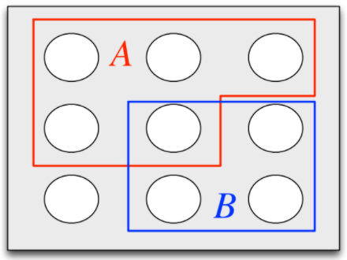

# Notes on Probability

## Change Log

* 9/30/20: First commit. Started chapter 1 of *Introduction to Probability 2nd Edition*. Worked through and including Section 1.2.

## Introduction to Probability 2nd Edition by Blitzstein and Hwang

### Chapter 1: Probability and Counting

#### Sample Spaces

* **Definition**: The *sample space* $\mathcal{S}$ of an experiment is the set of all possible outcomes of the experiment
* **Definition**: An *event* is a subset of the sample space $\mathcal{S}$
* The sample space can be finite, countably infinite, or uncountably infinite
* *De Morgan's Laws*:
  * $(A \cup B)^{c} = A^{c} \cap B^{c}$
    * Saying that it is *not* the case that at least one of $A$ and $B$ occur is the same as saying that $A$ does not occur and $B$ does not occur.
  * $(A \cap B)^{c} = A^{c} \cup B^{c}$
    * Saying that it is *not* the case that both occur is the same as saying that at least one does not occur.
* **Example**: Coin flipping Let $A_{1} = {(1,s_{2}, \ldots, s_{10}):s_{j} \in \{0,1\} \text{ for } 2 \leq j \leq 10}$ be the event that the first coin flip is heads. Likewise, let $A_{j}$ be the event that the $j^{th}$ flip is heads for $j = 2,3,\ldots,10$.
  * Let $B$ be the event that at least one flip was heads: $B = \cup_{j=1}^{10} A_{j}$ 
  * Let $C$ be the event that all flips were heads: $C = \cap_{j=1}^{10}A_{j}$
  * Let $D$ be the event that there were at least two consecutive heads: $D = \cup_{j=1}^{9} (A_{j} \cap A_{j+1})$

#### Naive Definition of Probability

* **Definition** (Naive definition of probability): Let $A$ be the event for an experiment with a finite sample space $S$. The *naive probability* of $A$ is
  $$
  P_{naive}(A) = \frac{\vert A \vert}{\vert S \vert} = \frac{\textrm{number of outcomes favorable to }A}{\textrm{total number of outcomes in }S}
  $$

* Note:
  $$
  P_{naive}(A^{c}) = \frac{\vert A^{c} \vert}{\vert S \vert} = \frac{\vert S \vert - \vert A \vert}{\vert S \vert} = 1 - \frac{\vert A \vert}{\vert S \vert} = 1 - P_{naive}(A)
  $$

* *Strategy*: Is it easier to find the probability of an event or of the probability of the complement of the event?

* **Restrictions**: The naive definition of probability assumes:

  * $\vert S \vert$ is finite
  * Each outcome has the same probability

* Naive probability is applicable:

  * symmetry, e.g. symmetry of a coin, cards in a deck
  * by design, e.g. surveys
  * null model

#### How to Count

Calculating naive probabilities requires computing $\vert A \vert$ and $\vert S \vert$. 

* Theorem (Multiplication rule): 