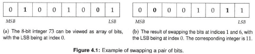

# Notes on Programming

## Change Log

* 9/30/20: Started Chapter 2 up to page 38.
* 10/1/20: Started chapter 2 of Haskell from First Principles. Fisished upto and including section 2.4

## Python

### Fluent Python

#### Chapter 1: The Python Data Model

#### Chapter 2: An Array of Sequences

* Container sequences: hold references to the objects they contain
  * list
  * tuple
  * collections.deque
* Flat sequences: physically store the value of each item within its own memory space
  * str
  * bytes
  * bytearray
  * memoryview
  * array.array
* Mutable sequences
  * list
  * bytearray
  * array.array
  * collections.deque
  * memoryview
* Immutable sequences
  * tuple
  * str
  * bytes

##### List Comprehensions and Generator Expressions

* List comprehensions do one thing: build a new list

* If list comprehension is multiple lines, consider using a regular for loop

* line breaks are ignored inside paired [], {} or ()

* local variables in a list comprehension do not mask variables from surrounding scope in python3

* List comprehensions build lists from sequences or any other iterable type by filtering and transforming items

  * replace map and filter

* Cartesian product example:

  * ```python
    colors = ['black', 'white']
    sizes = ['S', 'M', 'L']
    tshirts = [(color, size) for color in colors
              							 for size in sizes]
    
    #output
    [('black', 'S'), ('black', 'M'), ('black', 'L'), ('white', 'S'),
    ('white', 'M'), ('white', 'L')]
    ```

* List comprehensions can only generate new lists

* Generator expressions use same syntax as list comprehensions but use paratheses rather than brackets

  * ```python
    symbols = '$¢£¥€¤'
    tuple(ord(symbol) for symbol in symbols)
    # output
    (36, 162, 163, 165, 8364, 164)
    
    import array
    array.array('I', (ord(symbol) for symbol in symbols))
    # output
    array('I', [36, 162, 163, 165, 8364, 164]
    ```

* If a generator expression is the single argument in a function call, there is no need to duplicate the enclosing paratheses.

* Generator expressions yields items one at a time instead of building the entire list which can save memory.

  * ```python
    colors = ['black', 'white']
    sizes = ['S', 'M', 'L']
    for tshirt in ('%s %s' %(c, s) for c in colors for s in sizes):
      print(tshirt)
    # output
    black S
    black M
    black L
    white S
    white M
    white L
    ```

##### Tuples are not just immutable lists

* Tuples can be used as immutable lists or also as recors with no field names

  * position gives meaning

* Tuple Unpacking

  * works with any iterable object

  * requires yielding exactly one item per variable in the receiving tuple

    * Unless you use the * operator 

  * parallel assignment an example

    * ```python
      b, a = a, b
      ```

  * unpacking with * operator example

    * ```python
      t = (20, 8)
      divmod(*)
      # output
      (2, 4)
      
      divmod(20, 8)
      # output
      (2, 4)
      ```

* Using * to grab excess items

  * ```python
    a, b, *rest = range(5)
    a, b, rest
    # output
    (0, 1, [2, 3, 4])
    
    a, b, *rest = range(2)
    a, b, rest
    # output
    (0, 1, [])
    ```

  * parallel assignment example

    * ```python
      a, *body, c, d = range(5)
      a, body, c, d
      # output
      (0, [1, 2], 3, 4)
      ```

* Can use nested tuple unpacking

##### Named Tuples

```python
from collections import namedtuple
City = namedtuple('City', 'name country population coordinates')
tokyo = City('Tokyo', 'JP', 36.933, (35.689722, 139.691667))
tokyo
City(name='Tokyo', country='JP', population=36.933, coordinates=(35.689722,
139.691667))
tokyo.population
36.933
tokyo.coordinates
(35.689722, 139.691667)
tokyo[1]
'JP'
```

* Named uuples require
  * class name
  * list of field names given by an iterable of strings or a single space delimited string

* Methods:
  * _fields: a tuple of field names of the class
  * _make(): allows instantiation from an iterable
  * _asdict(): returns a collections.OrderedDict

##### Tuples as Immutable Lists

* Can't add or remove items from a tuple

##### Slices

* Why to exclude last item in a slice?
  * Easy to get the length of a slice, e.g. range(3) has 3 items
  * Easy to compute length given start and stop: stop - start
  * Easy to split into two parts at an index x: my_list[:x] and my_list[x:]
* s[a : b : c]
  * a is the start index
  * b is the end of the slice
  * c is the stride
  * e.g. s[start:stop:step]
* Can name slices
* Can assign to slices

##### Using + and * with Sequences

* Sequences must be of the same type

* Returns a new sequence

  * **WARNING**: Beware when sequence contains mutable items! 

    * E.g. my_list = [[]] * 3 results in a list with three references to the same inner list

    * Right: 

      ```python
      board = [['_'] * 3 for i in range(3)]
      board
      [['_', '_', '_'], ['_', '_', '_'], ['_', '_', '_']]
      board[1][2] = 'X'
      board
      [['_', '_', '_'], ['_', '_', 'X'], ['_', '_', '_']]
      ```

      Acts like

      ```python
      >>> board = []
      >>> for i in range(3):
      ... 	row = ['_'] * 3 #
      ... 	board.append(row)
      ...
      >>> board
      [['_', '_', '_'], ['_', '_', '_'], ['_', '_', '_']]
      >>> board[2][0] = 'X'
      >>> board #
      [['_', '_', '_'], ['_', '_', '_'], ['X', '_', '_']]
      ```

    * Wrong:

      ```python
  weird_board = [['_'] * 3] * 3
      weird_board
      [['_', '_', '_'], ['_', '_', '_'], ['_', '_', '_']]
      weird_board[1][2] = 'O'
      weird_board
      [['_', '_', 'O'], ['_', '_', 'O'], ['_', '_', 'O']]
      ```
    
      Acts like

      ```python
  row = ['_'] * 3
      board = []
      for i in range(3):
      	board.append(row)
      ```

##### Augmented Assignment with Sequences

* `+=` uses the method `__iadd__` (in-place addition)
  * If `__iadd__` is not implemented, Python falls back to `__add__` 
  * If `__iadd__` is implemented and called on a mutable sequence (e.g. list), then the object will be changed in place
  * If `__iadd__` is not implemented, then `a += b` is the same as `a = a + b` which may change the identity of `a` 
* For immutable sequences, in-place modification is not possible (return new object)
* Same holds for `*=` 
* Repeated concatenation of immutable sequences is inefficient due to copying
* **Tip** don't put mutable items in tuples

##### list.sort and sorted build-in function

* `list.sort` method sorts a list in place (i.e. without making a copy)
  * return `None` to remind us that it changes the target object and does not create a new list
* **Convention**: functions or methods that change an object in-place should return `None` 
  * Downside: Cannot cascade calls to these methods
* `sorted` returns a new list
* `list.sort` and `sorted` take two optional keyword arguments
  * `reverse`
    * if `True` returns in descending order
    * default is `False`
  * `key` 
    * a one-argument function that is applied to each item to produce a sorting key
* Python uses Timsort
  * Timsort is stable: maintains relative ordering of items that compare equal

##### Managing Ordered Sequences with bisect

* `bisect` module has two main functions
  * `bisect`
    * `bisect(haystack, needle)` performs binary search for needle in haystack (haystack must be sorted) to find location where needle can be inserted while mainting haystack in ascending order, i.e. all items less than the index are less than needle.
  * `insort`
    * `insort(seq, item)`: finds position and inserts item into sorted list

##### When a List Is Not The Answer

* Arrays: use when storing many values of the same type, i.e. floats, as it only stores the values and not the full objects
* use `pickle` module for serialization
* A memoryview is essentially a generalized NumPy array structure in Python itself (without the math). It allows you to share memory between data-structures (things like PIL images, SQLlite databases, NumPy arrays, etc.) without first copying. This is very important for large data sets.

##### Deques and Other Queues

* `collections.deque` is a thread-safe double-ended queue designed for fast inserting and removing from both ends.
  * has optional `maxlen` argument
* optimized for appending and popping, not for adding or removing in the middle

##### Summary

* Flat sequences are compact, faster and easier to use than container sequences, but must use atomic data such as numbers, characters and bytes
* Container sequences are flexible but may surprise you when they hold mutable objects.

### First Course on Data Structures in Python

#### Chapter 2: Basic Python

##### Sequence, Selection, and Iteration

* One model for imperative programming: Sequence-Selection-Iteration
  1. **Sequence**: Performing operations one at a time in a specified order
  2. **Selection**: Using conditional statements such as `if` to select which operations to execute
  3. **Iteration**: Repeating some operation using loops or recursion

##### Expressions and Evaluation

* **Expressions** get **evaluated** and produce a **value** 
* **Operator precedence** determines order of operations

##### Variables, Types and State

* **State**: stored information

* Store information in **variables**

* In Python a variable is created by an **assignment** statement

  * `variable name = some_value`
  * The equal sign is doing something (assignment) rather than describing something (equality)
  * RHS of equal sign is evaluated first
    * thus `x = x+1` works
  * An assignment statement is not an expression: it does not have a value

* Every name is associated with a piece of data called an object

* The name of a variable, by itself, is treated as an expression that evaluates to whatever object it is mapped to.

* Every object has a **type**

  * types often determine what you can do with the variable

* **Atomic types**

  * integers
  * floats
  * booleans

* Can inspect the type of a variable using `type()` 

* Objects have three things:

  * **identity**
  * **type**
  * **value**
  * There's a difference between a variable and the object the variable represents

* Can use the `is` keyword to see if two objects are the same

  ```python
  x = [1, 2, 3]
  y = x
  z = [1, 2, 3]
  
  print(x is y) # True
  print(x is z) # False
  print(x == z) # True
  ```

* An object cannot change its identity

* You cannot change the type of an object

* You can reassign a variable to point to a different object

  ```python
  x = 2
  print('x =', x) # x = 2
  print('float(x) =', float(x)) # float(x) = 2.0
  print('x still has type', type(x)) # x still has type <class 'int'>
  
  print('Overwriting x.') # Overwriting x
  x = float(x)
  print('Now, x has type', type(x)) # Now, x has type <class 'float'>
  ```

* A **string** is a sequence of characters.

  * There is no character class
  * Strings are immutable

* If the value of an object can be changed, it is **mutable**

* If the value of an object cannot be changed, it is **immutable**  

##### Collections

###### Strings

* **Strings** are sequences of characters
* You can **concatenate** strings to create a new string with the plus sign
* You can access individual characters using square brackets and an **index**
* The name of the class for strings is **str** 
* You can turn many objects into a string with the `str()` function

###### Lists

* **Lists** are ordered sequences of objects
  * They do not have to be the same type
* The **elements** of the list are separated by commas
* You can append an item to the end of a list `L` by `L.append(newitem)` 
* You can index into a list with square brackets
  * You can use negative indices to count backwards fro the end of the list
* You can overwrite values in a list using regular assignment statements

###### Tuples

* An immutable ordered sequence of objects 
  * Can access items
  * Cannot change what items are in a tuple
    * Same is true of strings

###### Dictionaries

* store key-value pairs
  * key provides value
* Keys can be different types but must be immutable
* Accessing a key that's not in the dictionary is a `KeyError`
* Dictionaries are unordered 
  * **nonsequential collection**

###### Sets

* An unordered collection of items without duplication
  * **nonsequential collection**
* Add an element to a set with the `add` method

##### Common things to do with collections

* `len` function gets the number of elements (length) of the collection
* For sequential types (list, tuples, string) can **slice** a subsequence
  * Slices are half-open (do not include the end index)
  * Slicing a collectoin creates a new object

##### Iterating Over a Collection

* `for` loop 

##### Other Forms of Control Flow

* **Control flow** refers to the commands in a language that affect the order in which operations are executed.
  * `if`
    * Evaluates *predicate* and if `True` then a block of code is executed
    * An example of *selection* 
    * can also have an `else` clause
  * `while` loop
    * repeat block of code until predicate is `False` 
  * `try` block is the way to catch and recover from errors
  * functions change the control flow
    * functions can be treated like any other object (first class)

##### Modules and Imports

* A single `.py` file is called a **module** 
* Import a module using the keyword `import` and use the name of the file without the `.py` extension
* The module has its own namespace
  * ``__name__`` attribute to determine how the module is being used
    * `__main__` means its being run directly
    * `__name__` has the name of the module means its being imported
* Modules are only exectued the first time they are imported
* `from module name import thethingIwanted` imports `thethingIwanted` and does not need to be preced by `modulename` and a dot
* Do not use `from modulename import *` 
* Can rename module after importing, e.g. `import numpy as np` 
  * Shorter name
  * avoid naming conflicts

#### Chapter 3: Object-Oriented Programming

* A primary goal of **object-oriented programming** is to make it possible to write code that is close to the way you think about the things your code represents.
* A **class** is a data type
  * An **object** is an **instance** of a class
    * E.g. ``myList = []``, myList is an object of type list
  * Can use `isinstance` to return boolean 
  * Can use ``type`` to print type
  * *type* and *class* are (mostly) synonymous in Python
* A function defined in a class is called a **method**. 
  * Standard convention to use `self` as the first parameter to a method which is the object to be operated on by the method
    * Do not need to pass in the `self` parameter explicitly
      * E.g. `u.norm()` is translated to `vector.norm(u)` 
* ``__init__`` methd is called the **initializer** 
* methods that start and end with two underscores are **magic methods** or **dunder methods** 
  * Don't write your own dunder methods
  * Dunder methods are usually invoked via other mechanisms
    * i.e. `__init__` is called by using the class name as a function, e.g. `Vector(3,4)`
* `__add__` implements `+` operator for a class (class on LHS)
* `__str__` is called by `print` 
* Can use older formatting `"(%f, %f)" % (self.x, self.y)` 

##### Encapsulation and the Public Interface of a Class

* **Encapsulation** has two related meanings
  * Combining data and methods into a single thing - a class
  * Boundary between inside and outside
* In Python, everything is public
  * Can start things that *ought* to be private with a single underscore
* The collection of public attributes (variables and methods) constitute the **public interface** of the class.
  * Used to help write working code
  * Not security

##### Inheritance and "is a" relationships

* **superclass** and **subclass** 

  * Common attributes in superclass

  ```python
  class Polygon:
    def __init__(self, sides, points):
      self._sides = sides
      self._points = list(points)
        if len(self._points) != self._sides:
        raise ValueError("Wrong number of points.")
        
    def sides(self):
    	return self._sides
    
  class Triangle(Polygon):
  	def __init__(self, points):
  		Polygon.__init__(self, 3, points)
  
    def __str__(self):
  		return "I'm a triangle."
  
  class Square(Polygon):
  	def __init__(self, points):
  		Polygon.__init__(self, 4, points)
  	def __str__(self):
  		return "I'm so square."
  ```

  * In the above, `Polygon` is the superclass and `Square` and `Triangle` are the subclasses

* If a method is called and it is not defined in the class, it looks in the superclass.

* The search for the correct function to call is called the **method resolution order** (MRO)

* The initializer of the superclass is not called automatically when we create a new instance of the subclass (unless the subclass doesn't define `__init__`)

* **Inheritance means is a**

* **DRY**: Don't repeat yourself
* The process of removing duplication by putting common code into a superclass is called **factoring out a superclass** 

##### Duck Typing

* Python has build in (parametric) **polymorphism**, so we can pass any type of object we want to a function.
* **Duck typing**: using objects with the appropriately defined methods
  * a concept related to dynamic **typing**, where the type or the class of an object is less important than the methods it defines.
* not every "is a" relationship needs to be expressed by inheritance
  * Example: `str` function works on any object that implements `__str__`, so `str(t)` for `Triangle t` calls `t.__str__()` which is equivalent to `Triangle.__str__(t)`

##### Composition and "has a " relationships

* **Composition**: one class stores an instance of another class

* **Composition means "has a"** 

  ```python
  class MyLimitedList:
    def __init__(self):
      self._L = []
      
    def append(self, item):
      self._L.append(item)
    
    def __getitem__(self, index):
      return self._L[index[]]
  ```

#### Testing

* Use tests to determine two things:
  * **Does it work?**: Does the code do what it's suppose to do?
  * **Does it still work?**: Can one be confident that the changes one makes haven't caused other parts of the code to break?

##### Writing Tests

* **Test behavior, not implementation** 

* Simple Case: `assert`

  ```python
  class Doubler:
  	def __init__(self, n):
  		self._n = 2 * n
  
  def n(self):
  	return self._n
  
  if __name__ == '__main__':
  	x = Doubler(5)
  	assert(x.n() == 10)
  	y = Doubler(-4)
  	assert(y.n() == -8)
  ```

  * `assert` is better than print - don't have to rely on visual inspection
  * **BAD IDEA** Deleting tests
  * **OGAE** protocol: Oh Good, An Error!

##### Unit Testing with `unittest`

* Unit tests: test a specific behavior of a specific function

* Python includes standard package `unittest`

  * Tests will extend the `unites.TestCase` class
  * Every test method must start with the word `test` 
  * Tests are run by calling `unittest.main` 

* Example:

  ```python
  import unittest
  from dayoftheweek import DayOfTheWeek
  
  class TestDayOfTheWeek(unittest.TestCase):
    def testinitwithabbreviation(self):
      d = DayOfTheWeek('F')
      self.assertEquals(d.name(), 'Friday')
      
      d = DayOfTheWeek('Th')
      self.assertEquals(d.name(), 'Thursday')
      
  unittest.main()
  ```

##### Test-Driven Development

* **Test-Driven Development (TDD)** is the idea that you can write the tests before you write the code.

* Writing tests first forces two things:

  * Decide how you want to be able to use some function. What should the parameters be? What should it return?
  * Write only the code that you need. If there is code that doesn't support some desired behavior with tests, then you don't need to write it.

* The TDD mantra is **Red-Green-Refactor**. 

  * **Red**: The tests fail. They should as nothing has been written yet.
  * **Green**: You get the tests to pass by changing the code.
  * **Refactor**: You clean up the code, removing duplication. 

* **Refactoring** is the process of cleaning up code, most often referring to the process of removing duplication.

  * Example

    ```python
    avg1 = sum(L1) / len(L1)
    avg2 = sum(L2) / len(L2)
    
    # Need to handle empty list
    if len(L1) == 0:
      avg1 = 0
    else:
      avg1 = sum(L1) / len(L1)
      
    if len(L2) == 0:
      avg2 = 0
    else:
      avg2 = sum(L2) / len(L2)
     
    # Refactored code
    def avg(L):
      if len(L) == 0:
        return 0
     	else:
        return sum(L) / len(L)
      
    avg1 = avg(L1)
    avg2 = avg(L2)
    ```

##### What to Test

* Ask:
  * What should happen when I run this code?
  * How do I want to use this code?
* Write tests that use the code the way it ought to be used
  * Then write tests that use the code incorrectly to test that the code fails gracefully.
    * Does it give clear error messages
* Test edge cases. 
  * Try to break code.
* Turn bugs into tests.
  * Don't want the same error to reappear.
* Test the public interface.

##### Testing and Object-Oriented Design

* Public methods of a class are the **interface** to the class
* To start design, look at the problem and identify nouns (classes) and verbs (methods)
  * What should happen
    * If then language, i.e. if I call this method with these parameters, then this will happen
    * Unit test to encode this expectation
* **It is faster to go slow**
  * If debugging is slow. Stop. Pitck one piece. Test it. Repeat.

#### Running Time Analysis


### Python Tricks: The Book

#### Patterns for Cleaner Python

##### Covering Your A** with Assertions 

* assert statements are a debugging aid that test a condition

  * If the condition is true, nothing happens
  * If false, an ``AssertionError`` exception is raised with an optional error message

* **Example**:

  ```python
  def apply_discount(product, discount):
      price = int(product['price'] * (1.0 - discount))
      assert 0 <= price <= product['price']
      return price
  ```

  Guarantees price is less than original price and positive.

* **Tip** Use currency values as integers in cents

###### Why Not Just Use a Regular Exception?

* The proper use of assertions is to inform developers about *unrecoverable* errors in a program. 
* Assertions are meant to be *internal self-checks* 
  * Declaring some condition to be impossible
* **NOT** meant as a mechanism to handle run-time errors.

###### Python's Assert Syntax

* ```python
  assert_stmt ::= "assert" expression1 ["," expression2]
  ```

  * `expression1` is the condition to test
  * `expression2` is the optional error message

* The above gets converteed to roughly

  ```python
  if __debug__:
      if not expression1:
          raise AssertionError(expression2)
  ```
  * Note the debug condition.

###### Common Pitfalls With Using Asserts in Python

* **Caveat #1: Don't Use Asserts for Data Validation**

  * assertions can be globally disabled with the `-O` and `-OO` command line switches, as well as the `PYTHONOPTIMIZE` environmental variable in CPython

  * **Example** 

    ```python
    def delete_product(prod_id, user):
        assert user.is_admin(), 'Must be admin'
        assert store.has_product(prod_id), 'Unknown product'
        store.get_product(prod_id).delete()
    ```

    * **Checking for admin privileges with an assert statement is dangerous** 
      * If asserts are disabled, any user can delete products (the asserts are never run)
    * **The `has_product()` check is skipped when asserts are disabled** 

  * **TAKE AWAY: NEVER USER ASSERTS TO DO DATA VALIDATION** 

  * Better solution

    ```python
    def delete_product(product_id, user):
        if not user.is_admin():
            raise AuthError('Must be admin to delete')
        if not store.has_product(product_id):
            raise ValueError('Unknown product id')
        store.get_product(product_id).delete()
    ```

    * In addition to be safer, raises the appropriate error

* **Caveat #2: Asserts That Never Fail** 

  * Passing a tuple as the first argument in an assert statement will always evaluate to true and never fail

    * tuples are truthy in Python

    * E.g. of an assertion that will never fail

      ```python
      assert(1 == 2, 'This should fail')
      ```

  * **TIP**: Test to make sure your assertions fail (i.e. work)

##### Complacent Comma Placement

End all lines with a comma for lists, dicts, and sets

* Bad:

  ```python
  names = ['Alice', 'Bob', 'Dilbert']
  ```

* Good:

  ```python
  names = [
    'Alice',
    'Bob',
    'Dilbert', # Notice the comma!
  ]
  ```

  * When you add an item, only have to modify (add one line) rather than modify two lines by adding a comma to the last line. Good for version control.

##### Context Managers and the `with` Statement

* `with` statement simplifies exception handling by encapsulating standard uses of try/finally statements in so-called context managers
* most commonly used to manage the safe acquisition and release of system resources
  
* resources are acquired by the `with` statement and released when execution leaves the `with` context.
  
* Example:

  ```python
  with open('hello.txt', 'w') as f:
    f.write('hello, world!')
  ```

  Translates to:

  ```python
  f = open('hello.txt', 'w')
  try:
    f.write('hello, world!')
  finally:
    f.close()
  ```

  * The `with` statement makes properly acquiring and releasing resources a breeze

  * Note it is not enough to write

    ```python
    f = open('hello.txt', 'w')
    f.write('hello, world!')
    f.close()
    ```

    because if there was an error in `f.write` then the file wouldn't close and the file descriptor would leak.

* Another example:

  ```python
  some_lock = threading.Lock()
  
  # Harmful:
  some_lock.acquire()
  try:
      # Do something...
  finally:
      some_lock.release()
  
  # Better:
  with some_lock:
      # Do something... 
  ```

* Makes code more readable, and less buggy/leaky

###### Supporting `with` in Your Own Objects

* Context Manager: a "protocol" that an object needs to follow in order to support the `with` statement . Require the following methods:

  * `__enter__`
  * `__exit__` 

* Example:

  ```python
  class ManagedFile:
      def __init__(self, name):
          self.name = name
  
  def __enter__(self):
          self.file = open(self.name, 'w')
          return self.file
  
  def __exit__(self, exc_type, exc_val, exc_tb):
      if self.file:
          self.file.close() 
  ```

  ```python
  >>> with ManagedFile('hello.txt') as f:
  ...    f.write('hello, world!')
  ...    f.write('bye now')
  ```

* Using `contextlib` for the above example

  ```python
  from contextlib import contextmanager
  
  @contextmanager
  def managed_file(name):
      try:
          f = open(name, 'w')
          yield f
      finally:
          f.close()
  
  >>> with managed_file('hello.txt') as f:
  ...     f.write('hello, world!')
  ...     f.write('bye now')
  ```

  `managed_file()` is a generator that first acquires the resource and then suspends its own execution and yields the resource so it can be used by the caller. When the caller leaves the `with` context, the generator continues to execute so that any remaining clean-up steps can occur and the resource can get released back to the system.

* Timer Example

  ```python
  import time
  from contextlib import contextmanager
  
  
  class Timer:
      def __init__(self):
          self.start = 0
          self.end = 0
  
      def __enter__(self):
          self.start = time.time()
          return self
  
      def __exit__(self, exc_type, exc_val, exc_tb):
          self.end = time.time()
          print('Time taken: {} seconds'.format(self.end-self.start))
  
  
  @contextmanager
  def timer2():
      try:
          start = time.time()
          yield
      finally:
          end = time.time()
          print('Time taken: {} seconds'.format(end-start))
  
  
  if __name__ == '__main__':
      with Timer() as t:
          for i in range(1000000):
              pass
  
      with timer2() as t2:
          for i in range(1000000):
              pass
  ```

##### Underscores, Dunders, and More

* Five underscore patterns and naming conventions:
  * Single leading underscore: `_var`
  * Single trailing underscore: `var_`
  * Double leading underscore: `__var`
  * Double leading and trailing underscore: `__var__`
  * Single underscore: `_` 

###### Single Leading Underscore: `_var`

* The underscore prefix is meant as a *hint* that the variable or method is intended for internal use
  * Does not affect the behavior of the program
    * Not distinction between public and private
* Will not be imported with *wildcard import* 

###### Single Trailing Underscore: `var_` 

* make a variable name that is a Python keyword
  * E.g. `class_` 

###### Double Leading Underscore: `__var`

* With Python class attributes (variables and methods), a double underscore prefix causes the Python interpreter to rewrite the attribute name in order to avoid naming conflicts in subclasses 

  * a.k.a. *name mangling* 

* Example:

  ```python
  class Test:
      def __init__(self):
          self.foo = 11
          self._bar = 23
          self.__baz = 42
  ```

  ```python
  >>> t = Test()
  >>> dir(t)
  ['_Test__baz', '__class__', '__delattr__', '__dict__',
   '__dir__', '__doc__', '__eq__', '__format__', '__ge__',
   '__getattribute__', '__gt__', '__hash__', '__init__',
   '__le__', '__lt__', '__module__', '__ne__', '__new__',
   '__reduce__', '__reduce_ex__', '__repr__',
   '__setattr__', '__sizeof__', '__str__',
   '__subclasshook__', '__weakref__', '_bar', 'foo']
  ```

  Note: `self.__baz` is not in the list. Was converted to `_Test__baz` 

  ```python
  class ExtendedTest(Test):
      def __init__(self):
          super().__init__()
          self.foo = 'overridden'
          self._bar = 'overridden'
          self.__baz = 'overridden'
  ```

  ```python
  >>> t2 = ExtendedTest()
  >>> t2.foo
  'overridden'
  >>> t2._bar
  'overridden'
  >>> t2.__baz
  AttributeError:
  "'ExtendedTest' object has no attribute '__baz'"
  ```

  ```python
  >>> dir(t2)
  ['_ExtendedTest__baz', '_Test__baz', '__class__',
   '__delattr__', '__dict__', '__dir__', '__doc__',
  '__eq__', '__format__', '__ge__', '__getattribute__',
   '__gt__', '__hash__', '__init__', '__le__', '__lt__',
   '__module__', '__ne__', '__new__', '__reduce__',
   '__reduce_ex__', '__repr__', '__setattr__',
   '__sizeof__', '__str__', '__subclasshook__',
   '__weakref__', '_bar', 'foo', 'get_vars']
  ```

  Note: In `ExtendedTest`, `self.__baz` got converted to `_ExtendedTest__baz`. The original `_Test__baz` is still there:

  ```python
  >>> t2._ExtendedTest__baz
  'overridden'
  >>> t2._Test__baz
  42
  ```

* Also affects method names

* "dunder" means "double underscore"

* *name mangling* also affects global variables

###### Double Leading and Trailing Underscore: `__var__`

* *name mangling* does not apply to attributes that start and end with double underscores
* sometimes attributues that start and end with double underscores are called *magic methods* 

###### Single Underscore: `_`

* Per convention, a single stand-alone underscore is used as a name to indicate that a variable is temporary or insignificant 

* Example:

  ```python
  for _ in range(32):
    print('Hello, World.')
  ```

* Can use in unpacking expressions to ignore particular values

  ```python
  >>> car = ('red', 'auto', 12, 3812.4)
  >>> color, _, _, mileage = car
  
  >>> color
  'red'
  >>> mileage
  3812.4
  >>> _
  12
  ```

* Also the previous calculation in an interpreter session is stored as `_` 

##### A Shocking Truth About String Formatting

###### "Old Style" String Formatting

* % operator

  ```python
  >>> errno = 50159747054
  >>> name = 'Bob'
  
  >>> 'Hello, %s' % name
  'Hello, Bob'
  
  >>> 'Hey %s, there is a 0x%x error!' % (name, errno)
  'Hey Bob, there is a 0xbadc0ffee error!'
  
  >>> 'Hey %(name)s, there is a 0x%(errno)x error!' % {
  ...     "name": name, "errno": errno }
  'Hey Bob, there is a 0xbadc0ffee error!'
  ```

###### "New Style" String Formatting

* Use the `format()` function

  ```python
  >>> 'Hello, {}'.format(name)
  'Hello, Bob'
  
  >>> 'Hey {name}, there is a 0x{errno:x} error!'.format(
  ...     name=name, errno=errno)
  'Hey Bob, there is a 0xbadc0ffee error!'
  ```

  Note the `:x` which is a *format spec*, which is a suffix after the variable name 

###### Literal String Interpolation (Python 3.6+)

* *Formatted String Literals*

  ```python
  >>> f'Hello, {name}!'
  'Hello, Bob!'
  
  >>> a = 5
  >>> b = 10
  >>> f'Five plus ten is {a + b} and not {2 * (a + b)}.'
  
  'Five plus ten is 15 and not 30.'
  
  >>> f"Hey {name}, there's a {errno:#x} error!"
  "Hey Bob, there's a 0xbadc0ffee error!"
  ```

  Note the last example allows you to do inline arithmetic. One can embed arbitrary Python expressions. 

###### Template Strings

* Example

  ```python
  >>> from string import Template
  >>> t = Template('Hey, $name!')
  >>> t.substitute(name=name)
  'Hey, Bob!'
  ```

* Template strings do not allow format specifiers 

  ```python
  >>> templ_string = 'Hey $name, there is a $error error!'
  >>> Template(templ_string).substitute(
  ...     name=name, error=hex(errno))
  'Hey Bob, there is a 0xbadc0ffee error!'
  ```

* Why use templates? Possibly use for user input due to security:

  ```python
  >>> SECRET = 'this-is-a-secret'
  >>> class Error:
  ...     def __init__(self):
  ...         pass
  >>> err = Error()
  >>> user_input = '{error.__init__.__globals__[SECRET]}'
  
  # Uh-oh...
  >>> user_input.format(error=err)
  'this-is-a-secret'
  
  >>> user_input = '${error.__init__.__globals__[SECRET]}'
  >>> Template(user_input).substitute(error=err)
  ValueError:
  "Invalid placeholder in string: line 1, col 1"
  ```

###### Dan's Python String Formatting Rule of Thumb

If your format strings are user-supplied, use Template Strings to avoid security issues. Otherwise, use Literal String Interpolation if you’re on Python 3.6+, and “New Style” String Formatting if you’re not.

#### Effective Functions

##### Python's Functions Are First-Class

* Python functions are first-class

  * assign to variables
  * store them in a data structure
  * pass them to other functions
  * return them as values from functions

* Example that will be used throughout

  ```python
  def yell(text):
      return text.upper() + '!'
  
  >>> yell('hello')
  'HELLO!' 
  ```

###### Functions Are Objects

* All data in a Python program are represented by objects or relations between objects

* Example: Assigning the `yell` function to a variable

  ```python
  bark = yell
  >>> bark('woof')
  'WOOF!'
  ```

  bark is a variable pointing to the function yell

* Function objects and their names are two separate concerns.

  * Can delete `yell` and `bark` still works

* Python attaches a string identifier to every function at creation time

  ```python
  >>> bark.__name__
  'yell'
  ```

* **a variable pointing to a function and the function itself are two separate concerns** 

###### Functions Can Be Stored in Data Structures

```python
>>> funcs = [bark, str.lower, str.capitalize]
>>> funcs
[<function yell at 0x10ff96510>,
 <method 'lower' of 'str' objects>,
 <method 'capitalize' of 'str' objects>]

>>> for f in funcs:
...     print(f, f('hey there'))
<function yell at 0x10ff96510> 'HEY THERE!'
<method 'lower' of 'str' objects> 'hey there'
<method 'capitalize' of 'str' objects> 'Hey there'

>>> funcs[0]('heyho')
'HEYHO!'
```

###### Functions Can Be Passed to Other Functions

```python
def greet(func):
    greeting = func('Hi, I am a Python program')
    print(greeting)

>>> greet(bark)
'HI, I AM A PYTHON PROGRAM!'
```

* Ability to pass function objects as arguments allows one to abstract away and pass around **behavior**. 

* Functions that can accept other functions are also call **higher-order functions**. 

  * They are necessary for the functional programming style

  * Example:

    ```python
    >>> list(map(bark, ['hello', 'hey', 'hi']))
    ['HELLO!', 'HEY!', 'HI!']
    ```

###### Functions Can Be Nested

* Example

  ```python
  def speak(text):
      def whisper(t):
          return t.lower() + '...'
      return whisper(text)
  
  >>> speak('Hello, World')
  'hello, world...'
  ```

  `whisper` does not exist outside speak

* Functions can return functions (i.e. return behaviors)

###### Functions Can Capture Local State

* Inner functions can capture and carry some of the parent function's state

  ```python
  def get_speak_func(text, volume):
      def whisper():
          return text.lower() + '...'
      def yell():
          return text.upper() + '!'
      if volume > 0.5:
          return yell
      else:
          return whisper
  ```

  Notice the inner function captures the text from the outer function

* A **lexical closure** remembers the values from its enclosing lexical scope even when the program flow is no longer in that scope.

  * In practical terms, this means not only can functions return behaviors but they can also pre-configure those behaviors.

  * Example:

    ```python
    def make_adder(n):
        def add(x):
            return x + n
        return add
    
    >>> plus_3 = make_adder(3)
    >>> plus_5 = make_adder(5)
    
    >>> plus_3(4)
    7
    >>> plus_5(4)
    9
    ```

    * `make_adder` serves as a **factory** 

###### Objects Can Behave Like Functions

* Objects can be made **callable** by the `__call__` dunder method

  ```python
  class Adder:
      def __init__(self, n):
           self.n = n
  
      def __call__(self, x):
          return self.n + x
  
  >>> plus_3 = Adder(3)
  >>> plus_3(4)
  7
  ```

  * can use ``callable`` function to determine if an object is callable or not

##### Lambdas Are Single-Expression Functions

* Example:

  ```python
  >>> add = lambda x, y: x + y
  >>> add(5, 3)
  8
  
  >>> def add(x, y):
  ...     return x + y
  >>> add(5, 3)
  8
  ```

  * The key difference here is that one does not have to bind the function object to a name before I used it.

    ```python
    >>> (lambda x, y: x + y)(5, 3)
    8
    ```

  * Lambda functions are restricted to a single expression. This means a lambda function can’t use statements or annotations—not even a return statement.

###### Lambdas You Can Use 

```python
>>> tuples = [(1, 'd'), (2, 'b'), (4, 'a'), (3, 'c')]
>>> sorted(tuples, key=lambda x: x[1])
[(4, 'a'), (2, 'b'), (3, 'c'), (1, 'd')]

>>> sorted(range(-5, 6), key=lambda x: x * x)
[0, -1, 1, -2, 2, -3, 3, -4, 4, -5, 5]
```

* lambdas also work as lexical closures.

  ```python
  >>> def make_adder(n):
  ...     return lambda x: x + n
  
  >>> plus_3 = make_adder(3)
  >>> plus_5 = make_adder(5)
  
  >>> plus_3(4)
  7
  >>> plus_5(4)
  9
  ```

###### But Maybe You Shouldn't

Lambda functions should be used sparingly and with extraordinary care.

```python
# Harmful:
>>> list(filter(lambda x: x % 2 == 0, range(16)))
[0, 2, 4, 6, 8, 10, 12, 14]

# Better:
>>> [x for x in range(16) if x % 2 == 0]
[0, 2, 4, 6, 8, 10, 12, 14]
```

##### The Power of Decorators

* Python's decorators allow you to extend and modify the behavior of a callable (functions, methods, classes) **without** permanently modifying the callable itself.
* Examples: tacking on generic functionality
  * logging
  * enforcing access control and authentication
  * instrumentation and timing functions
  * rate-limiting
  * caching
  * etc.

###### Python Decorator Basics

* A decorator is a callable that takes another callable as input and returns another callable

* Simplest decorator

  ```python
  def null_decorator(func):
      return func
  
  def greet():
      return 'Hello!'
  
  greet = null_decorator(greet)
  
  >>> greet()
  'Hello!'
  ```

* More convenient syntax

  ```python
  @null_decorator
  def greet():
      return 'Hello!'
  
  >>> greet()
  'Hello!'
  ```

  Using the @ syntax is just syntactic sugar

* Note that using the @ syntax decorates the function immediately at definition time. This makes it difficult to access the undecorated original without brittle hacks.

###### Decorators Can Modify Behavior

* Example:

  ```python
  def uppercase(func):
    def wrapper():
      original_result = func()
      modified_result = original_result.upper()
      return modified_result
    return wrapper
  
  @uppercase
  def greet():
    return 'Hello'
  
  >>> greet()
  'HELLO!'
  
  >>> greet
  <function greet at 0x10e9f0950>
  
  >>> null_decorator(greet)
  <function greet at 0x10e9f0950>
  
  >>> uppercase(greet)
  <function uppercase.<locals>.wrapper at 0x76da02f28>
  ```

  * The above example defines a closure and uses it to *wrap* the input function to modify its behavior at call time
  * The `uppercase` decortor returns a different function

###### Applying Multiple Decorators to a Function

* Can apply more than one decorator to a function

* Example:

  ```python
  def strong(func):
      def wrapper():
          return '<strong>' + func() + '</strong>'
      return wrapper
  
  def emphasis(func):
      def wrapper():
          return '<em>' + func() + '</em>'
      return wrapper
  
  @strong
  @emphasis
  def greet():
    return 'Hello'
  
  >>> greet()
  '<strong><em>Hello!</em></strong>'
  ```

  * Ordered applied bottom to top
    * First wrapped by emphasis then strong
    * "decorator stacking"
      * `decorated_greet = strong(emphasis(greet))`

###### Decorating Functions that Accept Arguments

* Use Pthon's `*args` and `**kwargs` features

  ```python
  def proxy(func):
    def wrapper(*args, **kwargs):
      return func(*args, **kwargs)
    return wrapper
  ```

  * Uses `*` and `**` operators to collect all positional and keyword arguments and store them to variables
  * `wrapper` closure then forwards the collected arguments to the original input function using `*` and `**` "argument unpacking" operators

* Anothe Example

  ```python
  def trace(func):
      def wrapper(*args, **kwargs):
          print(f'TRACE: calling {func.__name__}() '
                f'with {args}, {kwargs}')
  
          original_result = func(*args, **kwargs)
  
          print(f'TRACE: {func.__name__}() '
                f'returned {original_result!r}')
  
          return original_result
      return wrapper
  
  @trace
  def say(name, line):
      return f'{name}: {line}'
  
  >>> say('Jane', 'Hello, World')
  'TRACE: calling say() with ("Jane", "Hello, World"), {}'
  'TRACE: say() returned "Jane: Hello, World"'
  'Jane: Hello, World'
  ```

###### How to Write "Debuggable" Decorators

* Decorators replace one function with another function. 

  * Decorator hides metadata with the original undecorated function (e.g. original function name, docstring, parameter list)

    ```python
    def greet():
        """Return a friendly greeting."""
        return 'Hello!'
    
    decorated_greet = uppercase(greet)
    
    >>> greet.__name__
    'greet'
    >>> greet.__doc__
    'Return a friendly greeting.'
    
    >>> decorated_greet.__name__
    'wrapper'
    >>> decorated_greet.__doc__
    None
    ```

* Can fix this issue by using `functools.wraps` 

  * copies metadata from the undecorated function to the decorated closure

  ```python
  >>> greet.__name__
  'greet'
  >>> greet.__doc__
  'Return a friendly greeting.'
  
  >>> decorated_greet.__name__
  'wrapper'
  >>> decorated_greet.__doc__
  None
  
  @uppercase
  def greet():
      """Return a friendly greeting."""
      return 'Hello!'
  
  >>> greet.__name__
  'greet'
  >>> greet.__doc__
  'Return a friendly greeting.'
  ```

  * **Recommendation**: Use `functools.wraps` for all decorators. 

##### Fun With `*args` and `**kwargs`

* `*args` and `**kwargs` allow a function to accept optional arguments

  * create flexible APIs

  ```python
  def foo(required, *args, **kwargs):
      print(required)
      if args:
          print(args)
      if kwargs:
          print(kwargs)
          
  >>> foo()
  TypeError:
  "foo() missing 1 required positional arg: 'required'"
  
  >>> foo('hello')
  hello
  
  >>> foo('hello', 1, 2, 3)
  hello
  (1, 2, 3)
  
  >>> foo('hello', 1, 2, 3, key1='value', key2=999)
  hello
  (1, 2, 3)
  {'key1': 'value', 'key2': 999}
  ```

  * Above has one required argument: `required` 
  * If additional arguments are provided, `args` will collect the extra positional arguments as a tuple because of the `*` prefix
  * `kwargs` will collect extra keyword arguments as a dictionary because the parameter has a `**` prefix
  * Both `args` and `kwargs` can be empty if no extra arguments are passed to the function.
  * `args` and `kwargs` is a naming convention, can use other variable names

###### Forwarding Optional or Keyword Arguments

* when calling a function, `*` and `**` unpack the positional and keyword arguments

  * As opposed to in a function definition where the arguments are collected into a tuple or dictionary

  ```python
  def trace(f):
      @functools.wraps(f)
      def decorated_function(*args, **kwargs):
          print(f, args, kwargs)
          result = f(*args, **kwargs)
          print(result)
      return decorated_function
  
  @trace
  def greet(greeting, name):
     return '{}, {}!'.format(greeting, name)
  
  >>> greet('Hello', 'Bob')
  <function greet at 0x1031c9158> ('Hello', 'Bob') {}
  'Hello, Bob!'
  ```

##### Function Argument Unpacking

* Example:

  ```python
  def print_vector(x, y, z):
    print('<%s, %s, %s>' % (x, y, z))
  
  tuple_vec = (1, 0, 1)
  list_vec = [1, 0, 1]
  dict_vec = {'y': 0, 'z': 1, 'x': 1}
  
  >>> print_vector(*tuple_vec)
  <1, 0, 1>
  >>> print_vector(*list_vec)
  <1, 0, 1>
  >>> print_vector(**dict_vec)
  <1, 0, 1>
  ```

  In the above, the `*` operator unpacked the tuple and the list into the three arguments used by `print_vector`

  * This technique works for any iterable
    * Including generators, in which case all the elemtns are consumed and passed to the function
  * `**` operator unpacks keyword arguments from dictionaries
    * In the above, it unpacks the `x` key to the `x` argument, etc. 
      * If one uses a `*` operator instead, the dictonary keys would be passed to the funciton in random ordered (since dicts are unordered)

##### Nothing to Return Here

* Python adds an implicit `return None` statement to the end of any function, so if no return value is specified, the function returns `None` 

  ```python
  def foo1(value):
      if value:
          return value
      else:
          return None
  
  def foo2(value):
      """Bare return statement implies `return None`"""
      if value:
          return value
      else:
          return
  
  def foo3(value):
      """Missing return statement implies `return None`"""
      if value:
          return value
  ```

  * All three functions return `None` if `value` is falsy. 

#### Classes & OOP

##### Object Comparisons: "is" vs "=="

* `==` checks for *equality*

  * Evaluates to `True` if the objects referred to by the variables are equal (have the same contents)

* `is` compares *identities* 

  * `True` when two variables point to the same (identical) object)

  ```python
  a = [1, 2, 3]
  b = a
  c = list(a) # creates a copy of a
  
  >>> a == b
  True
  
  >>> a is b # a and b point to the same object
  True
  
  >>> a == c
  True
  
  >>> a is c # a and c do not point to the same object
  False
  ```

##### String Conversion (Every Class Needs a `__repr__`)

* Trying to print a class without `__str__` or `__repr__` will print the class name and the `id` of the object instance

  ```python
  class Car:
      def __init__(self, color, mileage):
          self.color = color
          self.mileage = mileage
  
      def __str__(self):
          return f'a {self.color} car'
  
  >>> my_car = Car('red', 37281)
  >>> print(my_car)
  'a red car'
  >>> my_car
  <__console__.Car object at 0x109ca24e0>
  ```

  * `__str__` is a "dunder" method that gets called when you try to convert an object to a string through 
    * `print()`
    * str()
    * `{}.format()`
  * Note: In the above the last line still does not print the string

###### `__str__` vs `__repr__`

* Two dunder methods to control how objects are converted to strings in Python 3

  * `__str__`
  * `__repr__`

* Example:

  ```python
  class Car:
      def __init__(self, color, mileage):
          self.color = color
          self.mileage = mileage
  
      def __repr__(self):
          return '__repr__ for Car'
  
      def __str__(self):
          return '__str__ for Car'
  
  >>> my_car = Car('red', 37281)
  >>> print(my_car)
  __str__ for Car
  >>> '{}'.format(my_car)
  '__str__ for Car'
  >>> my_car
  __repr__ for Car
  >>> str([my_car])
  '[__repr__ for Car]'
  ```

  * Notice that containers (e.g. lists, dictionaries) use the result of `__repr__` to represent the objects they contain, even if one uses `str` on the container 
  * For manually choosing representation, use `str` or `repr` instead of calling the dunder method directly

* When to use `__str__` or `__repr__`? 

  * `__str__` should be about *readability*

  * `__repr__` should be about *unambiguity*, such as information needed to debug

  * Example:

    ```python
    >>> import datetime
    >>> today = datetime.date.today()
    
    >>> str(today)
    '2017-02-02'
    >>> repr(today)
    'datetime.date(2017, 2, 2)'
    ```

    * We could copy and paste the string returned by `__repr__` and execute it as valid Python to recreate the original date object. This is a neat approach and a good goal to keep in mind while writing your own reprs.

###### Why Every Class Needs a `__repr__`

* If `__str__` is not implemented, Python falls back to the result of `__repr__`

* **Tip**: Always implemented a `__repr__` method for a class

  * Car Example

    ```python
    def __repr__(self):
      return (f'{self.__class__.__name__}('
              f'{self.color!r}, {self.milage!})')
    ```

    Note the use of `!r` to get the representations of `self.color` and `self.milage`

##### Defining Your Own Exception Classes

* Bad Example;

  ```python
  def validation(name):
    if len(name) < 10:
      raise ValueError
  ```

  Not descriptive

* Better Example:

  ```python
  class NameTooShortError(ValueError):
    pass
  
  def validate(name):
    if len(name) < 10:
      raise NameTooShortError(name)
  ```

* It's easier to ask for forgiveness than permission (EAFP) is considered Pythonic

##### Cloning Objects for Fun and Profit

* Assignment statements in Python do not create copies of objects

  * they only bind names to an object

* For Python's built-in mutable collections (lists, dicts, sets), copies are made by calling the factory function on an existing collection

  ```python
  new_list = list(original_list)
  new_dict = dict(original_dict)
  new_set = set(original_set)
  ```

  **PROBLEM**: Doesn't work for custom objects and only makes **SHALLOW COPIES**, i.e. creates a new object but populated with references to the child objects found in the original. A **DEEP COPY** is recursive and creates a whole new object. 

* Example

  ```python
  >>> xs = [[1,2,3], [4,5,6], [7,8,9]]
  >>> ys = list(xs) # Make a shallow copy
  
  >>> xs.append(['new sublist'])
  >>> xs
  [[1, 2, 3], [4, 5, 6], [7, 8, 9], ['new sublist']]
  >>> ys
  [[1, 2, 3], [4, 5, 6], [7, 8, 9]]
  
  >>> xs[1][0] = 'X'
  >>> xs
  [[1, 2, 3], ['X', 5, 6], [7, 8, 9], ['new sublist']]
  >>> ys
  [[1, 2, 3], ['X', 5, 6], [7, 8, 9]]
  ```

###### Making Deep Copies

Using `copy` module in the Python standard library

```python
>>> import copy
>>> xs = [[1,2,3], [4,5,6], [7,8,9]]
>>> zs = copy.deepcopy(xs)

>>> xs[1][0] = 'X'
>>> xs
[[1, 2, 3], ['X', 5, 6], [7, 8, 9]]
>>> zs
[[1, 2, 3], [4, 5, 6], [7, 8, 9]]
```

* Note: `copy.copy` creates a shallow copy
  * More Pythonic to use factory functions for python mutable collections

###### Copying Arbitrary Objects

`copy.copy` and `copy.deepcopy` can copy arbitrary objects

```python
class Point:
    def __init__(self, x, y):
        self.x = x
        self.y = y

    def __repr__(self):
        return f'Point({self.x!r}, {self.y!r})'

>>> a = Point(23, 42)
>>> b = copy.copy(a)
>>> a
Point(23, 42)
>>> b
Point(23, 42)
>>> a is b
False

class Rectangle:
    def __init__(self, topleft, bottomright):
        self.topleft = topleft
        self.bottomright = bottomright

    def __repr__(self):
        return (f'Rectangle({self.topleft!r}, '
                f'{self.bottomright!r})')

rect = Rectangle(Point(0, 1), Point(5, 6))
srect = copy.copy(rect)

>>> rect
Rectangle(Point(0, 1), Point(5, 6))
>>> srect
Rectangle(Point(0, 1), Point(5, 6))
>>> rect is srect
False
>>> rect.topleft.x = 999
>>> rect
Rectangle(Point(999, 1), Point(5, 6))
>>> srect
Rectangle(Point(999, 1), Point(5, 6)) # Changed due to shallow copy
>>> drect = copy.deepcopy(srect)
>>> drect.topleft.x = 222
>>> drect
Rectangle(Point(222, 1), Point(5, 6))
>>> rect
Rectangle(Point(999, 1), Point(5, 6))
>>> srect
Rectangle(Point(999, 1), Point(5, 6))
```

Note because `self.x` and `self.y` are immutable, there's no difference between a shallow and deep copy of `Point`.

##### Abstract Base Classes Keep Inheritance in Check


### Elements of Programming Interviews in Python

#### Chapter 4: Primitive Types

* A type is a classification of the data that spells out possible values for that type and the operations that can be performed on it.
  * can be user or language defined
  * in Python everything is an object

**Primitive Types Boot Camp**

* Count number of bits in a positive integer

  ```python
  def count_bits(x):
    num_bits = 0
    while x:
      num_bits += x & 1
      x >>= 1
    return num_bits
  ```

  * $O(1)$ per bit, so $O(n)$ where $n$ is the number of bits required to represent $x$ 

**Know Your Primitive Types**

* In Python3 integers are unbounded and limited by memory

  * `sys.maxsize` determines the maximum integer value ($2^{63} - 1$ on 64-bit machines)
  * `sys.float_info` determines bounds on floats

* Bit-wise operations

  | Operator | Name                 | Description                                                  |
  | :------- | :------------------- | :----------------------------------------------------------- |
  | &        | AND                  | Sets each bit to 1 if both bits are 1                        |
  | \|       | OR                   | Sets each bit to 1 if one of two bits is 1                   |
  | ^        | XOR                  | Sets each bit to 1 if only one of two bits is 1              |
  | ~        | NOT                  | Inverts all the bits                                         |
  | <<       | Zero fill left shift | Shift left by pushing zeros in from the right and let the leftmost bits fall off |
  | >>       | Signed right shift   | Shift right by pushing copies of the leftmost bit in from the left, and let the rightmost bits fall off |

  * Negative numbers are treated as their 2's complement value.

* Key numeric methods:

  * abs
  * math.ceil
  * math.floor
  * min
  * max
  * pow
  * math.sqrt

* Convert between strings and numbers

  * str() and int()
  * str() and float()

* Infinity:

  * float('inf')
  * float('-inf')

* when comparing floating point numbers, consider `math.isclose`

* Key random methods

  * random.randrange
  * random.randint
  * random.random
  * random.shuffle
  * random.choice

##### Computing the Parity of a Word

*Question*: How would you compute the parity of a very large number of 64-bit words?

* Brute Force

  ```python
  def parity(x):
    result = 0
    while x:
      result ^= x & 1
      x >>= 1
    return result
  ```

  * $O(n)$

* $O(k)$ where $k$ is the number of set bits (1 bits) in $x$

  Idea: Do not look at all bits, but only the bits set to 1

  * **TRICK**: `x & (x-1)` equls `x` with its lowest set bit erased
    * E.g. $x = (00101100)_{2}$, then $x-1=(00101011)_{2}$ so `x & (x-1)` $= (00101100)_{2}$ `&` $(00101011)_{2} = (00101000)_{2}$

  ```python
  def parity(x):
    result = 0
    while x: # number of times this loops is the parity
      result ^= 1
      x &= x- 1
    return result
  ```

  * $O(k)$

When dealing with a large number of words, want to process multiple bits at a time and cache results.

###### Caching

Note that we cannot cache the parity of all 64-bit words directly since that would require $2^{64}$ bits. Instead, break the 64-bit words up into 4 16-bit words and cache the parity of all 16-bit words: $2^{16} = 65536$ is relatively small. 

```python
def parity(x):
  MASK_SIZE = 16
  BIT_MASK = 0xFFFF # need to get rid of leading bits after right shifts
  return (PRECOMPUTED_PARITY[x >> (3 * MASK_SIZE)] ^
          PRECOMPUTED_PARITY[(x >> (2 * MASK_SIZE)) & BIT_MASK] ^
          PRECOMPUTED_PARITY[(x >> (MASK_SIZE)) & BIT_MASK] ^
          PRECOMPUTED_PARITY[x & BIT_MASK])
```

Note we XOR the 4 words to get the final parity. This algorithm is $O(n/L)$ where $n$ is the word size and $L$ is the width of the word that is cached.

###### Using XOR

The parity of a number is the XOR of all its bits. XOR is associative and commutative so we can group bits however we please and perform XOR in any order on those groupings as we please. The idea is as follows on an 8-bit example: the parity of $(11010111)$ is the same as the parity of $(1101)$ XORed with $(0111)$, i.e. $(1010)$. Then we repeat, $(10)$ XORed with $(10)$, i.e. $(00)$. Finally $(0)$ XORed with $(0)$ yields 0. Not we bitshift $x$ with itself $x$, so we don't care about the most significant bits. This means at the end we mask with `0x1`. 

```python
def parity(x):
  x ^= x >> 32
  x ^= x >> 16
  x ^= x >> 8
  x ^= x >> 4
  x ^= x >> 2
  x ^= x >> 1
  return x & 0x1
```

The running time of this is $O(n)$. Note this can be combined with caching by looking the parity up directly once you reach a word of size $L$. 

##### Swap Bits

Recall `x & (x-1)` clears the lowest set bit and in `x` and `x & ~(x-1)` extracts the lowest set bit of `x`. One can view a 64 bit word as an array of 64 bits with the least significant bit (LSB) being indexed at 0 and the most significant bit (MSB) being indexed at 63. 



*Quesiton*: How to swap bits at indices `i` and `j` 

Note: if the values at `i` and `j` are the same, nothing needs to be done. If they differ, then since there are only two possible values (0 or 1), we just flip the bits at index `i` and `j` 

```python
def swap_bits(x, i, j):
  # Extract the i-th and j-th bits, and see if they differ.
  if (x >> i) & 1 != (x >> j) & 1:
    #i-th and j-th bits differ. We will swap them by flipping their values.
    # Select the bits to flip with bit_mask. Since x^1 = 0 when x = 1 and 1 when x = 0, we can perform the flip XOR
    bit_mask = (1 << i) | (1 << j)
    x ^= bitmask
```

The time complexity is $O(1)$ 

##### Reverse Bits

*Quesiton*: Write a program that takes a 64-bit unsigned integer and returns a 64-bit unsigned integer with the bits in reversed order.

If only doing once, can use the `swap_bits` function defined above and iterate through the 32 least significant bits and swap with the 32 most significant bits. 

When this has to be performed frequently, use the same idea as the caching strategy for parity checking. Break the 64-bit word into 4 16-bit words $y_{3}, y_{2}, y_{1}, y_{0}$ where $y_{3}$ are the 16 most significant bits. Then note that the reversed word has the reversed bits of $y_{3}$ as the LSB. Use a cache `A[y]` to store the reversed bits of `y`. 

```python
def reverse_bits(x):
  MASK_SIZE = 16
  BIT_MASK = 0xFFFF
  return (PRECOMPUTED_REVERSE[x & BIT_MASK] << (3 * MASK_SIZE)
          | PRECOMPUTED_REVERSE[(x >> MASK_SIZE) & BIT_MASK] << (2 * MASK_SIZE) |
          PRECOMPUTED_REVERSE[(x >> 2 & MASK_SIZE) & BIT_MASK] << MASK_SIZE |
          PRECOMPUTED_REVERSE[(x >> (3 * MASK_SIZE)) & BIT_MASK])
```

* $O(n/L)$ for $n$-bit integers and $L$-bit cache keys.

##### Find a Closest Integer with the Same Weight


## Haskell

### Haskell Programming from First Principles

#### Chapter 2: Hello, Haskell!

* :: is a way to write down the type signature
  
  * saying *has the type* 
  
* In GHCI, type
  * ":q" to quit
  * ":l" to load a file
  * ":m" stands for module, to unload a file
  * ":r" reload the same file
  
* Everything in Haskell is an *expression* or a *declaration* 
  * Expressions may be values, combination of values, and/or functions applied to values
  * Expressions evaluate to a result
    * For a literal value, the value evaluates to itself
  
* *Normal Form*: an expression is in normal form when there are no more evaluation steps that can be taken, i.e. the expression is in an irreducible form.
  
  * Reducible expressions are called *redexes*. 
  
* A **function** 
  * maps an input or set of inputs to an output
  * an expression that is applied to an argument and always returns a result
    * In Haskell always takes one argument
      * Multiple arguments are handled by **currying** 
  
* Functions allow abstractions - abstract the parts of the code we want to reuse for different literal values.

* Functions
  * start with the name of the function (function declaration)
    * Function names (and variable names) must start with a lowercase letter
  * followed by the formal parameters of the functions separated by white space
  * followed by an equal sign
  * concluded by an expression that is the body of the function
  
* As with the Lambda calculus, application is evaluation

  * Can replace a function with its definition

* Haskell reduces to Weak Head Normal Form (WHNF)

* Operators are functions that can be used in infix style

* Can sometimes use function infix style

  ```haskell
  10 `div` 4 -- these are equivalent and the answer is 2
  div 10 4
  ```

* alphanumeric function names are prefix by default

* not all prefix functions can be made infix

* If the name is a symbol, it is infix by default and can be made prefix by wrapping it in parentheses, e.g. (+) 

* use ``:info`` command to get associativity and precedence 

  * precedence is on a scale of 0-9, with higher number being higher precedence

* Module names are capitalized

* Indentation is significant in Haskell

* Use spaces and not tabs

* All declarations must start at the same indentation, which is set by the first declaration


