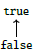

# Seven Sketches In Compositionality: An Invitation To Applied Category Theory

## Chapter 1: Generative Effects: Orders and Galois Connections

Compositionality*: cases in which systems or relationships can be combined to form new systems or relationships.

### More than the sum of their parts

* Observation is inherently "lossy"
  * To extract information from something requires dropping the details. 
* Central theme to category theory: study of structure and structure-preserving maps
  * A map $f: X \rightarrow Y$ is a kind of observation of $X$ via a specified relationship it has with another object $Y$. 
  * Asking what aspects of $X$ one wants to preserve under the observation $f$ becomes the question: "what category are you working in?"
    * E.g. Out of all functions $f: \mathbb{R} \rightarrow \mathbb{R}$, only some preserve order, preserve distance, etc.
* **Definition**: A function $f: \mathbb{R} \rightarrow \mathbb{R}$ is said to be:
  * *order-preserving*: if $x \leq y$ implies $f(x) \leq f(y)$ for all $x, y \in \mathbb{R}$ 
  * *metric-preserving*: if $\vert x - y \vert = \vert f(x) - f(y) \vert$
  * *addition-preserving*: if $f(x+y) = f(x) + f(y)$ 
* In category theory, want to keep control over which aspects are being preserved
  * The less structure that is being preserved, the more "surprises" can occur
    * These surprises are *generative effects* 

#### A first look at generative effects

* Connections are symmetric and transitive. 

* Joining two systems combines their connections. Denoted $A \vee B$.

  * "take the transitive closure of the union of the connections in A and B"

  

  

#### Ordering Systems

* Given systems $A$ and $B$, we say that $A \leq B$ if, whenever $x$ is connect to $y$ in $A$, then $x$ is connected to $y$ in B.

  

  * In the above diagram, an arrow from $A$ to $B$ means $A \leq B$. These diagrams are called Hasse diagrams.

* The joined system $A \vee B$ is the smallest system that is bigger than both $A$ and $B$, i.e. $A \leq A \vee B$ and $B \leq A \vee B$. 

  * Join is derived from ordering

* The set $\mathbb{B} = \{true, false\}$ of booleans has an order, $false \leq true$ 

  

  * Thus, $false \leq false$, $false \leq true$, $true \leq true$, but $true \nleq false$ 
    * In other words $A \leq B$ if A implies B. 

### What is Order?

#### Review of sets, relations, and functions

* Notation: $\underline{n}$ denotes the $n^{th}$ ordinal and has $n$ elements $1,2,3,\ldots,n$. E.g. $\underline{0} = \empty$, $\underline{5} = \{1,2,3,4,5 \}$. 
* Given sets $X$ and $Y$, $X$ is a subset of $Y$, $X \subseteq Y$ if every element in $X$ is also in $Y$. 
  * Empty set is a subset of every set. 
* Given a set $Y$ and a property $P$ that is either true or false for each element of $Y$, denote $\{ y \in Y \vert P(y)\}$ to be the subset of those y's that satisfy P.
* For $X_{1}, X_{2} \subseteq Y$, $X_{1} \cup X_{2}$ is the subset of $Y$ containing the elements in $X_{1}$ **or** $X_{2}$ 
* For $X_{1}, X_{2} \subseteq Y$, $X_{1} \cap X_{2}$ is the subset of $Y$ containing the elements in $X_{1}$ **and** $X_{2}$ 
* Given two sets $X$ and $Y$, the *product* $X \times Y$ is the set of pairs $(x, y)$ where $x \in X$ and $y \in Y$. 
* Given two sets $X$ and $Y$, their *disjoint union* is the set of pairs of the form $(x, 1)$ or $(y, 2)$, where $x \in X$ and $y \in Y$. 

