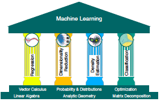

# Mathematics For Machine Learning

## Chapter 1: Introduction and Motivation

* Machine learning is about designing algorithms that automatically extract valuable information from data.
* Three core concepts:
  * data
  * a model
  * learning
* A model is said to learn from data if its performance on a given task improves after the data is taken into account.
* Want to find models that generalize well to unseen data.
* Learning can be understood as a way of automatically finding patterns and structure in data by optimizing the parameters of the model

### Finding Words for Intuitions

* Vectors can be interpreted three different ways
  * a list of numbers (CS)
  * an arrow with direction and magnitude (physics)
  * an object that obeys addition and scaling (math)
* Main concepts of the book
  * represent data as vectors
  * choose an appropriate model
    * probabilistic view
    * optimization view
  * learn from the available data using numerical optimization methods

