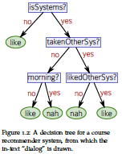
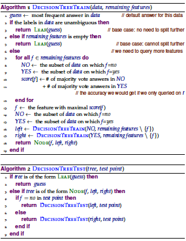
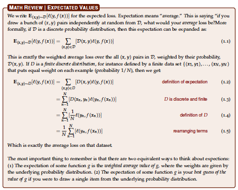

# A Course In Machine Learning

## Chapter 1: Decision Trees

* **Generalization** is perhaps the most central concept in machine learning
* **Examples** are the objects the algorithm makes prediction about.
  * **test set** is the collection of examples on which the algorithm is evaluated
    * The test set should be kept secret (i.e. separate)
* The goal of inductive machine learning is to take some training data and use it to induce a function $f$ 

### Some Canonical Learning Problems

* *Regression*: trying to predict a real value
* *Binary Classification*: trying to predict a yes/no response
* *Multiclass Classification*: trying to put an example into one of a number of classes
* *Ranking*: trying to put a set of objects in order of relevance

The reason to consider types of machine learning problems is becaues of how they measure error. What a "good prediction" is differs between the types. 

### The Decision Tree Model of Learning

* Related to "divide and conquer"

* Can be applied to many learning problems

* Binary classification idea/example: Make classification based on the result of yes/no quesitons. The task is to figure out what questions to ask, the order to ask them, and what classification decision to make once enough questions have been asked.

  

* The questions that can be asked are **features**

* The answer to the questions are the **feature values** 

* The correct classification is the **label** 

* Can construct the decision tree greedily: **If I could only ask one question, what would that quesiton be?** 

  * Want to find the feature that is the most useful

* First feature is selected to be the one with the highest score

  

* There are other approaches that differ primarily in how the score is computed

### Formalizing the Learning Problem

* Performance measured on unseen test set
* The performance measure should depeond on the problem trying to be solved
* There should be a strong relationship between the data that the algorithm is trained on and evaluated on.
* **Loss function** $\ell(\cdot, \cdot)$ determines the error.
  * possible regression loss functions
    * squared error: $\ell(y, \hat{y}) = (y - \hat{y})^2$ 
    * absolute error: $\ell(y, \hat{y}) = \vert y - \hat{y} \vert$
  * binary classification 
    * zero/one loss (not the best idea due to non-differentiability)
  * multiclass classification
    * zero/one loss (not the best idea due to non-differentiability)
* Must decide on loss function based on the goals of learning
* Probabilistic model of learning: probability distribution $\mathcal{D}$ over input/output pairs.
  * **Data generating distribution** 
    * This distribution is unknown in most machine learning problems
* Learning problem is defined by two quantities:
  1. The loss function $\ell$, which captures our notion of what is important to learn
  2. The data genreating distribution $\mathcal{D}$, which defines what sort of data we expect to see.

* We are provided **training data**, which is a random sample of input/output pairs drawn from $\mathcal{D}$. 

  * Based on the training data, need to induce a function $f$ that maps new inputs $\hat{x}$ to corresponding predictions $\hat{y}$. 

  * The key property that $f$ should obey is that it should do well (as measured by $\ell$) on future examples that are *also* drawn from $\mathcal{D}$. 

    * **Expected loss**
      $$
      \mathbb{E}_{(x,y) \sim \mathcal{D}}[\ell(y, f(x))] = \sum_{(x,y)} \mathcal{D}(x,y) \ell(y, f(x))
      $$

* The difficulty in minimizing the expected loss is that **we don't know $\mathcal{D}$**. 

  * Just have training data sampled from it

* The training data consists of $N$ input/output pairs $(x_{1}, y_{1}),\ldots,(x_{N}, y_{N})$. Given a learned function $f$, the **training error** is
  $$
  \frac{1}{N} \sum_{n = 1}^{N} \ell(y_{n}, f(x_{n}))
  $$

  * Think of it as the expected error given that $\mathcal{D}$ assigns probability $1/N$ to each point in the training set
  * The training error is the average error over the training data
  * Can drive the training error to zero by memorizing the training set

* A fundamental difficulty: only have access to the training error, but the thing we care about minimizing is the expected error. 

  * In order to get the expected error down, the learned function $f$ needs to **generalize** beyond the training data to some future data

* Inductive machine learning:

  1. Given a loss function $\ell$
  2. a sample D from some unknown distribution $\mathcal{D}$ 

  you must compute a function $f$ that has low expected error $\epsilon$ over $\mathcal{D}$ with respect to $\ell$. 

* Important point: you cannot expect the machine learning algorithm to generalize beyond the data distribution it has seen at training time. 

### Summary

* Break data into three sets: training, development (validation), and test
* Determine hyperparameters (depth) on training and development data sets
* General idea:
  1. Select a model (and its associated inductive biases)
  2. Use the data to find parameters of the model that work well on the training data
  3. Use the development data to avoid underfitting and overfitting
  4. Use the test data to estimate future model performance

## Chapter 2: Limits of Learning

