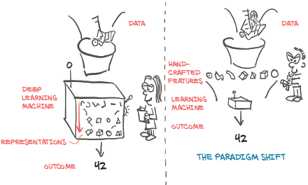

# Deep Learning With PyTorch

## Part 1: Core PyTorch

### Chapter 1: Introducing Deep Learning and the PyTorch Library

* Conflate self-awareness with intelligence, but it is not required to perform some tasks which machine learning is good at. 

#### The deep learning revolution

* Before deep learning, machine learning was heavily dependent on *feature engineering*. 
  * Features are transformations on the input data that facilitate downstream algorithms, e.g. classification
  * Deep learning finds the representations automatically to perform the desired task.

