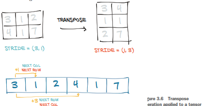

# Deep Learning With PyTorch

## Part 1: Core PyTorch

### Chapter 1: Introducing Deep Learning and the PyTorch Library

* Conflate self-awareness with intelligence, but it is not required to perform some tasks which machine learning is good at. 

#### The deep learning revolution

* Before deep learning, machine learning was heavily dependent on *feature engineering*. 
  * Features are transformations on the input data that facilitate downstream algorithms, e.g. classification
  * Deep learning finds the representations automatically to perform the desired task.


* Steps to execute successful deep learning:
  * Need a way to ingest whatever data we have at hand
  * We need to somehow define the deep learning machine
  * We must have an automated way, *training*, to obtain useful representation and make the machine produce the desired outputs
* Training:
  * Have a *criterion* to measure discrepancy between desired and actual output
  * Modify the machine to minimize the discrepancy

#### PyTorch for deep learning

* Core PyTorch data structure: *tensor* 

#### Why PyTorch?

PyTorch has two features that make it highly attractive for deep learning

* GPU support
* Numerical optimization on generic mathematical expressions

##### The deep learning competitive landscape

Three main libraries currently:

* PyTorch
* TensorFlow
* JAX

#### An overview of how PyTorch supports deep learning projects

* At it's core, PyTorch provides *tensors* (i.e. multidimensional arrays) and operations on them that can be used on the CPU or GPU as well as keeping track of operations on tensors and being able to compute the derivative. 
* Core PyTorch module: `torch.nn`
* To train a model:
  * need source of training data
  * an optimizer to adapt the model to the training data
  * a way to get the model and data to the hardware that will be performing the calculations
* The bridge between custom data and PyTorch tensor is the `Dataset` class in `torch.utils.data` 
  * Since the data varies from problem to problem, will need to write the data sourcing ourselves.
* Want to batch data for parallel computation:
  * `DataLoader` class
* Compare output of model to input data and compute loss using loss functions
  * Found in `torch.nn` 
* `torch.optim` provides optimizers to adjust the model parameters.

### Summary

* Deep learning models automatically learn to associate inputs and desired outputs from examples
* Libraries like PyTorch allow you to build and train neural network models efficiently
* PyTorch defaults to immediate execution for operations

## Chapter 2: Pretrained networks

* Using off-the-shelf models can be a quick way to jump-start a deep learning project.
  * Can think of pre-trained model as a program that takes inputs and generates outputs

### A pretrained network that recognizes the subject of an image


* The input will be images of type `torch.Tensor` with two spatial dimensions and one color dimension (3 color channels). 
  * for images, we have [batch_size, color_channels, height, width]
* The output will be a `torch.Tensor` of 1000 elements each representing the score associated with a class

#### Obtaining a pretrained network for image recognition

* TorchVision has many datasets and pretrained models
  * Capitalized objects are classes
  * Lowercase objects are convenience functions that return models instantiated from the classes

#### AlexNet


#### ResNet

```python
from torchvision import models

# see all objects in models
dir(models)

# create an instance of ResNet101
resnet = model.resnet101(pretrained=True)

# print to see details of the model
print(resnet) # one module/layer per line

# Can call resnet like a function to produce output scores.

# Preprocess images
from torchvision import transforms
preprocess = transforms.Compose([
    transforms.Resize(256),
    transforms.CenterCrop(224),
    transforms.ToTensor(),
    transforms.Normalize(
        mean=[0.485, 0.456, 0.406],
        std=[0.229, 0.224, 0.225]) # need to normalize to what model expects
])

# test on image
# test on image
from pathlib import Path
from PIL import Image
import torch

filename = Path('../dlwpt-code/data/p1ch2/bobby.jpg')
img = Image.open(filename)
img_t = preprocess(img)
batch_t = torch.unsqueeze(img_t, 0) # Add batch dimension

# running the model is also called inference
# need to put network in eval mode
resent.eval()
out = resnet(batch_t)

# Verify inference
labelfile = Path('../dlwpt-code/data/p1ch2/imagenet_classes.txt')
with open(labelfile) as f:
    labels = [line.strip() for line in f.readlines()]

# Find maximum class score
# torch.max returns maximum value and the index
_, index = torch.max(out, 1) # index is 1d tensor, so need to index into it

# Turns scores into probabilities
percentage = torch.nn.functional.softmax(out, dim=1)[0] * 100
labels[index[0]], percentage[index[0]].item()

# Use sort function to find other scores
# returns the indices in the original tensor
_, indices = torch.sort(out, descending=True)
[(labels[idx], percentage[idx].item()) for idx in indices[0][:5]] #indices is a 2d tensor
```

### A pretrained model that fakes it until it makes it

#### The GAN game

* Idea: Have two networks, a *generator* and a *discriminator*, where the generator "tries to fool" the discriminator and the discriminator provides feedback as to how it can tell the real and fake apart.


#### CycleGAN

* Idea: Have two generators and two discriminators and go to a transformed domain and then back to original domain.
  * The second network helps stabilize training
  * Don't need matched pairs of (original, tranformed) (e.g. horse and zebra in the book example)
    * Can use independent data sets (e.g. one dataset of horses and another of zebras)


* Example: A network that turns horses into zebras

  ```python
  netG = ResNetGenerator() # resnet architecture with random weights
  model_path = ... # path to model weights stored as a pickle file .pth
  model_data = torch.load(model_path) # load 
  netG.load_state_dict(model_data) # load parameters into model
  ```

  * Can use `transforms.ToPILImage()(tensor)` to go from output to image format

### A pretrained network that describes scenes


* network trained on images paired with descriptive sentence

* to run the NeuralTalk2 model

  * place images in the `data` directory of the cloned repository and then run the script:

    ```python
    python eval.py --model ./data/FC/fc-model.pth --infos_path ./data/FC/fc-infos.pkl --image_folder ./data
    ```

### Torch Hub

* Torch Hub is a mechanism through which authors can publish a model on Github, with or without trained pretrained weights, and expose it through an interface that PyTorch understands. 

  * Look at `hubconf.py` to find entry-point

* Example:

  ```python
  import torch
  from torch import hub
  
  resnet18_model = hub.load('pytorch/vision/master',
                           'resnet18',
                           pretrained=True)
  ```

  * First line is the name and branch of the GitHub repo
  * Second line is the entry-point function
  * Third line is keyword argument (found from `hubconf.py`)

* Torch Hub will not install missing dependencies, but it will report them
* Entry points are suppose to return models, but do not have to.
* Find models on Torch Hub by googling "GitHub hubconf.py"

### Summary

* A pretrained network is a model that has already been trained on a dataset
* Generative Adversarial Networks (GANs) have two parts, a generator and a discriminator
* CycleGAN architecture converts back and forth between two different classes of images
* NeuralTalk2 uses a hybrid model to consume an image and produce a text description of the image
* Torch Hub is a standardized way to load models and weights from projects with a `hubconf.py` file

## It starts with a tensor

* Deep learning consists fo building a system that can transform data from one representation to another.

### The world as floating-point numbers


* Computer has to deal with numbers, so need a way to convert to and from numbers

* Deep learning learns in stages. The output of the stages are intermediate representations

* Tensors are a generalization of vectors and matrices to an arbitrary number of dimensions (i.e. a multidimensional array)

  

### Tensors: Multidimensional arrays


* Slicing and indexing provides **views** of underlying memory
  * Not creating new objects

### Named tensors

* Can give names to dimensions

  `weights_named = torch.tensor([0.2126, 0.7152, 0.0722], names=['channels'])`

* Can add names to dimensions of an existing tensor

  ```python
  img_named = img_t.refine_names(..., 'channels', 'rows', 'columns')
  batch_named = batch_t.refine_names(..., 'channels', 'rows', 'columns')
  ```

* When doing operations, PyTorch will check name of dimensions as well

  * It does not automatically align dimensions

  * `align_as` returns a tensor with missing dimensions added and existing ones permuted to the right order

    `weights_aligned = weights_named.align_as(img_named)` 

* Functions accepting dimension arguments can also take named dimensions

  `gray_named = (img_named * weights_aligned).sum('channels')`

* If we want to used named tensors outside functions that operate on named tensors, need to drop the names by renaming them to `None`

  `gray_plain = gray_named.rename(None)`

### Tensor element types

* Standard Python numeric types are suboptimal because:
  * Numbers in Python are objects
  * List in Python are meant for sequential collections of objects
  * The Python interpreter is slow compared to optimized, compiled code
* Thus used optimized structures like numpy or PyTorch.
  * Need data to all by of the same type

#### Specifying the numeric type with dtype

`dtype` in the tensor constructor specifies the type of data the tensor holds:

*  `torch.float32` or `torch.float`
* `torch.float64` of `torch.double`
* `torch.float16` or `torch.half`
* `torch.int8`
* `torch.unit8`
* `torch.int16` or `torch.short`
* `torch.in32` or `torch.int`
* `torch.int64` or `torch.long`
* `torch.bool`

The default type for tensors is `torch.float` (32-bit floating point)

#### A dtype for every occasion

Tensors can be used as indices in other tensors, in which case the indexing tensor must be `torch.int64`. 

* `torch.tensor([2,2])` is a 64-bit integer tensor by default

Predicates on tensors produce `torch.bool`, such as `points > 1.0` 

#### Managing a tensor's dtype attribute

* Specify in constructor

  ```python
  double_points = torch.ones(10, 2, dtype=torch.double)
  short_points = torch.tensor([[1,2], [3,4]], dtype=torch.short)
  ```

* Can get `dtype` by accessing the attribute: `short_points.dtype`

* Can cast: `double_points = torch.zeros(10, 2).double()`

  * Also use `to` method: `double_points = torch.zeros(10, 2).to(torch.double)`

* When mixing input types in operations, the inputs are converted to the large type automatically

### The tensor API

* A vast majority of operations on an between tensors are available in the `torch` module or can be called as a method of the tensor object

  ```python
  a = torch.ones(3,2)
  a_t = torch.transpose(a, 0, 1)
  
  b = torch.ones(3,2)
  b_t = b.transpose(0,1)
  ```

### Tensors: Scenic views of storage

* Values in tensors are allocated in contiguous chunks of memory managed by `torch.Storage` 

  * Storage is a one-dimensional contiguous array of numerical data.
  * Use offset and per-dimension strides to index

* Multiple tensors can index the same storage even if they index into the data differently

  

#### Indexing into storage

* Storage for a given tensor is accessible using the `.storage` method
* Can index into storage manually (which is one-dimensional)
* Changing the value of a storage changes the referring tensor

#### Modifying stored values: In-place operations

* Methods ending in an underscore operate in-place rather than return a new tensor

  ```python
  a = torch.ones(3,2)
  a.zero_() # zeros out the tensor
  ```

### Tensor metadata: Size, offset, and stride

* To index into storage, tensors rely on:

  * size: a tuple indicating how many elements are in each dimension
  * offset: offset to first element of tensor
  * stride: a tuple indicating how many elements in storage need to be skipped over to obtain the next element along each dimension

  

#### Views of another tensor's storage

* To access element `i`, `j` in a 2D tensor: `storage_offset + stride[0] * i + stride[1] * j` 

* Changing a sub-tensor changes the original tensor

  ```python
  points = torch.tensor([[4.0, 1.0], [5.0, 3.0], [2.0, 1.0]])
  second_point = points[1]
  second_point[0] = 10.0 # Changes points
  third_point = points[2].clone() # Use clone to create new storage and tensor to avoid this
  ```

#### Transposing without copying

* Transposing changes the strides.

  * Does not allocate new memory

  ```python
  points = torch.tensor([[4.0, 1.0], [5.0, 3.0], [2.0, 1.0]])
  points_t = points.t() # transpose
  assert(id(points.storage()) == id(points_t.storage())) # have the same storage
  assert(points.stride() == (2,1))
  assert(points_t.stride() == (1,2))
  ```

  

#### Transposing in higher dimensions

* Specify the two dimensions to transpose

  ```
  some_t = torch.ones(3,4,5)
  transpose_t = some_t.transpose(0,2)
  ```

* A tensor laid out in storage starting from the rightmost dimension onward (i.e. moving along rows in a 2D tensor) is defined as contiguous. 

  * Contiguous tensors have better performance because there is less jumping around in memory (better memory locality)

#### Contiguous tensors

* Some operators in PyTorch only work on contiguous tensors

  * E.g. `view`

* Use `is_contiguous()` method on tensors

  * E.g. `points.is_contiguous()`

* Can get a new contiguous tensor from another tensor by using the `contiguous` method

  * `points_t_cont = points_t.contiguous()`
  * does not hurt performance to call `contiguous()` on a tensor that is already contiguous

  

### Moving tensors to the GPU

