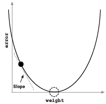
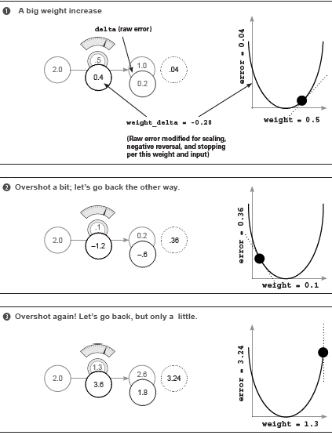

# Grokking Deep Learning

## Chapter 1: Introducing Deep Learning

* Whenever we encouter a math formula, translate its methods into an intuitive analogy to the real world and break it into parts. 

## Chapter 2: Fundamental Concepts

### What is deep learning?


### What is machine learning

* Machine learning is a subfield of computer science wherein machines learn to perform tasks for which they were not *explicitly programmed*. 
  * Supervised vs. unsupervised learning

### Supervised machine learning

* Supervised learning is a method for transforming one dataset into another. 
  
  * Useful for taking what you know and transforming it into what you want to know.
    
    

### Unsupervised machine learning

* Unsupervised learning groups your data.

* Transforms one dataset into another, like supervised learning, but unlike supervised learning, the output data set is not previously known. 
  
  * There is no known "right answer" beforehand
    
    
  
  ​        

* All forms of unsupervised learning can be viewed as a form of clustering.

### Parametric vs. nonparametric learning

* Oversimplified: trial-and-error learning vs counting and probability
  
  

* A parametric model is characterized by having a fixed number of parameters

* A nonparametric model's number of parameters is infinite (determined by the data)

### Supervised parametric learning

* Oversimplified: trial-and-error learning using knobs
  * learning occurs by adjusting the knobs
  * the entirity of what the model has learned is captured by the positions of the knobs
* Three steps to supervised parametric learning
  1. Predict
  2. Compare to the truth
  3. Learn
     * adjust the knobs
     * knobs represent the prediction's sensitivity to different types of input data

### Unsupervised parametric learning

* Use knobs to group data

### Nonparametric learning

* Oversimplified: counting-based methods
* Number of parameters is based on the data (instead of predefined).

## Chapter 3: Introduction to neural prediction - forward propagation

### Step 1: Predict

* Predict, compare, learn paradigm

* **Rule of thumb**: always present enough information to the network, where "enough information" is loosely defined as how much a human might need to make the same prediction.

### A simple neural network making a prediction

```python
### single input, single output, single weight network
weight = 0.1
def neural_network(input, weight):
    prediction = input * weight
    return prediction


number_of_toes = [8.5, 9.5, 10, 9] # input data
input = number_of_toes[0]
pred = neural_network(input, weight)
print(pred)
```

### What is a neural network?

* **What is input data?**: It's a number that you record in the real world

* **What is a prediction?**: It's what the neural network tells you given the input data. 

* **How does the network learn?**: Trial and error. First make a prediction, compare it to the known output, and adjust the weights/parameters to minimize the prediction error. 

* The neural network API is simple: accept the input as information and the weight as knowledge. The network uses the weights/knowledge to interpret the input/information.

* Can think of weights as the networks sensitivity. Large weights have high sensitivity; small weights low sensitivity.

### Making a prediction with multiple inputs

* Neural networks can combine intelligence from multiple datapoints.
  
  ```python
  weights = [0.1, 0.2, 0]
  def neural_network(input, weights):
      pred = w_sum(input, weights)
      return pred
  
  def w_sum(a,b):
      assert(len(a) == len(b))
  
      output = 0
      for i in range(len(a)):
          output += a[i] * b[i]
  
      return output
  
  # multiple inputs
  toes = [8.5, 9.5, 9.9, 9.0]
  wlrec = [0.65, 0.8, 0.8, 0.9]
  nfans = [1.2, 1.3, 0.5, 1.0]
  
  input = [toes[0], wlrec[0], nfans[0]]
  pred = neural_network(input, weights)
  ```


    

### Multiple inputs: What does this neural network do?

* It multiplies three inputs by three weights and sums them: a weighted sum or dot product.

* Need to combine multiple inputs at the same time: single features are not informative enough (e.g. number of toes). 

* store inputs and weights as vectors and matrices.

* elementwise operations perform operations on individual elements of a vector or matrix
  
  ```python
  def elementwise_multiplication(vec_a, vec_b):
      assert(len(vec_a) == len(vec_b))
      return [x[0] * x[1] for x in zip(vec_a, vec_b)]
  
  def elementwise_addition(vec_a, vec_b):
      assert(len(vec_a) == len(vec_b))
      return [x[0] + x[1] for x in zip(vec_a, vec_b)]
  
  def vector_sum(vec_a):
      return sum(vec_a)
  
  def vector_average(vec_a):
      assert(len(a) > 0)
      return vector_sum(vec_a) / len(vec_a)
  ```

* Dot product is essential to understand how neural networks make predictions. The dot product is a notion of similarity.

* Can think of negative weights as a logical `not` 

* Logical interpretation of weights
  
  ```python
  # This interpretation is CRUDE
  weights = [1, 0, 1] => if input[0] or input[2]
  weights = [1, 0, -1] => if input[0] or not input[2]
  weights = [0.5, 0, 1] => if BIG input[0] or input[2]
  ```
  
  * Note that the weight of 0.5 requires the input to be larger to have the same effect. 

* In the previous example, 
  
  * `nfans` is ignored due to the 0 weight
  
  * `ntoes` is dominant because it has the largest product of input and weight

* Cannot shuffle weights: their position determines what inputs they influence.

* The value of the weight and the input determine the overall impact on the final score. 

* Negative weights cause some inputs to reduce the final prediction.

### Multiple inputs: Complete runnable code

Numpy implementation

```python
weights = np.array([0.1, 0.2, 0])
def neural_network(input, weights):
    pred = input.dot(weights)
    return pred

toes = np.array([8.5, 9.5, 9.9, 9.0])
wlrec = np.array([0.65, 0.8, 0.8, 0.9])
nfans = np.array([1.2, 1.3, 0.5, 1.0])

input = np.array([toes[0], wlrec[0], nfans[0]])
pred = neural_network(input, weights)
print(pred)
```

### Making a prediction with multiple outputs

* Neural networks can also make a prediction using only a single input

* 

* Note in this example, the neural network makes three separate predictions.
  
  ```python
  def neural_network(input, weights):
      return [input * w for w in weights]
  ```

### Predicting with multiple inputs and outputs

* Neural networks can predict multiple outputs given multiple inputs

    


```python
def dot(a,b):
    vector_sum(elementwise_multiplication(a,b))

def vect_mat_mul(vect, matrix):
    # assume matrix is a list of lists
    assert(len(vect) == len(matrix))

    output = [dot(vect, row) for row in matrix]
    return output

def neural_network(input, weights):
    return vect_mat_mul(input, weights)
```

### Multiple inputs and outputs: How does it work?

* It performs three independent weighted sums of the input to make three predictions.
  
  * Can think of it as three weights coming out of each input node, or
  
  * Three weights going into each output node.

* Think of list of numbers as a vector and a list of vectors as a matrix
  
  * vector matrix multiplication is the series of weighted sums: take a vector and perform a dot product with every row in a matrix

### Predicting on predictions

* Neural networks can be stacked

    

* `numpy` implementation
  
  ```python
  import numpy as np
  
  # toes % wins # fans
  ih_wgt = np.array([
      [0.1, 0.2, -0.1], # hid[0]
      [-0.1, 0.1, 0.9], # hid[1]
      [0.1, 0.4, 0.1], # hid[2]
  ])
  
  # hid[0] hid[1] hid[2]
  hp_wgt = np.array([
      [0.3, 1.1, -0.3], # hurt?
      [0.1, 0.2, 0.0], # win?
      [0.0, 1.3, 0.1], # sad?
  ])
  
  weights = [ih_wgt, hp_wgt]
  
  def neural_network(input, weights):
      hid = input.dot(weights[0])
      pred = hid.dot(weights[1])
      return pred
  
  toes = np.array([8.5, 9.5, 9.9, 9.0])
  wlrec = np.array([0.65, 0.8, 0.8, 0.9])
  nfans = np.array([1.2, 1.3, 0.5, 1.0])
  
  input = np.array([toes[0], wlrec[0], nfans[0]])
  
  pred = neural_network(input, weights)
  print(pred)
  ```

### A quick primer on NumPy

* General rule of thumb for anything elementwise (e.g. +,-,*,/) is that either two variables must have the **same** number of columns, or one of the variables has only one column.

* Golden rule for `dot`: for `x.dot(y)`, the number of columns of `x` must equal the number of rows of `y` 

### Summary

* To predict, neural networks perform repeated weighted sums of the input
  
  * forward propagation

## Chapter 4: Introduction to neural learning - gradient descent

* Question: How do you set the weight values of the network to predict accurately?

### Compare

* Comparing gives a measurement of how wrong the prediction was

* Error is always positive

### Learn

* Learning tells each weight how it can change to reduce the error

* Learning is about *error attribution* 
  
  * The art of figuring out how each weight played its part in creating error (the blame game)

### Compare: Does the network make good predictions?

```python
knob_weight = 0.5
input = 0.5
goal_pred = 0.8

pred = knob_weight * input

error = (pred - goal_pred) ** 2
```

* `goal_pred` is the target

* squaring the error keeps the error positive and makes big error bigger (>1) and small errors smaller (<1)

### Why measure error?

* Measuring error simplifies the problem

* Different ways of measuring error prioritize error differently
  
  * i.e. L2 norm vs. L1 norm

* Want positive error so cancellation doesn't occur when averaging
  
  * i.e. don't want -100 and 100 to cancel out

### What's the simplest form of neural learning?

* Learning is about adjusting weights

* Simple idea: hot and cold learning

  * Wiggle the weights to see which direction reduce the error most and move the weights in that direction
  * Repeat until error is minimized

* Learning in neural networks is really a **search problem**

  * Searching for the best possible configuration of weights

  ```python
  weight = 0.5
  input = 0.5
  goal_prediction = 0.8
  
  step_amount = 0.001
  
  for iteration in range(1101):
      
      prediction = input * weight
      error = (prediction - goal_prediction) ** 2
      
      print('Error:', str(error), ' Prediction:', str(prediction))
      
      up_prediction = input * (weight + step_amount)
      up_error = (goal_prediction - up_prediction) ** 2
      
      down_prediction = input * (weight - step_amount)
      down_error = (goal_prediction - down_prediction) ** 2
      
      if(down_error < up_error):
          weight -= step_amount
      if(down_error > up_error):
          weight += step_amount
  ```

### Characteristics of hot and cold learning

* Simple
* Inefficient
* Sometimes impossible to predict exact goal due to fixed step size
  * Know correct direction to move, but not the correct amount
  * This amount is unrelated to the error in this case
* Can we determine amount and direction without repeated predictions?

### Calculating both direction and amount from error

```python
weight = 0.5
goal_pred = 0.8
input = 0.5

for iteration in range(20):
    pred = input * weight
    error = (pred - goal_pred) ** 2
    direction_and_amount = (pred - goal_pred) * input
    weight -= direction_and_amount
    
    print('Error', str(error), ' Prediction:', str(pred))
```

* "Pure error": `(pred-goal_pred)` indicates raw direction and amount missed.
  * If positive: predicted too high
  * If negative: predicted too low
  * If large: missed by a big amount
* Multiplying by input scales, provides negative reversal and stopping
  * input of zero has no effect in learning
  * if input is negative, then increase `pred` decreases `direction_and_amount`
  * larger the input, the larger the in magnitude `direction_and_amount` 

### One iteration of gradient descent

```python
alpha = 0.01
delta = pred - goal # difference
weight_delta = input * delta # weigh by input
weight -= weight_delta * alpha # weigh by alpha
```

* `weight_delta` is a measure of how much a weight caused the network to miss
* `alpha` controls how fast the network learns

### Learning is just reducing error

* Adjust the weight in the correct direction and the correct amount so the error keeps getting reduced
* Note that input and goal are fixed. The variables are the weights.

### Let's watch several steps of learning

```python
weight, goal_pred, input = (0.0, 0.8, 1.1)

for iteration in range(4):
    print("-----\nWeight:" + str(weight))
    pred = input * weight
    error = (pred - goal_pred) ** 2
    delta = pred - goal_pred
    weight_delta = delta * input
    weight = weight - weight_delta
    print("Error:" + str(error) + " Prediction:" + str(pred))
    print("Delta:" + str(delta) + " Weight Delta:" + str(weight_delta))
```

### Why does this work? What is weight_delta, really?

* Changing the weight means the function *conforms to the patterns in the data*. 
  * Changes only how predict works
* **Key takeaway**: you can modify anything in the `pred` calculation except `input` 

### Concept: Learning is adjusting the weight to reduce the error to 0

* Want to understand the relationship between `weight` and `error`
  * Hot and cold learning tried this by experimenting
  * `error = ((input * weight) - goal_pred) ** 2` is the exact relationship 
    * How do we change `weight` to reduce `error`
  
  

* The slope points to the lowest error. So use slope information to help reduce error.
* Modify error function until the `erro` goes to 0.
  * Can't change input data, output data, error logic
  * Can change weights
* The derivative describes how one variable changes w.r.t. another variable.
  * derivative's sign gives direction
  * derivative's value gives amount
* A neural network is just a bunch of weights used to compute an error function
  * Can compute the relationship (derivative) between any weight and the error
* The derivative points in the opposite direction that you want to move to minimize error
  * E.g. if the slope is negative, want to increase the value to get closer to the error minimizer.
  * This metho is gradient descent

### Divergence 

* Need to take small steps as to not overcorrect

  * If derivative is large, can take large steps and lead to oscillation

    

* Solution: multiply the derivative by a factor to reduce step size
  * How this factor is chosen is "guessing"
  * `weight = weight - alpha * derivative` 

### Memorize

* Write code from memory:

  ```python
  weight, input, goal = 0.5, 2, 0.8
  alpha = 0.1
  
  num_iter = 100
  tol = 1e-10
  
  for i in range(num_iter):
      pred = weight * input
      error = (pred - goal) ** 2
      delta = pred - goal
      step = input * delta
      
      print('Iteration:',i,'Error:', error,' Prediction:', pred)
      
      weight = weight - alpha * step
      
      if abs(error) < tol:
          break
  ```

  