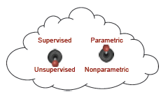

# Grokking Deep Learning

## Chapter 1: Introducing Deep Learning

* Whenever we encouter a math formula, translate its methods into an intuitive analogy to the real world and break it into parts. 

## Chapter 2: Fundamental Concepts

### What is deep learning?

### What is machine learning

* Machine learning is a subfield of computer science wherein machines learn to perform tasks for which they were not *explicitly programmed*. 
  * Supervised vs. unsupervised learning

### Supervised machine learning

* Supervised learning is a method for transforming one dataset into another. 

  * Useful for taking what you know and transforming it into what you want to know.

    

### Unsupervised machine learning

* Unsupervised learning groups your data.

* Transforms one dataset into another, like supervised learning, but unlike supervised learning, the output data set is not previously known. 

  * There is no known "right answer" beforehand

    

  ​		

*  All forms of unsupervised learning can be viewed as a form of clustering.

### Parametric vs. nonparametric learning

* Oversimplified: trial-and-error learning vs counting and probability

  

* A parametric model is characterized by having a fixed number of parameters
* A nonparametric model's number of parameters is infinite (determined by the data)

### Supervised parametric learning

* Oversimplified: trial-and-error learning using knobs
  * learning occurs by adjusting the knobs
  * the entirity of what the model has learned is captured by the positions of the knobs
* Three steps to supervised parametric learning
  1. Predict
  2. Compare to the truth
  3. Learn
     * adjust the knobs
     * knobs represent the prediction's sensitivity to different types of input data

### Unsupervised parametric learning

* Use knobs to group data

### Nonparametric learning

* Oversimplified: counting-based methods
* Number of parameters is based on the data (instead of predefined).