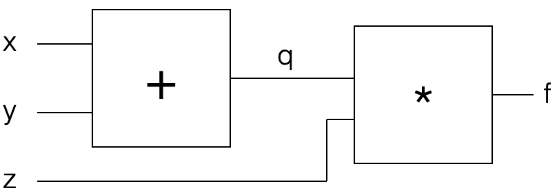
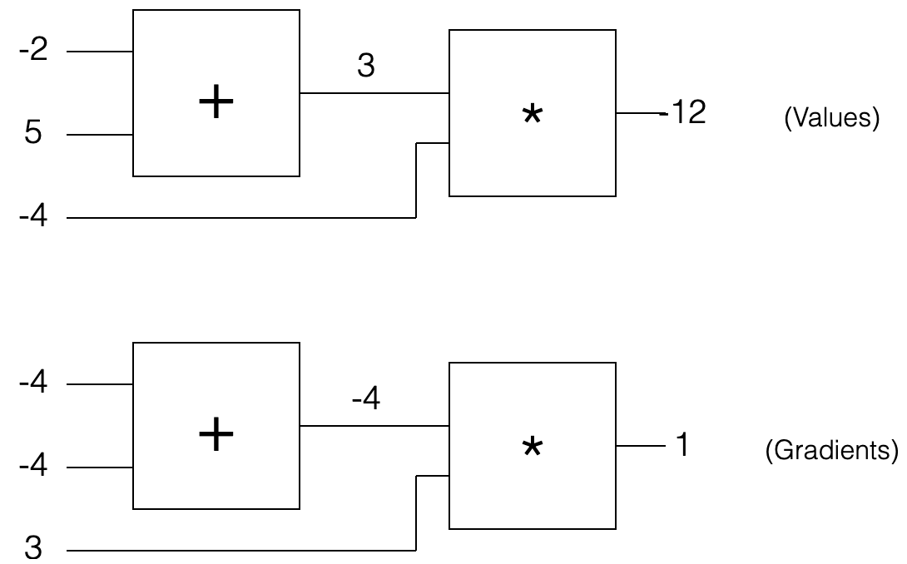

# Hacker's Guide to Neural Networks

## Chapter 1: Real-Valued Circuits

### Base Case: Single Gate in the Circuit


```python
def forwardMultiplyGate(x,y):
  return x*y

assert(forwardMultiplyGate(-2,3) == -6)
```

$$
f(x,y) = xy
$$

* In this example: the gate takes two inputs and produces a **single** output

#### The Goal

The problem looks like this:

1. We provide the circuit specific input values
2. The circuit computes the output value
3. *How do you change the input slightly to increase the output?* 

#### Strategy #1: Random Local Search

* We can easily "forward" (i.e. compute the output) of the circuit for any `x` and `y`, so we can randomly tweak `x` and `y` and keep track of the best tweak.

  ```python
  import numpy as np
  
  best_out = float('-inf')
  tweak_amount = 0.01
  num_iter = 100
  
  # inputs
  x, y = -2, 3
  # keeping track of best inputs
  best_x, best_y = x, y
  
  for i in range(num_iter):
      x_try = x + tweak_amount * (np.random.random() * 2 - 1) # tweak x a bit
      y_try = y + tweak_amount * (np.random.random() * 2 - 1) # tweak y a bit
      out = forwardMultiplyGate(x_try, y_try)
      if out > best_out:
          best_out = out
          best_x, best_y = x_try, y_try
  ```

* This strategy works, but it is inefficient

  * How would you do this with millions of inputs?

#### Strategy #2: Numerical Gradient

* *Intuition*: Imagine taking the output value from the circuit and tugging on it in the positive direction. This induces forces on the inputs `x` and `y`. These forces tell us how to change `x` and `y` to increase the output value

> The derivative can be thought of as a force on each input as we pull on the output to become higher.

* Idea: rather than looking backwards through the circuit, change the input slightly and see how the output changes. This is the derivative
  $$
  \frac{\partial f(x,y)}{\partial x} = \frac{f(x+h,y) - f(x,y)}{h}
  $$
  where $h$ is small (the tweak amount).

  * Numerator on the RHS measures the difference in the output due to the tweak of the input
  * The denominator on the RHS normalizes the difference by the arbitrary tweak amount

  * On the LHS of the above, it is not division. The entire entity is one thing: the partial derivative (i.e. the derivative of f(x,y) w.r.t. x). The RHS is division.

  ```python
  x, y = -2, 3
  out = forwardMultiplyGate(x, y)
  h = 0.0001
  
  # compute the derivative wrt x
  xph = x + h
  out2 = forwardMultiplyGate(xph,y)
  x_derivative = (out2 - out) / h
  # compute the derivative wrt y
  yph = y + h
  out3 = forwardMultiplyGate(x,yph)
  y_derivative = (out3 - out) / h
  ```

  * Ideally h would be infinitesimally small

> The derivative with respect to some input can be computed by tweaking that input by a small amount and observing the change on the output value.

* The **gradient** is made up of the derivatives of all the inputs concatenated in a vector.

* If we let the inputs respond to the tug by following the gradient a tinay amount (i.e. we just add the derivative on top of every input), we increase the output value:

  ```python
  step_size = 0.01
  out = forwardMultiplyGate(x,y)
  x = x + step_size * x_derivative
  y = y + step_size * y_derivative
  out_new = forwardMultiplyGate(x,y)
  ```

  * Do not need to try random search: the gradient is the direction of steepest increase. 
  * Evaluation of the derivative above only required three evaluations of the forward pass
    * Instead of hundreds for random search.
    * derivative provides the best tug one can hope for

* **Bigger step is not always better**: The math is for infinitesimal step sizes. For large steps, all bets are off. We hope that the function is smooth enough such that the step sizes we take work.

* **Hill-climbing analogy**: Like walking up a hill blindfolded: shuffle your feet in the direction of steepest ascent, but if you take a large step, you might fall off a cliff.

### Strategy #3: Analytic Gradient

* In the previous section, the derivative was computed by probing the ciruit's output value, independently for every input.
  * Yields **numerical gradient** 
  * Complexity is linear in the number of inputs (need to compute for each input)
* Better approach: **analytic gradient** from calculus
  * Idea: Compute gradient for small and simple expressions and then compose then with the **chain rule** 

> The analytic derivative requires no tweaking of the inputs. It can be derived using mathematics (calculus).

* Derivation from previous example of $f(x,y) = xy$
  $$
  \frac{\partial f(x,y)}{\partial x} = \frac{f(x+h,y) - f(x,y)}{h} = \frac{(x+h)y - xy}{h} = \frac{xy +hy -xy}{h} = \frac{hy}{y} = y
  $$
  (limits as h goes to zero omitted)

  * No tweaking required!

* Updated code using analytic gradient

  ```python
  x = -2
  y = 3
  out = forwardMultiplyGate(x,y)
  x_gradient = y
  y_gradient = x
  
  step_size = 0.01
  x += step_size * x_gradient
  y += step_size * y_gradient
  out_new = forwardMultiplyGate(x,y)
  ```

* **Progression:**

  * Strategy #1 (**random search**) required forwarding the circuit hundreds of times
  * Strategy #2 (**numerical gradient**) required forwarding twice the number of inputs (computation of numerator)
  * Strategy #3 (**analytic gradient**) requires forwarding a single time
  * Also strategies #1 and #2 only yield appoximate gradients, while strategy #3 gives the exact gradient.

* In practice implement analytic gradient, but verify by comparing it with the numerical gradient, which is easy, but expensive, to compute

### Recursive Case: Circuits with Multiple Gates

> A single extra multiplication will turn a single (useless gate) into a cog in the complex machine that is an entire neural network.

* Example circuit/function: $f(x,y,z) = (x+y)z$ 



```python
def forwardMultiplyGate(a,b):
    return a * b

def forwardAddGate(a,b):
    return a + b

def forwardCircuit(x, y, z):
    q = forwardAddGate(x,y)
    f = forwardMultiplyGate(q,z)
    return f

x = -2
y = 5
z = -4

f = forwardCircuit(x,y,z)
```

* **Idea**: Ignore $x$ and $y$ and call the output of the add gate $q$, then we are back at the simple multiply gate with inputs $q$ and $z$.
  $$
  f(q,z) = qz \Rightarrow \frac{\partial f(q,z)}{\partial q} = z, \frac{\partial f(q,z)}{\partial z}=q
  $$

* Next, compute the gradient of $q(x,y) = x + y$ w.r.t. $x$ and $y$. 
  $$
  q(x,y) = x + y \Rightarrow \frac{\partial q(x,y)}{\partial x} = 1, \frac{\partial q(x,y)}{\partial y} = 1
  $$

### Backpropagation

* The **chain rule** tells us how to compute the gradient of the final output w.r.t. $x$ and $y$ given the gradient of $q$ w.r.t. $x$ and $y$ and the gradient of the final output w.r.t. $q$. 

  * Multiply the derivatives together!
    $$
    \frac{\partial f(q,z)}{\partial x} = \frac{\partial q(x,y)}{\partial x} \frac{\partial f(q,z)}{\partial q}
    $$
    

  ```python
  x = -2
  y = 5
  z = -4
  q = forwardAddGate(x,y)
  f = forwardMultiplyGate(q,z)
  
  # Gradient of the MULTIPLY gate w.r.t. its inputs
  derivative_f_wrt_z = q
  derivative_f_wrt_q = z
  
  # Gradient of the ADD gate w.r.t. its inputs
  derivative_q_wrt_x = 1.0
  derivative_q_wrt_y = 1.0
  
  # Chain rule
  derivative_f_wrt_x = derivative_q_wrt_x * derivative_f_wrt_q
  derivative_f_wrt_y = derivative_q_wrt_y * derivative_f_wrt_q
  
  # Final gradient
  gradient_f_wrt_xyz = [derivative_f_wrt_x,
                        derivative_f_wrt_y,
                        derivative_f_wrt_z,]
  
  # Let the inputs respond to the force/tug
  step_size = 0.01
  x += step_size * derivative_f_wrt_x
  y += step_size * derivative_f_wrt_y
  z += step_size * derivative_f_wrt_z
  
  q = forwardAddGate(x,y)
  z = forwardMultiplyGate(q,z)
  ```

* To increase the output value, imagine "pulling" up on the output

  * This induces a force on both $q$ and $z$
    * The circuit wants to increase $z$ since `derivative_f_wrt_z = +3` (i.e is positive)
      * The size of the derivative can be interpreted as the magnitude of the force
    * $q$ felt a stronger downward force: `derivative_f_wrt_q = -4`
      * $q$ wants to decrease with a force of 4
  * `q` is a function of `x,y`
    * **Crucial point**: The gradient of `q` was computed as negative, so the circuit wants `q` to decrease with a force of 4.
      * So if the `+` gate wants to contribute to making the final input value larger, it needs to listen to the gradient signal coming from the top. 
      * In this case, it needs to apply tugs on `x,y` opposite what it would normally apply with a force of 4. 
      * The multiplication by `-4` in the chain rule accomplishes this. 
        * Instead of applying a positive force of `+1` on both `x` and `y` (the local derivatives), the full circuit's gradient on both `x` and `y` becomes `1 x -4 = -4`. 
        * This makes sense since the circuit wants both `x` and `y` to get smaller because it will make `q` smaller, which in turn makes `f` larger

* **Recap**

  * For a since gate, use calculus to derive the analytic gradient. Interpret the gradient as a force, or tug, on the inputs that pulls them in a direction which would make the gate's output higher
  * For multiple gates, every gate is hanging out by itself completely unaware of the circuit it is embedded in.
    * The **only** difference is that something can pull on this gate from above: the gradient of the final circuit output value w.r.t. the output of the gate.
    * The gate simply takes this force and multiplies it to all the forces it computed for its input before (this is the chain rule)
  * If a gate experiences a strong positive pull from above, it will also pull harder on its own inputs, scaled by the force it is experiencing from above
  * If it experiences a negative tug, this means the circuit wants its value to decrease, not increase, so it will flip the force of the pull on its inputs to make its own output value smaller

> A nice picture to have in mind is that as we pull on the circuit's output value at the end, this induces pulls downward through the entire circuit, all hte way down to the inputs.

* Repeat: the **only** difference between the case of a single gate and the multiple interacting gates that compute arbitrarily complex expressions is this additional multiply operation that now happens in each gate.

### Patterns in the "backward" flow

* Look at the previous circuit with values filled in

  

* The first circuit is the raw values of the forward pass. The second circuit are the gradients.
  
  * The gradient always starts off with a value of `+1` at the end to start off the chain. This is the (default) pull on the circuit to have its value increased.
* Patterns:
  * `+` gate simply passes the gradient to all its inputs
  * `max(x,y)` is `+1` for the larger of `x` and `y`, and `0` for the other
    * Acts like a switch: takes the gradient from above and "routes" it to the input that had a higher value during the forward pass. 

#### Numerical Gradient Check

```python
x = -2
y = 5
z = -4

# numerical gradient check
h = 0.0001
dx = (forwardCircuit(x+h,y,z) - forwardCircuit(x,y,z)) / h # -4
dy = (forwardCircuit(x,y+h,z) - forwardCircuit(x,y,z)) / h # -4
dz = (forwardCircuit(x,y,z+h) - forwardCircuit(x,y,z)) / h # 3
```

## Example: Single Neuron

* Example in this section:
  $$
  f(x,y,a,b,c) = \sigma(ax + by + c)
  $$
  where $\sigma$ is the sigmoid function
  $$
  \sigma(x) = \frac{1}{1+e^{-x}}
  $$

  * This is a "squashing function" since it takes any input and squashes it to be between 0 and 1. 

* The derivative of $\sigma$ is
  $$
  \frac{\partial \sigma(x)}{\partial x} = \sigma(x)(1-\sigma(x))
  $$

* This is all we need to use this gate! 

  * Know how to take an input and forward it through the sigmoid gate
  * We have an expression for the gradient w.r.t. its input so we can **backprop** through it.

* Note the sigmoid is itself composed of more **atomic** functions: exponentiation, addition, and division. Treat it as a single unit moving forward.

* Every wire in our circuits has two numbers associated with it

  1. the value it carries during the forward pass
  2. the gradient (i.e. the **pull**) that flows back through it in the backward pass
  3. Package this up:

  ```python
  # every Unit corresponds to a wire in the diagrams
  class Unit:
      def __init__(self, value, grad):
          self.value = value
          self.grad = grad
  ```

* Next build the multiply gate

  ```python
  class MultiplyGate:
      def __init__(self):
          self.u0 = None
          self.u1 = None
          self.utop = None
          
      def forward(self, u0, u1):
          self.u0 = u0
          self.u1 = u1
          self.utop = Unit(u0.value * u1.value, 0.0)
          return self.utop
      
      def backward(self):
          self.u0.grad += self.u1.value * self.utop.grad
          self.u1.grad += self.u0.value * self.utop.grad
  ```
  
  * The multiply gate takes two inputs that each hold a value and creates a unit that stores its output.
  * The gradient is initialized to zero. 
* In the backward pass we get the gradient from the output unit that we generated during the forward pass and multiply it with the local gradient for this gate (the chain rule). 
  
  * Use `+=` to add onto the gradient in the `backward` function. This allows us to possibly use the output of one gate multiple times (think of wire branching), since it turns out that the gradients from these different branches just add up when computing the final gradient w.r.t. the circuit output. 
  
* Add Gate:

  ```python
  class AddGate:
      def __init__(self):
          self.u0 = None
          self.u1 = None
          self.utop = None
          
      def forward(self, u0, u1):
          self.u0 = u0
          self.u1 = u1
          self.utop = Unit(u0.value + u1.value, 0.0)
          return self.utop
      
      def backward(self):
          self.u0.grad += 1.0 * self.utop.grad
          self.u1.grad += 1.0 * self.utop.grad
  ```

* Sigmoid Gate:

  ```python
  import math
  
  class SigmoidGate:
      def __init__(self):
          self.u0 = None
          self.utop = None
          
      def forward(self, u0):
          self.u0 = u0
          self.utop = Unit(self.sig(u0.value), 0.0)
          return self.utop
      
      def backward(self):
          s = self.sig(self.u0.value)
          self.u0.grad += (s*(1-s)) * self.utop.grad
          
      def sig(self, x):
          return 1.0 / (1.0 + math.exp(-x))
  ```

* Create units and gates

  ```python
  # Create input units
  a = Unit(1.0, 0.0)
  b = Unit(2.0, 0.0)
  c = Unit(-3.0, 0.0)
  x = Unit(-1.0, 0.0)
  y = Unit(3.0, 0.0)
  
  # Create the gates
  mulg0 = MultiplyGate()
  mulg1 = MultiplyGate()
  addg0 = AddGate()
  addg1 = AddGate()
  sg0 = SigmoidGate()
  ```

* Link them together

  ```python
  def forwardNeuron():
      ax = mulg0.forward(a, x)
      by = mulg1.forward(b, y)
      axpby = addg0.forward(ax, by)
      axpbypc = addg1.forward(axpby, c)
      s = sg0.forward(axpbypc)
      return s
    
  s = forwardNeuron()
  ```

* Backprogation

  ```python
  s.grad = 1.0
  sg0.backward()
  addg1.backward()
  addg0.backward()
  mulg1.backward()
  mulg0.backward()
  ```

  * Note we initialize the gradient at the outptu to be 1.0
    * Tugging on the entire network with a force of `+1` to increase the output value.

* Update parameters

  ```python
  step_size = 0.01
  a.value += step_size * a.grad
  b.value += step_size * b.grad
  c.value += step_size * c.grad
  x.value += step_size * x.grad
  y.value += step_size * y.grad
  ```

* Verify backpropagation with numerical gradient computation

  ```python
  def forwardCircuitFast(a,b,c,x,y):
      return 1/(1+math.exp(-(a*x + b*y + c)))
    
  a = 1
  b = 2
  c = -3
  x = -1
  y = 3
  h = 0.0001
  
  a_grad = (forwardCircuitFast(a+h,b,c,x,y) - forwardCircuitFast(a,b,c,x,y)) / h
  b_grad = (forwardCircuitFast(a,b+h,c,x,y) - forwardCircuitFast(a,b,c,x,y)) / h
  c_grad = (forwardCircuitFast(a,b,c+h,x,y) - forwardCircuitFast(a,b,c,x,y)) / h
  x_grad = (forwardCircuitFast(a,b,c,x+h,y) - forwardCircuitFast(a,b,c,x,y)) / h
  y_grad = (forwardCircuitFast(a,b,c,x,y+h) - forwardCircuitFast(a,b,c,x,y)) / h
  ```

* The above code generalizes to compute gradients of arbitrary expressions

  * Just have to write small gates that compute the local derivatives w.r.t. their inputs

### Becoming a Backprop Ninja

* Example: consider variables `a,b,c,x` with gradients as `da, db,dc,dx` 

  * Think of variables as forward flow, and gradients as backward flow along every wire

* `*` gate

  ```python
  x = a * b
  da = b * dx # assume dx is given coming from where above us in the circuit (or +1 by default otherwise)
  db = a * dx
  ```

  * `*` gate acts as a switcher during the backward pass
    * It remembers twhat its inputs were
    * The gradients on each one will be the value of the other during the forward pass
    * Multiplies by the gradient from above

* `+` gate

  ```python
  x = a + b
  da = 1.0 * dx
  db = 1.0 * dx
  ```

  * where `1.0` is the local gradient and the multiplication is the chain rule
  * `+` gate takes the gradient from the top and routes it equally to all its inputs (since its local gradient is always simply `1.0` for all its inputs regardless of their actual values)

* Adding three numbers?

  ```python
  # lets compute x = a + b + c in two steps
  q = a + b # gate 1
  x = q + c # gate 2
  
  # backward pass
  dc = 1.0 * dx # backprop gate 2
  dq = 1.0 * dx
  da = 1.0 * dq # backprop gate 1
  db = 1.0 * dq
  
  # do it faster
  x = a + b + c
  da = 1.0 * dx
  db = 1.0 * dx
  dc = 1.0 * dx
  ```

* Combining gates

  ```python
  x = a * b + c
  da = b * dx
  db = a * dx
  dc = 1.0 * dx
  ```

* Neuron

  ```python
  # lets do our neuron in two steps:
  q = a*x + b*y + c
  f = sig(q) # sig is the sigmoid function
  # and now the backward pass, we are given df, and:
  df = 1.0
  dq = (f * (1 - f)) * df
  # and now we chain it to the inputs
  da = x * dq
  dx = a * dq
  db = y * dq
  dy = b * dq
  dc = 1.0 * dq
  ```

* Test

  ```python
  x = a * a
  da = a * dx
  da += a * dx
  # short form:
  da = 2 * a * dx
  ```

  * Think of this as value `a` flowing to the `*` gate, but the wire gets split and becomes both inputs.
    * The backward flow of gradients always adds up

* Another test

  ```python
  x = a*a + b*b + c*c
  da = 2*a*dx
  db = 2*b*dx
  dc = 2*c*dx
  ```

* More complex example

  ```python
  x = math.pow((a * b + c) * d, 2)
  # break into chunks
  x1 = a * b + c
  x2 = x1 * d
  x = x2 * x2 # this is identical to the above expression for x
  # and now in backprop we go backwards
  dx2 = 2 * x2 * dx # backprop into d
  dd = x1 * dx2 # backprop into d
  dx1 = d * dx2 # backprop into x1
  da = b * dx1
  db = a * dx1
  dc = 1.0 * dx1
  ```

  * For every variable in the forward pass, we have an equivalent variable in the backward pass that contains its gradient w.r.t. the circuit's final output.

* More examples:

  ```python
  x = 1.0/a # division
  dx = -1.0/(a*a)
  
  x = (a + b)/(c + d)
  # decompose
  x1 = a + b
  x2 = c + d
  x3  = 1.0 / x2
  x = x1 * x3 # equivalent to the above
  # backprop (again in reverse order)
  dx1 = x3 * dx
  dx3 = x1 * dx
  dx2 = (-1.0/(x2*x2)) * dx3 # local gradient as shown above, and chain rule
  dc = 1.0 * dx2 # finally into the original variables
  dd = 1.0 * dx2
  da = 1.0 * dx1
  db = 1.0 * dx1
  ```

  ```python
  # another example
  x = math.max(a, b)
  da = 1.0 if a > b else 0
  db = 1.0 if b > a else 0
  ```

  * In the backward pass, the max gate will take the gradient from the top and route it to the input that actually flowed through it during the forward pass

* Rectified Lienar Unit (ReLU) non-linearity

  ```python
  x = max(a, 0)
  # Backprop
  da = 1.0 if a > 0 else 0.0
  ```

  * The gate passes the value through if it's larger than 0, or it stops the flow and sets it to zero
  * In the backward pass, the gate will pass on the gradient from the top if it was activate during the forward pass or stop the gradient flow if the original input was below zero

## Chapter 2: Machine Learning

### Binary Classification

Given a dataset of $N$ vectors and every one of them is labeled with a `+1` or a `-1`, e.g. 

```javascript
vector -> label
---------------
[1.2, 0.7] -> +1
[-0.3, 0.5] -> -1
[-3, -1] -> +1
[0.1, 1.0] -> -1
[3.0, 1.1] -> -1
[2.1, -3] -> +1
```

* Here `N=6` datapoints, where every datapoint has two **features** (`D=2`). 
* Three have a **label** `+1` and three have a label `-1` 

**Goal**: In this example, the goal of binary classification is to learn a function that takes a 2-dimensional vector and predicts the label. 

	* This function is usually parameterized by a certain set of parameters. We want to tune the parameters of the function so that its outputs are consistent with the labeling in the provided dataset. 
	* Use the learned function to predict future values

#### Training Protocol

* Consider a linear classifier: $f(x,y) = ax + by + c$
  * The inputs are `x` and `y`
  * The parameters of the function we are learning are `a,b,c` 
* Training works as follows (**stochastic gradient descent**):
  1. Select a datapoint at random to feed through the network
  2. Interpret the output as a confidence that the datapoint has class `+1` 
  3. Measure how well the prediction aligns with the label
  4. Backpropagate to better align prediction with label
  5. Since `x,y` is the fixed datapoint, ignore the the tug (i.e. do not update with gradient during backpropagation - can think of as fixed pegs in the ground)
  6. Update parameters `a,b,c` (**parameter update**)
  7. Iterate! Go back to step 1
* Note: `x,y` change from sample to sample, but `a,b,c` are shared

#### Learning a Support Vector Machine

* Support Vector Machine "Force Specification":

  * If we feed a positive datapoint through the SVM and the output is less than 1, pull on the circuit with force `+1`
  * Conversely, if we feed a negative datapoint through the SVM and the output is greater than -1, then pull the circuit downwards with force `-1` 
  * Additionally, always add a small amount of pull on the parameters `a,b` (but not `c`) that pulls them towards zero. 
    * Think of `a,b` as being a spring attached to zero 
    * Pull towards zero proportional to the value of `a,b` (Hooke's law?)
      * This is **regularization**: makes sure `a,b` don't get too large
      * Since `a,b` multiply `x,y`, don't want `f` to be overly sensitive 

  ```python
  class Circuit:
      def __init__(self):
          # Create the gates
          mulg0 = MultiplyGate()
          mulg1 = MultiplyGate()
          addg0 = AddGate()
          addg1 = AddGate()
      
      def forward(self,x,y,a,b,c):
          ax = mulg0.forward(a,x)
          by = mulg1.forward(b,y)
          axpby = addg0.forward(ax,by)
          axpbypc = addg1.forward(axpby, c)
          self.axpbypc = axpbypc
          return self.axpbypc
          
      def backward(self, gradient_top):
          self.axpbypc.grad = gradient_top
          addg1.backward()
          addg0.backward()
          mulg1.backward()
          mulg0.backward()
          
  # SVM
  class SVM:
      def __init__(self):
          self.a = Unit(1.0, 0.0)
          self.b = Unit(-2.0, 0.0)
          self.c = Unit(-1.0, 0.0)
          self.circuit = Circuit()
      
      def forward(self, x, y):
          self.unit_out = self.circuit.forward(x,y,self.a,self.b,self.c)
          return self.unit_out
      
      def backward(self, label):
          
          # reset pulls on a,b,c
          self.a.grad = 0.0
          self.b.grad = 0.0
          self.c.grad = 0.0
          
          # compute the pull based on what the circuit output was
          pull = 0
          if label == 1 and self.unit_out.value < 1:
              pull = 1 # the score was too low: pull up
          elif label == -1 and self.unit_out.value > 1:
              pull = -1 # the score was too high, pull down
          
          self.circuit.backward(pull) # writes gradient into x,y,a,b,c
          
          # add regularization pull for parameters
          # towards zero and proportional to value
          self.a.grad += -self.a.value
          self.b.grad += -self.b.value
          
      def learnFrom(self, x, y, label):
          self.forward(x,y)
          self.backward(label)
          self.parameterUpdate()
          
      def parameterUpdate(self):
          step_size = 0.01
          self.a.value += step_size * self.a.grad
          self.b.value += step_size * self.b.grad
          self.c.value += step_size * self.c.grad
  
  # Train SVM with SGD
  data, labels = [], []
  
  data.append([1.2, 0.7])
  labels.append(1)
  
  data.append([-0.3, -0.5])
  labels.append(-1)
  
  data.append([3.0, 0.1])
  labels.append(1)
  
  data.append([-0.1, -1.0])
  labels.append(-1)
  
  data.append([-1.0, 1.1])
  labels.append(-1)
  
  data.append([2.1, -3])
  labels.append(1)
  
  svm = SVM()
  
  # a function that computes the classification accuracy
  def evalTrainingAccuracy(data, labels):
      num_correct = 0
      for i in range(len(data)):
          x = Unit(data[i][0], 0.0)
          y = Unit(data[i][1], 0.0)
          true_label = labels[i]
          
          predicted_label = 1 if svm.forward(x,y).value > 0 else -1
          if predicted_label == true_label:
              num_correct += 1
              
      return num_correct / len(data)
    
  # the learning loop
  import random
  num_iter = 400
  for i in range(num_iter):
      i = random.randint(0,len(data)-1)
      x = Unit(data[i][0], 0.0)
      y = Unit(data[i][1], 0.0)
      label = labels[i]
      svm.learnFrom(x,y,label)
      
      if i % 25 == 0:
          print('Training accuracy at iter {}: {}'.format(i, evalTrainingAccuracy(data,labels)))
  ```

  * Variable pull: Notice that the pull was always `+1` or `-1`. Can consider alternatives such as making it proportional to the mistake (squared hinge loss SVM). 

#### Generalizing the SVM into a Neural Network

```python
# 2-layer NN example

# Randomly initialize parameters
a1 = random.random() - 0.5
b1 = random.random() - 0.5
c1 = random.random() - 0.5
a2 = random.random() - 0.5
b2 = random.random() - 0.5
c2 = random.random() - 0.5
a3 = random.random() - 0.5
b3 = random.random() - 0.5
c3 = random.random() - 0.5
a4 = random.random() - 0.5
b4 = random.random() - 0.5
c4 = random.random() - 0.5
d4 = random.random() - 0.5

for iteration in range(400):
    
    # pick a random data point
    i = random.randint(0,len(data)-1)
    x = data[i][0]
    y = data[i][1]
    label = labels[i]

    # forward pass
    n1 = max(0, a1*x + b1*y + c1) # Activation of 1st hidden neuron
    n2 = max(0, a2*x + b2*y + c2) # 2nd neuron
    n3 = max(0, a3*x + b3*y + c3) # 3rd neuron
    score = a4*n1 + b4*n2 + c4*n3 + d4 # score

    # compute the pull on top
    pull = 0
    if label == 1 and score < 1:
        pull = 1
    elif label == -1 and score > -1:
        pull = -1

    # Backpropagation

    # backprop through the last "score" neuron
    dscore = pull
    da4 = n1 * dscore
    dn1 = a4 * dscore
    db4 = n2 * dscore
    dn2 = b4 * dscore
    dc4 = n3 * dscore
    dn3 = c4 * dscore
    dd4 = 1.0 * dscore

    # backprop the relu non-lineariteies, in place
    # i.e. just set the gradients to zero if the neurons did not fire
    dn3 = 0 if n3 == 0 else dn3
    dn2 = 0 if n2 == 0 else dn2
    dn1 = 0 if n1 == 0 else dn1

    # backprop to parameters of neuron 1
    da1 = x * dn1
    db1 = y * dn1
    dc1 = 1.0 * dn1

    # backprop to parameters of neuron 2
    da2 = x * dn2
    db2 = y * dn2
    dc2 = 1.0 * dn2

    # backprop to parameters of neuron 3
    da3 = x * dn3
    db3 = y * dn3
    dc3 = 1.0 * dn3

    # Note: did not need to backprop into x or y

    # Add the pulls due to regularization
    # don't regularize affine coefficients
    da1 += -a1
    da2 += -a2
    da3 += -a3

    db1 += -b1
    db2 += -b2
    db3 += -b3

    da4 += -a4
    db4 += -b4
    dc4 += -c4

    # Parameter update
    step_size = 0.01
    a1 += step_size * da1
    b1 += step_size * db1
    c1 += step_size * dc1

    a2 += step_size * da2
    b2 += step_size * db2
    c2 += step_size * dc2

    a3 += step_size * da3
    b3 += step_size * db3
    c3 += step_size * dc3

    a4 += step_size * da4
    b4 += step_size * db4
    c4 += step_size * dc4
    d4 += step_size * dd4
```

## A More Conventional Approach: Loss Functions

* In real life, will not see **force specifications**, but rather **loss functions** (a.k.a. **cost functions** or **objectives**) 

* For SVM example above, let the dataset have $N$ points of the form $(x_{i0}, x_{i1})$ and label $y_{i}$ where the labels are either `+1` or `-1` 

* The SVM loss is then:
  $$
  L = \sum_{i=1}^{N} \max \left ( 0, -y_{i} (w_{0}x_{i0} + w_{1} x_{i1} + w_{2}) + 1 \right ) + \alpha (w_{0}^{2} + w_{1}^{2})
  $$

  ```python
  X = [[1.2, 0.7],
       [-0.3, 0.5],
       [3, 2.5]]
  y = [1, -1, 1]
  w = [0.1, 0.2, 0.3] 
  alpha = 0.1
  
  def cost(X, y, w):
      total_cost = 0
      for i in range(len(X)):
          # loop over data points and compute their score
          xi = X[i]
          score = w[0] * xi[0] + w[1] * xi[1] + w[2]
          
          # accumulate cost 
          yi = y[i]
          costi = max(0, -yi*score+1)
          total_cost += costi
          
      # regularization
      reg_cost = alpha * (w[0]**2 + w[1] ** 2)
      total_cost += reg_cost
      
      print('total cost is:', total_cost)
      
      return total_cost
  
  cost(X,y,w)
  ```

  * Note: always positive due to thresholding at 0 and squaring in the regularization
  * Want to minimize the loss
  * Last term is regularization: saying we want the model parameters to be small.
    * Means the loss function will never be zero

> A cost function is an expression that measures how bad your classifier is. When the training set is perfectly classified, the cost (ignoring regularization) will be zero.
>
> A majority of cost functions in machine learning consit of two parts: 1. A part that measures how well a model fits the data, and 2. Regularization, which measures some notion of how complex or likely a model is.

* To get a good SVM, wan to make the **cost as small as possible**. 

  * Use backpropagation!
    * Forward pass examples through circuit
    * Compute backward pass
    * Update parameters such that the circuit will output a smaller cost in the future
  * Specifically, compute the gradient and then update the parameters in the **opposite direction** of the gradient (since we weant to make the cost small, not large)

  > We know exactly what to do: the cost function written above is our circuit