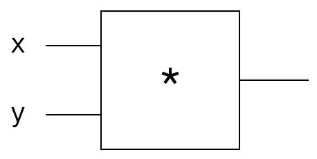

# Hacker's Guide to Neural Networks

## Chapter 1: Real-Valued Circuits

### Base Case: Single Gate in the Circuit



```python
def forwardMultiplyGate(x,y):
  return x*y

assert(forwardMultiplyGate(-2,3) == -6)
```

$$
f(x,y) = xy
$$

* In this example: the gate takes two inputs and produces a **single** output

#### The Goal

The problem looks like this:

1. We provide the circuit specific input values
2. The circuit computes the output value
3. *How do you change the input slightly to increase the output?* 

#### Strategy #1: Random Local Search

* We can easily "forward" (i.e. compute the output) of the circuit for any `x` and `y`, so we can randomly tweak `x` and `y` and keep track of the best tweak.

  ```python
  import numpy as np
  
  best_out = float('-inf')
  tweak_amount = 0.01
  num_iter = 100
  
  # inputs
  x, y = -2, 3
  # keeping track of best inputs
  best_x, best_y = x, y
  
  for i in range(num_iter):
      x_try = x + tweak_amount * (np.random.random() * 2 - 1) # tweak x a bit
      y_try = y + tweak_amount * (np.random.random() * 2 - 1) # tweak y a bit
      out = forwardMultiplyGate(x_try, y_try)
      if out > best_out:
          best_out = out
          best_x, best_y = x_try, y_try
  ```

* This strategy works, but it is inefficient

  * How would you do this with millions of inputs?

#### Strategy #2: Numerical Gradient

* *Intuition*: Imagine taking the output value from the circuit and tugging on it in the positive direction. This induces forces on the inputs `x` and `y`. These forces tell us how to change `x` and `y` to increase the output value

> The derivative can be thought of as a force on each input as we pull on the output to become higher.

* Idea: rather than looking backwards through the circuit, change the input slightly and see how the output changes. This is the derivative
  $$
  \frac{\partial f(x,y)}{\partial x} = \frac{f(x+h,y) - f(x,y)}{h}
  $$
  where $h$ is small (the tweak amount).

  * Numerator on the RHS measures the difference in the output due to the tweak of the input
  * The denominator on the RHS normalizes the difference by the arbitrary tweak amount

  * On the LHS of the above, it is not division. The entire entity is one thing: the partial derivative (i.e. the derivative of f(x,y) w.r.t. x). The RHS is division.

  ```python
  x, y = -2, 3
  out = forwardMultiplyGate(x, y)
  h = 0.0001
  
  # compute the derivative wrt x
  xph = x + h
  out2 = forwardMultiplyGate(xph,y)
  x_derivative = (out2 - out) / h
  # compute the derivative wrt y
  yph = y + h
  out3 = forwardMultiplyGate(x,yph)
  y_derivative = (out3 - out) / h
  ```

  * Ideally h would be infinitesimally small

> The derivative with respect to some input can be computed by tweaking that input by a small amount and observing the change on the output value.

* The **gradient** is made up of the derivatives of all the inputs concatenated in a vector.

* If we let the inputs respond to the tug by following the gradient a tinay amount (i.e. we just add the derivative on top of every input), we increase the output value:

  ```python
  step_size = 0.01
  out = forwardMultiplyGate(x,y)
  x = x + step_size * x_derivative
  y = y + step_size * y_derivative
  out_new = forwardMultiplyGate(x,y)
  ```

  * Do not need to try random search: the gradient is the direction of steepest increase. 
  * Evaluation of the derivative above only required three evaluations of the forward pass
    * Instead of hundreds for random search.
    * derivative provides the best tug one can hope for

* **Bigger step is not always better**: The math is for infinitesimal step sizes. For large steps, all bets are off. We hope that the function is smooth enough such that the step sizes we take work.

* **Hill-climbing analogy**: Like walking up a hill blindfolded: shuffle your feet in the direction of steepest ascent, but if you take a large step, you might fall off a cliff.

### Strategy #3: Analytic Gradient

