# TensorFlow In Action

## Chapter 1: The amazing world of TensorFlow

* Machine learning is the gatekepper that lets you cross from the world of data into the realm of information (e.g. actionable insights, useful patterns), bya llowing machines to learn from data.
* What is machine learning?
  * the process of training a computational model to predict some output given the data

### What is TensorFlow

* In its most raw form, TensorFlow provides three basic entities:
  * `tf.Variable`: a mutable data structure that can be used to store model parameters
  * `tf.Tensor`: immutable data structure that can be used to record data and interim and final ouputs of the model
  * `tf.Operation`: various operations provided in TensorFlow that are used to implement actual algorithms (e.g. matrix multiplication)
* Usually do not work at this level but rather use a higher level API such as Keras. 
* When a model is built, TensorFlow creates a data-flow graph and identifies hardware to execute on (e.g. GPU). 
* Tensorboard is a visualization tool to track the model as it trains.
* `SavedModel` used to save and store model
* TensorFlow serving helps deploy trained models and implement an API.

### CPU vs GPU

* CPUs can execute complex sequences of instructions very fast at a small scale (e.g. 8 cores in parallel)
* GPUs are good at executing basic instructions, typically slower than CPUs, but runs at a much larger scale (e.g. thousands of cores in parallel)

### When and when not to use TensorFlow?

#### When to use TensorFlow?

* Prototyping deep learning models
* Implementing models (including non-deep learning) that can run faster on optimized hardware
* Productionized Models / Seriving on cloud
* Monitoring models during training
* Creating heavy-duty data pipelines

#### When not to use TensorFlow?

* Implementing traditional machine learning models. Instead consider:
  * scikit-learn
  * xgboost
  * rapids.ai
* Manipulating and analyzing small-scale structured data
  * If the data can fit in memory, use Pandas or Numpy
* Creating complex natural language processing (NLP) pipelines

### What will this book teach you?

* TensorFlow fundamentals
* Deep learning algorithms
* Monitoring and optimization

### Who is this book for?

* Important question is **not** "how do I use TensorFlow to solve my problem?" but "how do I use TensorFlow effectively to solve my problem?"
* Effective solution:
  * minimizing lines of code without sacrificing readability
  * using latest and greatest features
  * utilizing optimization whenever possible
    * avoid loops
    * use vectorization
* This book: "enabling the reader to write effective TensorFlow solutions"

### Summary

* TensorFlow is an end-to-end machine learning framework that provides an ecosystem facilitating model prototyping, model building, model monitoring and model serving and more.

## Chapter 2: TensorFlow 2

* Tensorflow also features:
  * probabilistic machine learning (tensorflow probability)
  * computer graphics related computations
  * TensorFlow hub to get pre-trained models
  * TensorBoard for visualization/debugging

### TensorFlow 2 vs TensorFlow 1

* A multi-layer perceptron (MLP) is a neural network with an input layer, one or more hidden layers and an output layer, a.k.a. a fully connected network

* Example:

  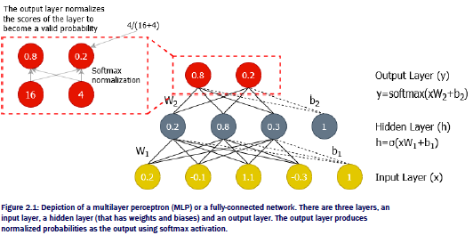

  ```python
  import numpy as np
  import tensorflow as tf
  
  x = np.random.normal(size=[1,4]).astype('float32')
  
  init = tf.keras.initializers.RandomNormal()
  
  w1 = tf.Variable(init(shape=[4,3]))
  b1 = tf.Variable(init(shape=[1,3]))
  
  w2 = tf.Variable(init(shape=[3,2]))
  b2 = tf.Variable(init(shape=[1,2]))
  
  @tf.function
  def forward(x, W, b, act):
      return act(tf.matmul(x,W)+b)
  
  # computing h
  h = forward(x, w1, b1, tf.nn.sigmoid)
  #computing y
  y = forward(h, w2, b2, tf.nn.softmax)
  ```

  * `tf.Variable` are used for weights and biases. Requires an initializer
  * input `x` is a normal numpy array
  * `@tf.function` wrapper tells Python there is tensorflow code
  * `act` is the nonlinearity, e.g. tf.nn.sigmoid
  * `tf.matmul(x, W) + b` performs the linear transformation
  * The intermediate values `h` and `y` are of type `tf.Tensor`

#### How does TensorFlow operate under the hood?

* In the previous example, TensorFlow is 

  * defining a data-flow (computation) graph
  * executing the graph 

* TensorFlow 2 uses *imperative style execution*: declaration (defining the graph) and execution happen simultaneously. This is also known as *eagerly executing* code. 

* A data-flow graph is a DAG where edges are data and nodes are operations.

  * Example for `h = xW + b`

  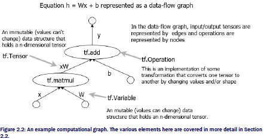

* TensorFlow knows to create the data-flow graph by the `@tf.function` decorator

  * This feature is known as AutoGraph
    * AutoGraph useful when many repeated operations
    * If many different operations, can slow you down due to overhead of generating the graph
    * For loops are unrolled, so can run out of memory
    * numpy arrays and Python lists will be converted to tf.constant objects

  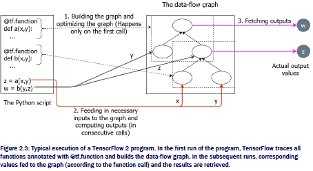

#### Visiting an old friend: TensorFlow 1

* Same example in TensorFlow 1

  ```python
  import numpy as np
  import tensorflow as tf
  
  x = tf.placeholder(shape=[1,4], dtype=tf.float32)
  
  w1 = tf.Variable(tf.initializers.truncated_normal()(shape=[4,3]), dtype=tf.float32)
  b1 = tf.Variable(tf.initializers.truncated_normal()(shape=[1,3]), dtype=tf.float32)
  
  w2 = tf.Variable(tf.initializers.truncated_normal()(shape=[3,2]), dtype=tf.float32)
  b2 = tf.Variable(tf.initializers.truncated_normal()(shape=[1,2]), dtype=tf.float32)
  
  h = tf.matmul(x,w1) + b1
  h = tf.nn.sigmoid(h)
  
  y = tf.matmul(x,w2) + b2
  y = tf.nn.softmax(y)
  
  with tf.Session() as sess:
      sess.run(tf.global_variables_initializers())
      res = sess.run(y, feed_dict={x: np.random.normal(size=[1,4])})
      print(res)
  ```

  * Clear distinction between graph definition and graph execution
    * prior to context manager: graph definition
    * in context manager: graph execution
  * In the above: `h` and `y` are symbolic as are variables. `res` is the actual output value
    * Need to initialize variables when executing the graph
  * TensorFlow 1 uses *declarative graph based execution*. 
    * First define data-flow graph using symbolic elements (e.g. placeholder inputs, variables) 
    * Explicitly write code to obtain or evaluate results from the graph
      * Feed in values to the previously defined symbolic elements

  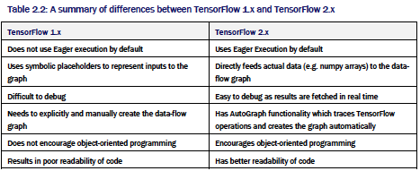

### Building blocks in TensorFlow

* In TensorFlow 2, there are three major elements:
  * `tf.Variable`: e.g. `w1`, `b1`
  * `tf.Tensor`: e.g. `h`, `y`
  * `tf.Operation`: e.g. `tf.matmul`

#### Understanding `tf.Variable`

* A typical ML model has two types of data:
  * model parameters, which change as the model is optimized
  * outputs of the model that are static given the input data and model parameters

* `tf.Variable` is ideal for defining model parameters which are initialized and then optimized.

* `tf.Variable` must have three attributes:

  * a `shape`
  * an initial value
  * a data-type

* Example definition: `tf.Variable(initial_value=None, trainable=None, dtype=None)`

  * `initial_value` contains the initial value, usually provided by `tf.keras.initializers`
    * E.g. `tf.keras.initializers.RandomUniform()([4,3])`
  * `trainable`: accepts boolean to determine if value can change during optimization
  * `dtype` determines the data type of the data contained in the variable

* Example: 1-D length 4 constant value of 2:

  `tf.Variable(tf.constant(2.0, shape=[4]), dtype='float32')`

* Can also define from a bumpy array

  `tf.Variable(np.ones(shape=[4,3]), dtype='float32')`

* Use `tf.keras.initializers`

  `tf.Variable(tf.keras.initializers.RandomNormal()(shape=[3,4,5]), dtype='float32')`

* When printing a `tf.Variable`, see:

  * name of the variable
  * shape of the variable
  * data type of the variable
  * the initial value of the variable

* Can convert `tf.Variable` to numpy array: `arr = v1.numpy()` where v1 is of type `tf.Variable`

* Can change the value of elements of a variable of type `tf.Variable`

  ```python
  v = tf.Variable(np.zeros(shape=[4,3]), dtype='float32')
  v = v[0,2].assign(1)
  v = v[2:,1:].assign([[3,3],[3,3]])
  ```

* Exercise: create a `tf.Variable` of type `int16` with values ``[[1,2,3],[4,3,2]]`

  ```python
  ex2 = tf.Variable(np.array([[1,2,3],[4,3,2]]), dtype='int16')
  ```

  

#### Understanding tf.Tensor

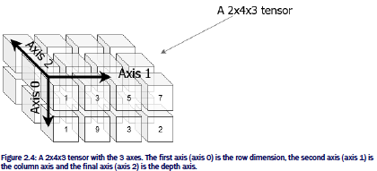

* `tf.Variable` is a mutable data structure whereas `tf.Tensor` is an immutable data structure

  * Can define a constant or the result of an operation on another `tf.Tensor` or `tf.Variable`

* Exercise: Create a `tf.Tensor` of size [4,1,5] that's randomly initialized from a normal distribution

  ```python
  ex3 = tf.constant (np.random.normal(size=[4,1,5]), dtype='float32')
  ```

#### Understanding `tf.Operation`

* Arithmetic and logical comparisons:

  ```python
  import tensorflow as tf
  import numpy as np
  
  a = tf.constant(4, shape=[4], dtype='float32')
  b = tf.constant(2, shape=[4], dtype='float32')
  
  # Arithmetic
  c = a+b
  d = a*b # Element-wise multiplication
  
  a2 = tf.constant([[1,2,3],[4,5,6]])
  b2 = tf.constant([[5,4,3],[3,2,1]])
  
  # element-wise comparison
  # returns boolean tf.Tensor
  equal_check = (a==b)
  leq_check = (a<=b)
  ```

* Reductions

  ```python
  # reductions
  a = tf.constant(np.random.normal(size=[5,4,3]), dtype='float32')
  
  # sum on all elements
  red_a1 = tf.reduce_sum(a)
  
  # element-wise product of each row
  red_a2 = tf.reduce_prod(a, axis=0) # result is of size=[4,3]
  
  # get the minimum over multiple axes
  red_a3 = tf.reduce_min(a, axis=[0,1]) # result is of size=[3]
  ```

  * When performing a reduction on a specific dimension, you lose that dimension

  * Can use `keepdims` parameter if you need to maintain that axis/dimension

    ```python
    # reducing with keepdims=False
    red_a4 = tf.reduce_min(a, axis=1) # result is of size=[5,3]
    # reducing with keepdims=True
    red_a5 = tf.reduce_min(a, axis=1, keepdims=True) # result is of size [5,1,3]
    ```

  * Other useful reductions:
    * `tf.argmax`
    * `tf.argmin`
    * `tf.cumsum`
    * `tf.reduce_mean`

* Exercise: Given an array `[[0.5, 0.2, 0.7], [0.2, 0.3, 0.4], [0.9, 0.1, 0.1]]`, use `tf.reduce_mean` to compute the mean of each column

  ```python
  a = tf.constant(np.array([[0.5, 0.2, 0.7],[0.2, 0.3, 0.4], [0.9, 0.1, 0.1]]), dtype='float32')
  col_mean = tf.reduce_mean(a, axis=0)
  ```

### Neural network related computations in TensorFlow

#### Matrix Multiplication

* `tf.matmul()` performs matrix multiplication

* If using `tf.matmul(a,b)` on two tensors, the dimensions of `a` and `b` must be identical except for the the last two axes. 

  * E.g. `a` has size `[3,5,7]` and `b` has size `[3,7,8]`. The result is `[3,5,8]`
  * E.g. a `[512,512,3]` image and `[3,1]` weight vector to turn to gray scale leads to `[512,512,1]` image

* Use `tf.squeeze()` to remove any dimensions that are of size one.

  ```python
  # Image example
  from PIL import Image
  import tensorflow as tf
  import numpy as np
  
  x_rgb = np.array(Image.open('lena.jpg')).astype('float32')
  x_rgb = tf.constant(x_rgb)
  
  grays = tf.constant([[0.3], [0.59], [0.11]]) # note need it to be [3,1] and not [3]
  
  x = tf.matmul(x_rgb, grays)
  x = tf.squeeze(x)
  ```

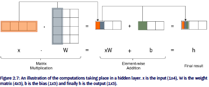

#### Convolution operation

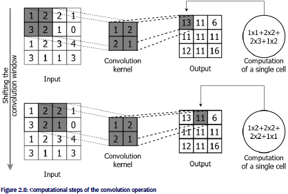

* `tf.nn.convolution()` to perform convolutions

  ```python
  # assume x is a numpy of the lenna image of shape [512,512]
  y = tf.constant(x) # convert to tf.Tensor
  filter = tf.Variable(np.array([[-1,-1,-1],[-1,8,-1],[-1,-1,-1]])).astype('float32') # convolution filter
  y_reshaped = tf.reshape(y, [1,512,512,1])
  filter_reshaped = tf.reshape(filter, [3,3,1,1])
  y_conv = tf.nn.convolution(y_reshaped, filter_reshaped)
  ```

  * Need input and filter to have same **rank** (the number of dimensions). Also called a convolution kernel.
    * Note the difference between the use of **rank** of a matrix
  * For 2D convolutions, need both the input and the kernel to have rank 4
    * For the input, need to add a dimension at the beginning representing the batch size, and a dimension at the end representing the channels (e.g. RGB)
      * In the above example want `[1,512,512,1]`
        * use `tf.reshape(x, [1,512,512,1])` in this case
    * For the kernel, add two dimensions on the end representing incoming channels and outgoing channels respectively
      * In the above example want `[3,3,1,1]`
        * use `tf.reshape(x, [3,3,1,1])` in this case

#### Pooling operation

* Pooling (or sub-sampling) is commonly used in convolutional neural networks to reduce the size of the output so less parameters can be used to learn from the data.

  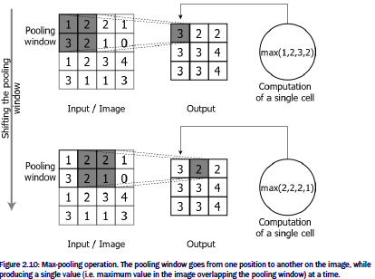

* There are no parameters in the pooling kernel.
* `tf.nn.max_pool()` for max pooling
  * E.g. `z_max = tf.nn.max_pool(y_conv, (1,2,2,1), strides=(1,2,2,1), padding='VALID')`
* `tf.nn.avg_pool()` for average pooling 
  * E.g. `z_avg = tf.avg_pool(y_conv, (1,2,2,1), strides=(1,2,2,1), padding='VALID')`
* Need to pass window dimensions: `[batch, height, width, channels]`

## Chapter 3: Keras & Data Retrieval in TensorFlow 2

* Keras is a sub-library of TensorFlow that provides a high-level API. 

### Keras model building APIs

* Can import Keras using `import tensorflow.keras`

* Keras has three main APIs:

  * Sequential API
  * Functional API
  * Sub-classing API

  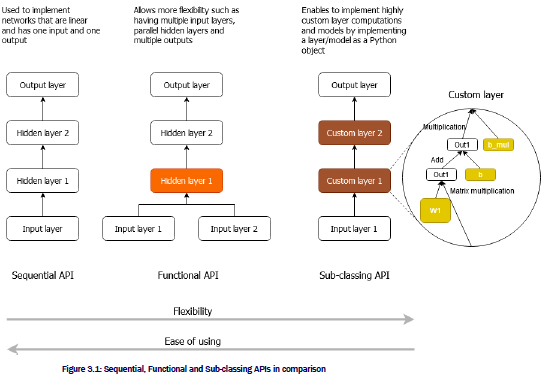

#### Introducing the dataset

Looking at the Iris dataset

```python
import requests
import pandas as pd
import tensorflow as tf

url = 'https://archive.ics.uci.edu/ml/machine-learning-databases/iris/iris.data'
r = requests.get(url)

# writing data to file
with open('iris.data', 'wb') as f:
    f.write(r.content)

iris_df = pd.read_csv('iris.data', header=None)

iris_df.columns = ['sepal_length', 'sepal_width', 'petal_width', 'petal_length', 'label']

# look at beginning of table
# iris_df.head() 

iris_df['label'] = iris_df['label'].map({'Iris-setosa':0, 'Iris-versicolor':1, 'Iris-virginica':2})

iris_df = iris_df.sample(frac=1.0, random_state=4321)
x = iris_df[['sepal_length', 'sepal_width', 'petal_width', 'petal_length']]
x = x - x.mean(axis=0)
y = tf.one_hot(iris_df['label'], depth=3)
```

* Shuffling is important
  * want each batch to have a good mix of classes
* one-hot encoded the output
  * 0 -> [1, 0, 0]
  * 1 -> [0, 1, 0]
  * 2 -> [0, 0, 1]

#### The Sequential API

* Example:

  * input layer with 4 features 
  * a 32 node hidden layer
  * a 16 node hidden layer
  * a 3 node output layer

* The number of nodes in each layer is a hyperparameter 

  * Consider using hyperparameter optimization

  ```python
  # Import necessary modules and classes
  from tensorflow.keras.layers import Dense
  from tensorflow.keras.models import Sequential
  import tensorflow.keras.backend as K
  
  K.clear_session() # clear the TensorFlow computational graph before creating the model
  # Defining the model with the Sequential API
  model = Sequential([
      Dense(32, activation='relu', input_shape=(4,)),
      Dense(15, activation='relu'),
      Dense(3, activation='softmax')
  ])
  ```

* Create sequential model using `Sequential` object and passing a sequence of layers, i.e. `Dense`

* A layer encapsulates typical reuseable computations

* The `Dense` layer computes `h = activation(xW + b)` where the output is `h` and input is `x`. Important parameters

  * number of hidden units
  * non-linear activation

* In the first layer, pass `input_shape` which determines the shapes of the subsequent layers

  * In the above, saying that the input will be of shape `[None, 4]` 
    * Although only specified 4, Keras automatically adds an unspecified dimension, i.e. `None` 
    * The added dimension represents the batch dimension of the input
      * Having it as `None` leaves it unspecified so that one can pass an arbitrary number of examples
    * 4 represents the feature dimension

* `relu` non-linearity: $y = \max(0,x)$

* `softmax` non-linearity: $y_{i} = \frac{x_{i}}{\sum x_{j}}$ (so it returns a vector the same length as the input)

  * Can interpret as a probability distribution

* After model specification, need model compilation

  ```python
  model.compile(loss='categorical_crossentropy', optimizer='adam', metrics=['acc'])
  ```

  * loss function
  * optimizer
  * metric

* Inspect model with `model.summary()`

* Train model with `fit()` function

  ```python
  model.fit(x, y, batch_size=64, epochs=25)
  ```

  * `fit` main arguments are
    * `x`: Data features
    * `y`: Data labels (one-hot encoded)
    * `batch_size` (optional): number of data points in a single batch
    * `epochs` (optional): number of times repeating the datasets during model training

##### Reproducibility in machine learning

* Consider setting random seed to be able to reproduce results

#### The Functional API

```python
from tensorflow.keras.layers import Input, Dense, Concatenate
from tensorflow.keras.models import Model

inp1 = Input(shape=(4,))
inp2 = Input(shape=(2,))

out1 = Dense(16, activation='relu')(inp1)
out2 = Dense(16, activation='relu')(inp2)

out = Concatenate(axis=1)([out1, out2])
out = Dense(16, activation='relu')(out)
out = Dense(3, activation='softmax')(out)

model = Model(inputs=[inp1, inp2], outputs=out)
model.compile(loss='categorical_crossentropy', optimizer='adam', metrics=['acc'])
model.fit([x, x_pca], y, batch_size=64, epochs=10)
```

* In the functional API, need to explicitly have `Input` layer. 
* `Concatenate` along `axis=1` since `axis=0` is the batch axis
* Need to create a `Model` object that specifies the inputs and outputs
* Can use `tf.keras.utils.plot_model(model)` to plot model
  * `to_file` argument to save to file
  * `show_shapes` argument to include sizes

#### The Sub-Classing API

* Motivating example: rather than use non-linear activations of the form `h=a(xW + b)`, try `h = a([xW+b]b_mul)` where `b_mul` is a multiplicative bias

  ```python
  from tensorflow.keras import layers
  
  class MulBiasDense(layers.Layer):
      
      # Defines various hyperparameters
      def __init__(self, units=32, input_dim=32, activation=None):
          super(MulBiasDense, self).__init__()
          self.units = units
          self.activation = activation
          
      # Defines parameters as tf.Variable objects    
      def build(self, input_shape):
          self.w = self.add_weight(shape=(input_shape[-1], self.units),
                                  initializer='glorot_uniform',
                                  trainable=True)
          self.b = self.add_weight(shape=(self.units,),
                                  initializer='glorot_uniform',
                                  trainable=True)
          self.b_mul = self.add_weight(shape=(self.units,),
                                      initializer='glorot_uniform',
                                      trainable=True)
      
      # Defines computation for the layer
      def call(self, inputs):
          out = (tf.matmul(inputs, self.w) + self.b) * self.b_mul
          return layers.Activation(self.activation)(out)
  ```

* No existing Keras layer, so need to build our own

* sub-classing comes from the software engineering concept of *inheritance*. 

  * super-class provides general functionality for a type of object (e.g. `layer`)
  * sub-class (or inherit) from the super-class to create a more specific layer to achieve desired functionality

* When sub-classing a `layer`, there are three important functions to override from the `Layer` base class:

  * `__init__()`: initializes the layer with any parameters it accepts
  * `build()`: this is where the parameters of the model will be created
  * `call()`: This funciton defines the computations that need to happen during the forward pass 
  * May also consider:
    * `compute_output_shape()`: Determines the output shape of the layer
    * `get_config()`: used to save model to disk

  ```python
  from tensorflow.keras.layers import Input, Dense, Concatenate
  from tensorflow.keras.models import Model
  import tensorflow.keras.backend as K
  import tensorflow as tf
  
  K.clear_session()
  
  inp = Input(shape=(4,))
  out = MulBiasDense(units=32, activation='relu')(inp)
  out = MulBiasDense(units=16, activation='relu')(out)
  out = Dense(3, activation='softmax')(out)
  
  model = Model(inputs=inp, outputs=out)
  model.compile(loss='categorical_crossentropy', optimizer='adam', metrics=['acc'])
  ```

  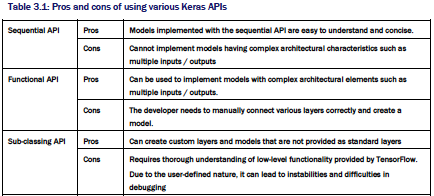

* Exercise: IF you have a fully connected network with a single input layer and two output layers, which API is best?
  * Answer: Functional API

### Retrieving data for TensorFlow/Keras models

* Three popular methods for data retrieval:
  * `tf.data` API
  * Keras data generators
  * `tensorflow-datasets`

#### `tf.data` API

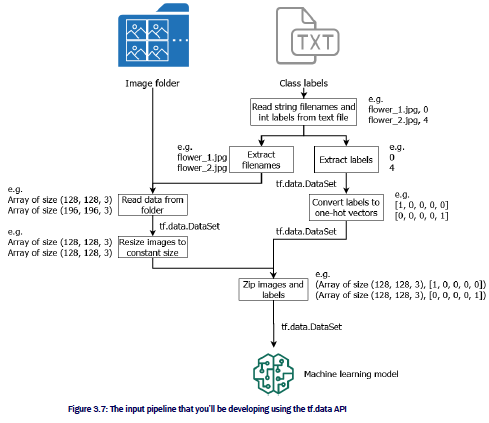

* Example: flower dataset

  ```python
  import os
  import tensorflow as tf
  
  data_dir = os.path.join('flower_color_images','flower_images','flower_images') + os.path.sep
  csv_ds = tf.data.experimental.CsvDataset(
      os.path.join(data_dir,'flower_labels.csv'), record_defaults=("", -1), header=True
  )
  
  fname_ds = csv_ds.map(lambda a,b: a)
  label_ds = csv_ds.map(lambda a,b: b)
  
  def get_image(file_path):
      
      # loading the image from disk as a byte string
      img = tf.io.read_file(data_dir + file_path)
      # conver the compressed string to a 3D uint8 tensor
      img = tf.image.decode_png(img, channels=3)
      # use 'convert_image_dtype' to convert to floats in the range [0,1]
      img = tf.image.convert_image_dtype(img, tf.float32)
      # resize the image to the desired size
      return tf.image.resize(img, [64, 64])
  
  # to get image tensors from file names
  image_ds = fname_ds.map(get_image)
  
  # convert labels to one-hot encoded vectors
  label_ds = label_ds.map(lambda x: tf.one_hot(x, depth=10))
  
  # Need to keep labels with images
  data_ds = tf.data.Dataset.zip((image_ds, label_ds))
  
  # shuffle the dataset
  data_ds = data_ds.shuffle(buffer_size=20)
  
  # batch data
  # e.g. a batch of 5 produces [5,64,64,3] tensor
  data_ds = data_ds.batch(5)
  ```

* the above resulting dataset behaves like a normal python iterator

* can use the iterator directly with `fit`

  * `model.fit(data_ds, epochs=10)`

* Exercise: remove invalid data (e.g. `-1`) from dataset using lambdas

  * Answer: `label_ds.map(lambda x: x if x != -1)` or `labels_ds.filter(lambda x: x != -1)` using `tf.Dataset.filter()` method

#### Keras DataGenerators

* Another approach is to use the data generators provided in Keras:
  * `tf.keras.preprocessing.image.ImageDataGenerator`
  * `tf.keras.preprocessing.sequence.TimeSeriesDataGenerator` 

* Not as flexible as the `tf.data` API

  ```python
  rom tensorflow.keras.preprocessing.image import ImageDataGenerator
  import os
  import pandas as pd
  
  data_dir = os.path.join('flower_color_images','flower_images','flower_images')
  
  img_gen = ImageDataGenerator(
      samplewise_center=True, rotation_range=30,
      brightness_range=(-0.2,0.2))
  
  labels_df = pd.read_csv(os.path.join(data_dir, 'flower_labels.csv'), header=0)
  
  gen_iter = img_gen.flow_from_dataframe(
      dataframe=labels_df, directory=data_dir,
      x_col='file', y_col='label',
      class_mode='raw', batch_size=2, target_size=(64,64))
  ```

#### `tensorflow-datasets` package

* `tensorflow-datasets` is a separate package from TensorFlow

* Provides many common datasets

  ```python
  import tensorflow_datasets as tfds
  
  # list datasets
  tfds.list_builders()
  
  # download CIFAR10 dataset
  data, info = tfds.load('cifar10', with_info=True)
  
  # data is a dictionary with keys `train` and `test`
  # want to batch
  train_ds = data['train'].batch(16)
  
  # train_ds is a dictionary with keys 'image' and 'label'
  # need to have it in a tuple format with one-hot encoded labels
  def format_data(x):
    return (x['image'], tf.one_hot(x['label'], depth=10))
  
  train_ds = train_ds.map(format_data)
  ```

* Exercise: import `caltech101` dataset
  * Answer: `data, info = tfds.load('caltech101', with_info=True)`

## Chapter 4: Dipping toes in Deep Learning


