# TensorFlow In Action

## Chapter 1: The amazing world of TensorFlow

* Machine learning is the gatekepper that lets you cross from the world of data into the realm of information (e.g. actionable insights, useful patterns), bya llowing machines to learn from data.
* What is machine learning?
  * the process of training a computational model to predict some output given the data

### What is TensorFlow

* In its most raw form, TensorFlow provides three basic entities:
  * `tf.Variable`: a mutable data structure that can be used to store model parameters
  * `tf.Tensor`: immutable data structure that can be used to record data and interim and final ouputs of the model
  * `tf.Operation`: various operations provided in TensorFlow that are used to implement actual algorithms (e.g. matrix multiplication)
* Usually do not work at this level but rather use a higher level API such as Keras. 
* When a model is built, TensorFlow creates a data-flow graph and identifies hardware to execute on (e.g. GPU). 
* Tensorboard is a visualization tool to track the model as it trains.
* `SavedModel` used to save and store model
* TensorFlow serving helps deploy trained models and implement an API.

### CPU vs GPU

* CPUs can execute complex sequences of instructions very fast at a small scale (e.g. 8 cores in parallel)
* GPUs are good at executing basic instructions, typically slower than CPUs, but runs at a much larger scale (e.g. thousands of cores in parallel)

### When and when not to use TensorFlow?

#### When to use TensorFlow?

* Prototyping deep learning models
* Implementing models (including non-deep learning) that can run faster on optimized hardware
* Productionized Models / Seriving on cloud
* Monitoring models during training
* Creating heavy-duty data pipelines

#### When not to use TensorFlow?

* Implementing traditional machine learning models. Instead consider:
  * scikit-learn
  * xgboost
  * rapids.ai
* Manipulating and analyzing small-scale structured data
  * If the data can fit in memory, use Pandas or Numpy
* Creating complex natural language processing (NLP) pipelines

### What will this book teach you?

* TensorFlow fundamentals
* Deep learning algorithms
* Monitoring and optimization

### Who is this book for?

* Important question is **not** "how do I use TensorFlow to solve my problem?" but "how do I use TensorFlow effectively to solve my problem?"
* Effective solution:
  * minimizing lines of code without sacrificing readability
  * using latest and greatest features
  * utilizing optimization whenever possible
    * avoid loops
    * use vectorization
* This book: "enabling the reader to write effective TensorFlow solutions"

### Summary

* TensorFlow is an end-to-end machine learning framework that provides an ecosystem facilitating model prototyping, model building, model monitoring and model serving and more.

## Chapter 2: TensorFlow 2

* Tensorflow also features:
  * probabilistic machine learning (tensorflow probability)
  * computer graphics related computations
  * TensorFlow hub to get pre-trained models
  * TensorBoard for visualization/debugging

### TensorFlow 2 vs TensorFlow 1

* A multi-layer perceptron (MLP) is a neural network with an input layer, one or more hidden layers and an output layer, a.k.a. a fully connected network

* Example:

  

  ```python
  import numpy as np
  import tensorflow as tf
  
  x = np.random.normal(size=[1,4]).astype('float32')
  
  init = tf.keras.initializers.RandomNormal()
  
  w1 = tf.Variable(init(shape=[4,3]))
  b1 = tf.Variable(init(shape=[1,3]))
  
  w2 = tf.Variable(init(shape=[3,2]))
  b2 = tf.Variable(init(shape=[1,2]))
  
  @tf.function
  def forward(x, W, b, act):
      return act(tf.matmul(x,W)+b)
  
  # computing h
  h = forward(x, w1, b1, tf.nn.sigmoid)
  #computing y
  y = forward(h, w2, b2, tf.nn.softmax)
  ```

  * `tf.Variable` are used for weights and biases. Requires an initializer
  * input `x` is a normal numpy array
  * `@tf.function` wrapper tells Python there is tensorflow code
  * `act` is the nonlinearity, e.g. tf.nn.sigmoid
  * `tf.matmul(x, W) + b` performs the linear transformation
  * The intermediate values `h` and `y` are of type `tf.Tensor`

#### How does TensorFlow operate under the hood?

* In the previous example, TensorFlow is 

  * defining a data-flow (computation) graph
  * executing the graph 

* TensorFlow 2 uses *imperative style execution*: declaration (defining the graph) and execution happen simultaneously. This is also known as *eagerly executing* code. 

* A data-flow graph is a DAG where edges are data and nodes are operations.

  * Example for `h = xW + b`

  

* TensorFlow knows to create the data-flow graph by the `@tf.function` decorator

  * This feature is known as AutoGraph
    * AutoGraph useful when many repeated operations
    * If many different operations, can slow you down due to overhead of generating the graph
    * For loops are unrolled, so can run out of memory
    * numpy arrays and Python lists will be converted to tf.constant objects

  

#### Visiting an old friend: TensorFlow 1

* Same example in TensorFlow 1

  ```python
  import numpy as np
  import tensorflow as tf
  
  x = tf.placeholder(shape=[1,4], dtype=tf.float32)
  
  w1 = tf.Variable(tf.initializers.truncated_normal()(shape=[4,3]), dtype=tf.float32)
  b1 = tf.Variable(tf.initializers.truncated_normal()(shape=[1,3]), dtype=tf.float32)
  
  w2 = tf.Variable(tf.initializers.truncated_normal()(shape=[3,2]), dtype=tf.float32)
  b2 = tf.Variable(tf.initializers.truncated_normal()(shape=[1,2]), dtype=tf.float32)
  
  h = tf.matmul(x,w1) + b1
  h = tf.nn.sigmoid(h)
  
  y = tf.matmul(x,w2) + b2
  y = tf.nn.softmax(y)
  
  with tf.Session() as sess:
      sess.run(tf.global_variables_initializers())
      res = sess.run(y, feed_dict={x: np.random.normal(size=[1,4])})
      print(res)
  ```

  * Clear distinction between graph definition and graph execution
    * prior to context manager: graph definition
    * in context manager: graph execution
  * In the above: `h` and `y` are symbolic as are variables. `res` is the actual output value
    * Need to initialize variables when executing the graph
  * TensorFlow 1 uses *declarative graph based execution*. 
    * First define data-flow graph using symbolic elements (e.g. placeholder inputs, variables) 
    * Explicitly write code to obtain or evaluate results from the graph
      * Feed in values to the previously defined symbolic elements

  

### Building blocks in TensorFlow

* In TensorFlow 2, there are three major elements:
  * `tf.Variable`: e.g. `w1`, `b1`
  * `tf.Tensor`: e.g. `h`, `y`
  * `tf.Operation`: e.g. `tf.matmul`

#### Understanding `tf.Variable`

* A typical ML model has two types of data:
  * model parameters, which change as the model is optimized
  * outputs of the model that are static given the input data and model parameters

* `tf.Variable` is ideal for defining model parameters which are initialized and then optimized.

* `tf.Variable` must have three attributes:

  * a `shape`
  * an initial value
  * a data-type

* Example definition: `tf.Variable(initial_value=None, trainable=None, dtype=None)`

  * `initial_value` contains the initial value, usually provided by `tf.keras.initializers`
    * E.g. `tf.keras.initializers.RandomUniform()([4,3])`
  * `trainable`: accepts boolean to determine if value can change during optimization
  * `dtype` determines the data type of the data contained in the variable

* Example: 1-D length 4 constant value of 2:

  `tf.Variable(tf.constant(2.0, shape=[4]), dtype='float32')`

* Can also define from a bumpy array

  `tf.Variable(np.ones(shape=[4,3]), dtype='float32')`

* Use `tf.keras.initializers`

  `tf.Variable(tf.keras.initializers.RandomNormal()(shape=[3,4,5]), dtype='float32')`

* When printing a `tf.Variable`, see:

  * name of the variable
  * shape of the variable
  * data type of the variable
  * the initial value of the variable

* Can convert `tf.Variable` to numpy array: `arr = v1.numpy()` where v1 is of type `tf.Variable`

* Can change the value of elements of a variable of type `tf.Variable`

  ```python
  v = tf.Variable(np.zeros(shape=[4,3]), dtype='float32')
  v = v[0,2].assign(1)
  v = v[2:,1:].assign([[3,3],[3,3]])
  ```

* Exercise: create a `tf.Variable` of type `int16` with values ``[[1,2,3],[4,3,2]]`

  ```python
  ex2 = tf.Variable(np.array([[1,2,3],[4,3,2]]), dtype='int16')
  ```

  

#### Understanding tf.Tensor


* `tf.Variable` is a mutable data structure whereas `tf.Tensor` is an immutable data structure

  * Can define a constant or the result of an operation on another `tf.Tensor` or `tf.Variable`

* Exercise: Create a `tf.Tensor` of size [4,1,5] that's randomly initialized from a normal distribution

  ```python
  ex3 = tf.constant (np.random.normal(size=[4,1,5]), dtype='float32')
  ```

#### Understanding `tf.Operation`

* Arithmetic and logical comparisons:

  ```python
  import tensorflow as tf
  import numpy as np
  
  a = tf.constant(4, shape=[4], dtype='float32')
  b = tf.constant(2, shape=[4], dtype='float32')
  
  # Arithmetic
  c = a+b
  d = a*b # Element-wise multiplication
  
  a2 = tf.constant([[1,2,3],[4,5,6]])
  b2 = tf.constant([[5,4,3],[3,2,1]])
  
  # element-wise comparison
  # returns boolean tf.Tensor
  equal_check = (a==b)
  leq_check = (a<=b)
  ```

* Reductions

  ```python
  # reductions
  a = tf.constant(np.random.normal(size=[5,4,3]), dtype='float32')
  
  # sum on all elements
  red_a1 = tf.reduce_sum(a)
  
  # element-wise product of each row
  red_a2 = tf.reduce_prod(a, axis=0) # result is of size=[4,3]
  
  # get the minimum over multiple axes
  red_a3 = tf.reduce_min(a, axis=[0,1]) # result is of size=[3]
  ```

  * When performing a reduction on a specific dimension, you lose that dimension

  * Can use `keepdims` parameter if you need to maintain that axis/dimension

    ```python
    # reducing with keepdims=False
    red_a4 = tf.reduce_min(a, axis=1) # result is of size=[5,3]
    # reducing with keepdims=True
    red_a5 = tf.reduce_min(a, axis=1, keepdims=True) # result is of size [5,1,3]
    ```

  * Other useful reductions:
    * `tf.argmax`
    * `tf.argmin`
    * `tf.cumsum`
    * `tf.reduce_mean`

* Exercise: Given an array `[[0.5, 0.2, 0.7], [0.2, 0.3, 0.4], [0.9, 0.1, 0.1]]`, use `tf.reduce_mean` to compute the mean of each column

  ```python
  a = tf.constant(np.array([[0.5, 0.2, 0.7],[0.2, 0.3, 0.4], [0.9, 0.1, 0.1]]), dtype='float32')
  col_mean = tf.reduce_mean(a, axis=0)
  ```

### Neural network related computations in TensorFlow

#### Matrix Multiplication

* `tf.matmul()` performs matrix multiplication

* If using `tf.matmul(a,b)` on two tensors, the dimensions of `a` and `b` must be identical except for the the last two axes. 

  * E.g. `a` has size `[3,5,7]` and `b` has size `[3,7,8]`. The result is `[3,5,8]`
  * E.g. a `[512,512,3]` image and `[3,1]` weight vector to turn to gray scale leads to `[512,512,1]` image

* Use `tf.squeeze()` to remove any dimensions that are of size one.

  ```python
  # Image example
  from PIL import Image
  import tensorflow as tf
  import numpy as np
  
  x_rgb = np.array(Image.open('lena.jpg')).astype('float32')
  x_rgb = tf.constant(x_rgb)
  
  grays = tf.constant([[0.3], [0.59], [0.11]]) # note need it to be [3,1] and not [3]
  
  x = tf.matmul(x_rgb, grays)
  x = tf.squeeze(x)
  ```


#### Convolution operation


* `tf.nn.convolution()` to perform convolutions

  ```python
  # assume x is a numpy of the lenna image of shape [512,512]
  y = tf.constant(x) # convert to tf.Tensor
  filter = tf.Variable(np.array([[-1,-1,-1],[-1,8,-1],[-1,-1,-1]])).astype('float32') # convolution filter
  y_reshaped = tf.reshape(y, [1,512,512,1])
  filter_reshaped = tf.reshape(filter, [3,3,1,1])
  y_conv = tf.nn.convolution(y_reshaped, filter_reshaped)
  ```

  * Need input and filter to have same **rank** (the number of dimensions). Also called a convolution kernel.
    * Note the difference between the use of **rank** of a matrix
  * For 2D convolutions, need both the input and the kernel to have rank 4
    * For the input, need to add a dimension at the beginning representing the batch size, and a dimension at the end representing the channels (e.g. RGB)
      * In the above example want `[1,512,512,1]`
        * use `tf.reshape(x, [1,512,512,1])` in this case
    * For the kernel, add two dimensions on the end representing incoming channels and outgoing channels respectively
      * In the above example want `[3,3,1,1]`
        * use `tf.reshape(x, [3,3,1,1])` in this case

#### Pooling operation

* Pooling (or sub-sampling) is commonly used in convolutional neural networks to reduce the size of the output so less parameters can be used to learn from the data.

  

* There are no parameters in the pooling kernel.
* `tf.nn.max_pool()` for max pooling
  
  * E.g. `z_max = tf.nn.max_pool(y_conv, (1,2,2,1), strides=(1,2,2,1), padding='VALID')`
* `tf.nn.avg_pool()` for average pooling 
  
  * E.g. `z_avg = tf.avg_pool(y_conv, (1,2,2,1), strides=(1,2,2,1), padding='VALID')`
* Need to pass window dimensions: `[batch, height, width, channels]`

## Chapter 3: Keras & Data Retrieval in TensorFlow 2

* Keras is a sub-library of TensorFlow that provides a high-level API. 

### Keras model building APIs

* Can import Keras using `import tensorflow.keras`

* Keras has three main APIs:

  * Sequential API
  * Functional API
  * Sub-classing API

  

#### Introducing the dataset

Looking at the Iris dataset

```python
import requests
import pandas as pd
import tensorflow as tf

url = 'https://archive.ics.uci.edu/ml/machine-learning-databases/iris/iris.data'
r = requests.get(url)

# writing data to file
with open('iris.data', 'wb') as f:
    f.write(r.content)

iris_df = pd.read_csv('iris.data', header=None)

iris_df.columns = ['sepal_length', 'sepal_width', 'petal_width', 'petal_length', 'label']

# look at beginning of table
# iris_df.head() 

iris_df['label'] = iris_df['label'].map({'Iris-setosa':0, 'Iris-versicolor':1, 'Iris-virginica':2})

iris_df = iris_df.sample(frac=1.0, random_state=4321)
x = iris_df[['sepal_length', 'sepal_width', 'petal_width', 'petal_length']]
x = x - x.mean(axis=0)
y = tf.one_hot(iris_df['label'], depth=3)
```

* Shuffling is important
  * want each batch to have a good mix of classes
* one-hot encoded the output
  * 0 -> [1, 0, 0]
  * 1 -> [0, 1, 0]
  * 2 -> [0, 0, 1]

#### The Sequential API

* Example:

  * input layer with 4 features 
  * a 32 node hidden layer
  * a 16 node hidden layer
  * a 3 node output layer

* The number of nodes in each layer is a hyperparameter 

  * Consider using hyperparameter optimization

  ```python
  # Import necessary modules and classes
  from tensorflow.keras.layers import Dense
  from tensorflow.keras.models import Sequential
  import tensorflow.keras.backend as K
  
  K.clear_session() # clear the TensorFlow computational graph before creating the model
  # Defining the model with the Sequential API
  model = Sequential([
      Dense(32, activation='relu', input_shape=(4,)),
      Dense(15, activation='relu'),
      Dense(3, activation='softmax')
  ])
  ```

* Create sequential model using `Sequential` object and passing a sequence of layers, i.e. `Dense`

* A layer encapsulates typical reuseable computations

* The `Dense` layer computes `h = activation(xW + b)` where the output is `h` and input is `x`. Important parameters

  * number of hidden units
  * non-linear activation

* In the first layer, pass `input_shape` which determines the shapes of the subsequent layers

  * In the above, saying that the input will be of shape `[None, 4]` 
    * Although only specified 4, Keras automatically adds an unspecified dimension, i.e. `None` 
    * The added dimension represents the batch dimension of the input
      * Having it as `None` leaves it unspecified so that one can pass an arbitrary number of examples
    * 4 represents the feature dimension

* `relu` non-linearity: $y = \max(0,x)$

* `softmax` non-linearity: $y_{i} = \frac{x_{i}}{\sum x_{j}}$ (so it returns a vector the same length as the input)

  * Can interpret as a probability distribution

* After model specification, need model compilation

  ```python
  model.compile(loss='categorical_crossentropy', optimizer='adam', metrics=['acc'])
  ```

  * loss function
  * optimizer
  * metric

* Inspect model with `model.summary()`

* Train model with `fit()` function

  ```python
  model.fit(x, y, batch_size=64, epochs=25)
  ```

  * `fit` main arguments are
    * `x`: Data features
    * `y`: Data labels (one-hot encoded)
    * `batch_size` (optional): number of data points in a single batch
    * `epochs` (optional): number of times repeating the datasets during model training

##### Reproducibility in machine learning

* Consider setting random seed to be able to reproduce results

#### The Functional API

```python
from tensorflow.keras.layers import Input, Dense, Concatenate
from tensorflow.keras.models import Model

inp1 = Input(shape=(4,))
inp2 = Input(shape=(2,))

out1 = Dense(16, activation='relu')(inp1)
out2 = Dense(16, activation='relu')(inp2)

out = Concatenate(axis=1)([out1, out2])
out = Dense(16, activation='relu')(out)
out = Dense(3, activation='softmax')(out)

model = Model(inputs=[inp1, inp2], outputs=out)
model.compile(loss='categorical_crossentropy', optimizer='adam', metrics=['acc'])
model.fit([x, x_pca], y, batch_size=64, epochs=10)
```

* In the functional API, need to explicitly have `Input` layer. 
* `Concatenate` along `axis=1` since `axis=0` is the batch axis
* Need to create a `Model` object that specifies the inputs and outputs
* Can use `tf.keras.utils.plot_model(model)` to plot model
  * `to_file` argument to save to file
  * `show_shapes` argument to include sizes

#### The Sub-Classing API

* Motivating example: rather than use non-linear activations of the form `h=a(xW + b)`, try `h = a([xW+b]b_mul)` where `b_mul` is a multiplicative bias

  ```python
  from tensorflow.keras import layers
  
  class MulBiasDense(layers.Layer):
      
      # Defines various hyperparameters
      def __init__(self, units=32, input_dim=32, activation=None):
          super(MulBiasDense, self).__init__()
          self.units = units
          self.activation = activation
          
      # Defines parameters as tf.Variable objects    
      def build(self, input_shape):
          self.w = self.add_weight(shape=(input_shape[-1], self.units),
                                  initializer='glorot_uniform',
                                  trainable=True)
          self.b = self.add_weight(shape=(self.units,),
                                  initializer='glorot_uniform',
                                  trainable=True)
          self.b_mul = self.add_weight(shape=(self.units,),
                                      initializer='glorot_uniform',
                                      trainable=True)
      
      # Defines computation for the layer
      def call(self, inputs):
          out = (tf.matmul(inputs, self.w) + self.b) * self.b_mul
          return layers.Activation(self.activation)(out)
  ```

* No existing Keras layer, so need to build our own

* sub-classing comes from the software engineering concept of *inheritance*. 

  * super-class provides general functionality for a type of object (e.g. `layer`)
  * sub-class (or inherit) from the super-class to create a more specific layer to achieve desired functionality

* When sub-classing a `layer`, there are three important functions to override from the `Layer` base class:

  * `__init__()`: initializes the layer with any parameters it accepts
  * `build()`: this is where the parameters of the model will be created
  * `call()`: This funciton defines the computations that need to happen during the forward pass 
  * May also consider:
    * `compute_output_shape()`: Determines the output shape of the layer
    * `get_config()`: used to save model to disk

  ```python
  from tensorflow.keras.layers import Input, Dense, Concatenate
  from tensorflow.keras.models import Model
  import tensorflow.keras.backend as K
  import tensorflow as tf
  
  K.clear_session()
  
  inp = Input(shape=(4,))
  out = MulBiasDense(units=32, activation='relu')(inp)
  out = MulBiasDense(units=16, activation='relu')(out)
  out = Dense(3, activation='softmax')(out)
  
  model = Model(inputs=inp, outputs=out)
  model.compile(loss='categorical_crossentropy', optimizer='adam', metrics=['acc'])
  ```

  

* Exercise: IF you have a fully connected network with a single input layer and two output layers, which API is best?
  
  * Answer: Functional API

### Retrieving data for TensorFlow/Keras models

* Three popular methods for data retrieval:
  * `tf.data` API
  * Keras data generators
  * `tensorflow-datasets`

#### `tf.data` API


* Example: flower dataset

  ```python
  import os
  import tensorflow as tf
  
  data_dir = os.path.join('flower_color_images','flower_images','flower_images') + os.path.sep
  csv_ds = tf.data.experimental.CsvDataset(
      os.path.join(data_dir,'flower_labels.csv'), record_defaults=("", -1), header=True
  )
  
  fname_ds = csv_ds.map(lambda a,b: a)
  label_ds = csv_ds.map(lambda a,b: b)
  
  def get_image(file_path):
      
      # loading the image from disk as a byte string
      img = tf.io.read_file(data_dir + file_path)
      # conver the compressed string to a 3D uint8 tensor
      img = tf.image.decode_png(img, channels=3)
      # use 'convert_image_dtype' to convert to floats in the range [0,1]
      img = tf.image.convert_image_dtype(img, tf.float32)
      # resize the image to the desired size
      return tf.image.resize(img, [64, 64])
  
  # to get image tensors from file names
  image_ds = fname_ds.map(get_image)
  
  # convert labels to one-hot encoded vectors
  label_ds = label_ds.map(lambda x: tf.one_hot(x, depth=10))
  
  # Need to keep labels with images
  data_ds = tf.data.Dataset.zip((image_ds, label_ds))
  
  # shuffle the dataset
  data_ds = data_ds.shuffle(buffer_size=20)
  
  # batch data
  # e.g. a batch of 5 produces [5,64,64,3] tensor
  data_ds = data_ds.batch(5)
  ```

* the above resulting dataset behaves like a normal python iterator

* can use the iterator directly with `fit`

  * `model.fit(data_ds, epochs=10)`

* Exercise: remove invalid data (e.g. `-1`) from dataset using lambdas

  * Answer: `label_ds.map(lambda x: x if x != -1)` or `labels_ds.filter(lambda x: x != -1)` using `tf.Dataset.filter()` method

#### Keras DataGenerators

* Another approach is to use the data generators provided in Keras:
  * `tf.keras.preprocessing.image.ImageDataGenerator`
  * `tf.keras.preprocessing.sequence.TimeSeriesDataGenerator` 

* Not as flexible as the `tf.data` API

  ```python
  rom tensorflow.keras.preprocessing.image import ImageDataGenerator
  import os
  import pandas as pd
  
  data_dir = os.path.join('flower_color_images','flower_images','flower_images')
  
  img_gen = ImageDataGenerator(
      samplewise_center=True, rotation_range=30,
      brightness_range=(-0.2,0.2))
  
  labels_df = pd.read_csv(os.path.join(data_dir, 'flower_labels.csv'), header=0)
  
  gen_iter = img_gen.flow_from_dataframe(
      dataframe=labels_df, directory=data_dir,
      x_col='file', y_col='label',
      class_mode='raw', batch_size=2, target_size=(64,64))
  ```

#### `tensorflow-datasets` package

* `tensorflow-datasets` is a separate package from TensorFlow

* Provides many common datasets

  ```python
  import tensorflow_datasets as tfds
  
  # list datasets
  tfds.list_builders()
  
  # download CIFAR10 dataset
  data, info = tfds.load('cifar10', with_info=True)
  
  # data is a dictionary with keys `train` and `test`
  # want to batch
  train_ds = data['train'].batch(16)
  
  # train_ds is a dictionary with keys 'image' and 'label'
  # need to have it in a tuple format with one-hot encoded labels
  def format_data(x):
    return (x['image'], tf.one_hot(x['label'], depth=10))
  
  train_ds = train_ds.map(format_data)
  ```

* Exercise: import `caltech101` dataset
  
  * Answer: `data, info = tfds.load('caltech101', with_info=True)`

## Chapter 4: Dipping toes in Deep Learning

### Fully connected networks

* Example: autoencoder for image restoration

> Hyperparameter optimization trends:
>
> * optimizing a subset of hyper parameters to limit the exploration space (e.g. type of activation instead of number of hidden units)
> * Using robust optimizers, early stopping learning rate decay, etc. to stop overfitting
> * Using model specifications from published models that achieve state-of-the-art
> * Following rules of thumb such as reducing the output size as you go deeper into the network

#### Understanding the data

* The example is an unsupervised task, so just need the data.
* Using a final output layer of `tanh` so want data to be normalized in `[-1, 1]` 
* Want to reshape data to be a vector rather than 2D image
* Want to create corrupted images 
  * Create a mask using the binomial distribution with `n=1`
    * `n`: the number of trials
    * `p`: probability of success
    * `size`: the number of tests

#### Autoencoder model

* In supervised learning, the multilayer perceptron is trained to solve a classification problem
* In an autoencoder, the multilayer perceptron is trained to solve an unsupervised task (e.g. reconstruct the original image given a noisy/corrupted image)

> Supervised vs. unsupervised learning (model-based)
>
> * In supervised learning, each input has a corresponding label or continuous value(s) (e.g. bounding boxes). The model is trained to predict the correct label/value(s)
> * In unsupervised learning, the models are trained using unlabeled data. The training process varies depending on the final expected outcome. 
>   * For example, autoencoders are trained to reconstruct images as a pre-training step for image-based supervised learning. 

* Autoencoder has two phases of functionality:

  * Compression phase: compress an image into a compressed hidden (i.e. latent) representation
  * Reconstruction phase: reconstruct the original image from the hidden representation

  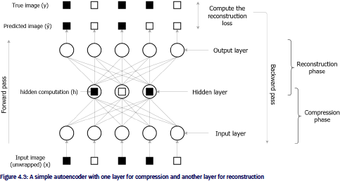

* When using an autoencoder to denoise, they are called denoising autoencoders
* Can't use accuracy metric in unsupervised learning
* Why use autoencoders?
  * Can learn unsupervised features that are useful for down-stream tasks like image classificaiton.
    * Can lead to well-performing models faster and with less data
  * The low dimensional hidden representation can be used as a low-dimensional proxy for clustering

```python
from tensorflow.keras.datasets.mnist import load_data
(x_train, y_train), (x_test, y_test) = load_data()

norm_x_train = ((x_train - 128.0) / 128.0).reshape([-1,784]) # Can use -1 to infer the last dimension

import numpy as np

def generate_masked_inputs(x, p, seed = None):
    if seed:
        np.random.seed(seed)
    mask = np.random.binomial(n=1,p=p, size=x.shape).astype('float32')
    return x * mask

masked_x_train = generate_masked_inputs(norm_x_train, 0.5)

from tensorflow.keras import layers, models

autoencoder = models.Sequential(
    [layers.Dense(64, activation='relu', input_shape=(784,)),
    layers.Dense(32, activation='relu'),
    layers.Dense(64, activation='relu'),
    layers.Dense(784, activation='tanh')]
)
autoencoder.compile(loss='mse', optimizer='adam')
autoencoder.summary()

history = autoencoder.fit(masked_x_train, norm_x_train, batch_size=64, epochs=10)

x_train_sample = x_train[:10]
y_train_sample = y_train[:10]

masked_x_train_sample = generate_masked_inputs(x_train_sample, 0.5, seed = 2048)
norm_masked_x = ((x_train - 128.0)/128.0).reshape(-1, 784)

y_pred = autoencoder.predict(norm_masked_x)

import matplotlib.pyplot as plt
%matplotlib inline

# Plotting the corrupted and restored images side-by-side
f, axes = plt.subplots(2, 10, figsize=(18,4))
for i, (img, res) in enumerate(zip(masked_x_train_sample, y_pred)):
    r1, c1 = 0, i
    r2, c2 = 1, i
    axes[r1,c1].imshow(img,cmap='gray')
    axes[r1,c1].axis('off')
    
    res = ((res * 128.0)+128.0).reshape(28,28)
    axes[r2,c2].imshow(res,cmap='gray')
    axes[r2,c2].axis('off')
```

* Exercise: Create an autoencoder with input 512, hidden layer of 32 nodes, a hidden layer of 16 nodes, and an output layer. All layers have sigmoid activation

  ```python
  from tensorflow.keras import models, layers
  
  autoencoder = models.Autoencoder(
  	[layers.Dense(32, activation='sigmoid', input_shape=(512,)),
     layers.Dense(16, activation='sigmoid'),
     layers.Dense(512, activation='sigmoid')]
  )
  ```

### Convolution neural networks

#### Understanding the data

```python
# Load data
import tensorflow_datasets as tfds
data = tfds.load('cifar10')

# Images are uint8
# Labels are integers
# Need to convert
import tensorflow as tf

def format_data(x, depth):
    return (tf.cast(x['image'], 'float32'), tf.one_hot(x['label'], depth=depth))

tr_data = data['train'].map(lambda x: format_data(x, depth=10)).batch(32)
```

### Implementing the network

* CNNs are popular for image related tasks becuse:

  * perserve spatial information
    * as opposing to unwrapping into a vector to use a fully connected network
  * fewer parameters which are shared
    * fully connected network, each node is connected to each other node.

* Three main types of layers:

  * convolution layers

    * several filters that generate a feature map (how strongly a given filter is represented in the image)

      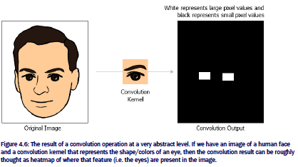

  * pooling layers

  * fully connected layers

* The deeper you go into a network, layers learn more high-level features

  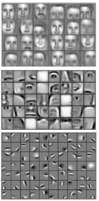

* Pooling layer takes in the feature maps generated by the convolutional layer and reduce their height and width dimension. 
  * This reduction helps the model be translation-invariant
    * E.g. a dog shifted a few pixels is still a dog

* Use fully connected layers to generate probability distribution on classes.

  * Need to convert output of convolution/pooling into a vector

* Apply softmax to the output of the fully connected layer to get the probabilities

* ```python
  layers.Conv2D(filters=16, kernel_size=(9,9), strides=(2,2),
               activation='relu', input_shape=(32,32,3))
  ```

  * `Conv2D` layer is the Keras implementation of 2D convolution operation
    * Same functionality as `tf.nn.convolution`
    * `filters`: Number of output channels
    * `kernel_size`: Convolution window size in height and width (in that order)
    * `strides`: How many pixels are skipped on height and width
      * A higher value outputs a smaller image
    * `activation`: the non-linearity on the convolution layer
    * `padding`: Type of padding to use
    * `input_shape`: A 3D tuple representing the input size (height, width, channels) dimensions. Keras adds unspecified batch dimension in front automatically

* Let $x$ be an $n \times n$ input matrix and $f$ be an $m \times m$ filter, then the output $y$ of convolution is:
  $$
  y_{(i,j)} = \sum_{k=0}^{m-1} \sum_{l=0}^{m-1} f_{(k,l)} \times x_{(i+k, j + l)}
  $$
  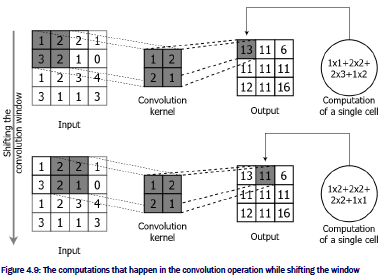

* Four important hyperparameters that affect the size and values produced

  * Number of filters
  * Kernel height and width
  * Kernel stride
  * Type of padding

|                     | Dimensionality                              | Example                           |
| ------------------- | ------------------------------------------- | --------------------------------- |
| Input               | [batch_size, height, width, input_channels] | [32,64,64,3] (i.e. batch size 32) |
| Convolution filters | [height, width, in_channels, out_channels]  | [5,5,3,16]                        |
| Output              | [batch_size, height, width, out_channels]   | [32,64,64,16]                     |

* The convolution filters are parameters to be optimized

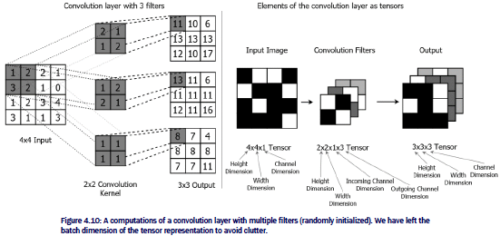

* The relationship between the output size of the convolution and the input and kernel size is $\textrm{size}(output) = \textrm{size}(input) - \textrm{size}(filter) +1$ 
  * E.g. For 7x7 input and 3x3 filter is a 5x5 output
  * Larger kernels mean more parameters
  * Smaller kernels lead to more robust features and better generalization

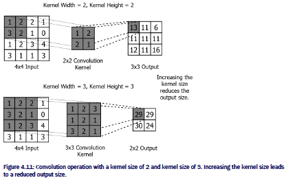

* Stride has two components: height and width

  * Defines how many pixels to stip during shifting

  * Accounting for size, the output size follows
    $$
    \textrm{size}(y) = \left \lfloor \frac{\textrm{size}(x) - \textrm{size}(f)}{s} \right \rfloor +1
    $$

  * Helps control the output size

  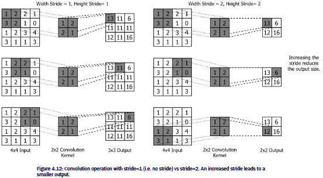

* Padding determines the effects of the border.
  * Can add imaginary zeros around the edges of the images to get the same output image size : add a border of size $\textrm{size}(f)-1$
    * This is `same` padding
  * Theoretically, you can use other (i.e. non-zero) padding techniques, but they are not supported natively in TensorFlow
    * Constant value
    * Reflection
    * nearest value
  * Not applying padding is called `valid` padding
* Max-pooling is provided by `tensorflow.keras.layers.MaxPool2D` with hyperparameters
  * `pool_size`: analogous to kernel size in convolution layer
  * `strides`: analogous to convolution layer
  * `padding`: `same` or `valid`. analogous to padding in convolution layer 
* Need a `Flatten()` layer prior to `Dense` layer to convert to a vector
  * provided by `tensorflow.keras.layers.Flatten`
* First `Dense` layer can be huge if not careful

```python
# Create network
from tensorflow.keras import layers, models
import tensorflow.keras.backend as K

K.clear_session()

cnn = models.Sequential(
    [layers.Conv2D(filters=16, kernel_size=(9,9), strides=(2,2), activation='relu',
                      padding='same', input_shape=(32,32,3)),
     layers.MaxPool2D(pool_size=(2,2), strides=(2,2), padding='same'),
     layers.Conv2D(filters=32, kernel_size=(7,7), activation='relu', padding='same'),
     layers.MaxPool2D(pool_size=(2,2), strides=(2,2), padding='same'),
     layers.Flatten(),
     layers.Dense(64, activation='relu'),
     layers.Dense(10, activation='softmax')
    ]
)
```

### One Step at a Time: Recurrent neural networks

* Typical feed-forward networks (i.e. fully-connected networks, convolution neural networks) cannot handle time-series data

  * Each input is assumed to be i.i.d.
  * Cannot look "into the past"

* Recurrent neural networks are designed to handle time-series data

  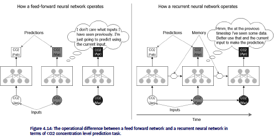

#### Understanding the data

* Example: CO2 concentration

  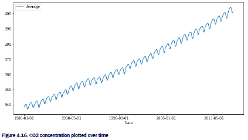

* Note: do not want to use data as is because the values are increasing into ranges that haven't been seen, so it's difficult for a network to extrapolate. 

  * Idea: Use differences between samples

    ```python
    data['Average Diff']=data['Average'] - data['Average'].shift(1).fillna(method='bfill')
    ```

    

  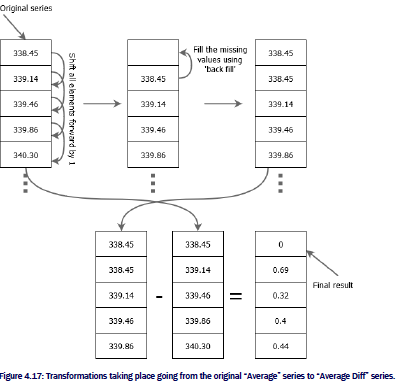

  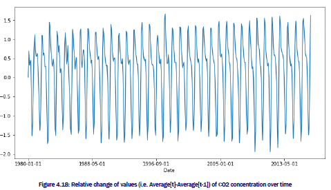

* How to take batches from time-series?

  * Can't sample i.i.d. (i.e. shuffle)

  * Determine window into the past we want to look

  * Pick random starting position, take window number of samples as input and then subsequent sample as the target

    ```python
    import numpy as np
    
    def generate_data(co2_arr, n_seq):
        x, y = [], []
        for i in range(co2_arr.shape[0]-n_seq):
            x.append(co2_arr[i:i+n_seq-1])
            y.append(co2_arr[i+n_seq-1:i+n_seq])
        x = np.array(x).reshape(-1,n_seq-1,1)
        y = np.array(y)
        return x,y
    ```

  * `SimpleRNN` need specific input(hence the `reshape` above)

    * batch dimension
    * time dimension
    * feature dimension

*  network:

  * a recurrent neural network layer with 64 hidden units
  * a dense layer with 64 hidden units, relu activation 
  * a dense layer with a single output, linear activation

  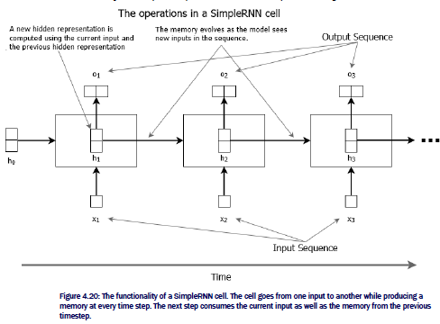

#### Predicting future CO2 values with the trained model

```python
# Prediction
history = data['Average Diff'].values[-12:].reshape(1,-1,1)
true_vals = []
prev_true = data['Average'].values[-1]
for i in range(60): # predict next 60 months
    p_diff = rnn.predict(history).reshape(1,-1,1) # prediction
    history = np.concatenate((history[:,1:,:],p_diff), axis=1) # update history to include latest prediction
    true_vals.append(prev_true+p_diff[0,0,0]) # Compute the absolute CO2 concentration
    prev_true = true_vals[-1] # Update prev_true so that the absolute CO2 concentration can be computed in the next time step
```

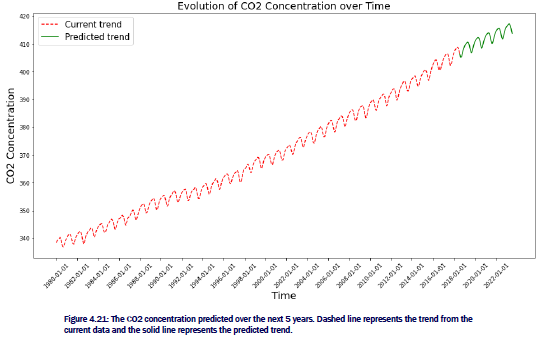

* Question: if we wanted to predict temperature and CO2 concentration, how would we change the network?

  ```python
  rnn = models.Sequential([
    layers.SimpleRNN(64, input_shape=(12,2)), # (12,2) instead of (12,1)
    layers.Dense(64, activation='relu'),
    layers.Dense(2) # two outputs instead of 1
  ])
  ```

### Summary

* Fully-connected network: use `Dense` layers
* Convolutional neural network: use `Conv2D`, `MaxPool2D`, `Flatten`
* RNNs used mostly for time series
  * typical RNNs expect 3-dimensional input tensor with batch dimension, time dimension and feature dimension

## Chapter 5: State-of-the-art in deep learning: Transformers

* Transformers originated in "Attention is all you need"
  * Understanding transformers is essential to excel at deep learning

### Representing text as numbers

* Question: How do you represent text as numbers?

* Start by assigning each word a number starting from 1. 0 is reserved for a special token

  * Then map each word in a phrase/sentence to the number to get a list/tensor of numbers

* Need fixed length phrases

  * Pad short phrases
  * Truncate long phrases

* One-hot encode words

  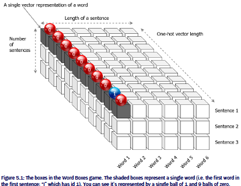

  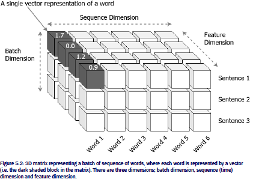

* Question: why not feed in the word IDs directly?
  * Very large range of IDs which leads to instabilities
  * Feeding in integer IDs would falsely indicate there's an ordering/notion of similiarity
* Different ways of converting IDs to vectors
  * One-hot encodings
  * Embeddings

### Understanding the Transformer model

#### The encoder-decoder view of the Transformer

* The transformer network is based on an encoder-decoder architecture 

  * encoder-decoder is common in many tasks (e.g. translation, question answering, unsupervised image reconstruction)
  * Encoder converts input into some latent representation
  * Decoder converts latent representation to meaning output

  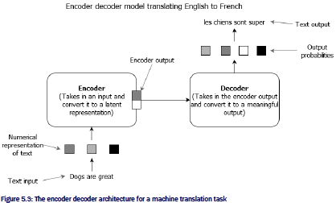

#### Diving deeper

* The encoder layer comprises two sub-layers:

  * self-attention layer (innovative part)
  * fully connected layer

* Idea behind self-attention:

  * When processing a word, can attend to other words
  * E.g. "I kicked the **ball** and **it** disappeared" 
    * Can attend to the word "ball" when processing "it"
  * The fully-connected layer takes the output of the self-attention sub-layer and produces the hidden representation

  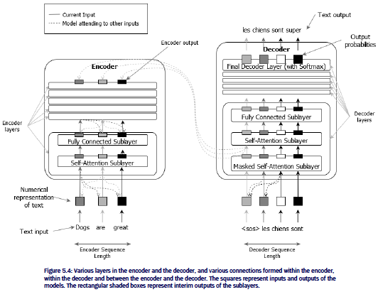
  * Encoder: Each sub-layer has:
    * attended representation/out is a weighted sum of the input where the weights are based on the attention layer
    * The hidden layer takes the attended representation and:
      * $h_{1} = \textrm{ReLU}(xW_{1} + b_{1})$
      * $h_{2} = h_{1}W_{2} + b_{2}$ 
  * Decoder: Each sublayer has 
    * masked self-attention layer: masks words ahead of currently processed word
      * Don't look into the future
    * self-attention layer: learn hidden representatio (i.e. attended representation)
    * fully connected layer

#### Self-attention layer

* When processing word $w_{t}$ at time $t$, determine how important it is to attend to the $i$th word. 

* Three different entities in the computation:

  * query: represent the word that is currently being processed
    * $W_{q}$ is a $d_{model} \times d_{q}$ matrix to compute query
  * key: represent candidate words to be attended to while processing the current word
    * $W_{k}$ is a $d_{model} \times d_{k}$ matrix
  * value: compute a weighted sum of all the words in the sequence, where the weight for each word is based on how important it is for understanding the current word
    * $W_{v}$ is a $d_{model} \times d_{v}$ matrix

* First convert words to vectors using an embedding

* Compute query, key and value as matrix product

* Then compute probabilities as:
  $$
  p = \textrm{softmax} \left ( \frac{qk^{t}}{\sqrt{d_{k}}} \right )
  $$

* Multiply probabilities by value:
  $$
  h = pv
  $$

```python
import tensorflow as tf
import numpy as np

n_seq = 7 # Sequence length

# Defining the input
x = tf.constant(np.random.normal(size=(1,n_seq,512)), dtype='float32')

# Query, Key and Value matrices
Wq = tf.Variable(np.random.normal(size=(512,512)), dtype='float32')
Wk = tf.Variable(np.random.normal(size=(512,512)), dtype='float32')
Wv = tf.Variable(np.random.normal(size=(512,512)), dtype='float32')

# Printing the shapes of the data
print('x.shape={}'.format(x.shape))
print('Wq.shape={}'.format(Wq.shape))
print('Wk.shape={}'.format(Wk.shape))
print('Wv.shape={}'.format(Wv.shape))

import tensorflow as tf
from tensorflow.keras import layers
import math

class SelfAttentionLayer(layers.Layer):
    """ Defines the computations in the self attention layer """
    def __init__(self, d):
        super(SelfAttentionLayer, self).__init__()
        # Feature dimensionality of the output
        self.d = d
    
    def build(self, input_shape):
        # Query weight matrix
        self.Wq = self.add_weight(
            shape=(input_shape[-1], self.d), initializer='glorot_uniform',
            trainable=True, dtype='float32'
        )        
        # Key weight matrix
        self.Wk = self.add_weight(
            shape=(input_shape[-1], self.d), initializer='glorot_uniform',
            trainable=True, dtype='float32'
        )
        # Value weight matrix
        self.Wv = self.add_weight(
            shape=(input_shape[-1], self.d), initializer='glorot_uniform',
            trainable=True, dtype='float32'
        )
    
    def call(self, q_x, k_x, v_x):
        # Computing query, key and value
        q = tf.matmul(q_x,self.Wq)
        k = tf.matmul(k_x,self.Wk)
        v = tf.matmul(v_x,self.Wv)
        
        # Computing the probability matrix
        p = tf.nn.softmax(tf.matmul(q, k, transpose_b=True)/math.sqrt(self.d))
        p = tf.squeeze(p)

        # Computing the final output
        h = tf.matmul(p, v)
        return h,p

# Creating a dummy self attention layer
layer = SelfAttentionLayer(512)
# Getting the output
h, p = layer(x, x, x)
print(h.shape)
```

* Why transformers over RNNs?
  * RNN performance degrades as the length increases: forget the beginning
  * Self-attention alleviates this problem

#### Self-attention as a cooking competition

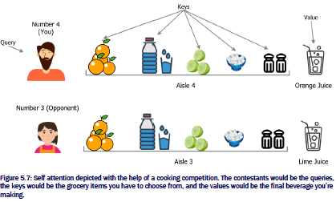

#### Masked self-attention layers

* Make probability matrix $P$ lower triangular so the model can't look ahead

  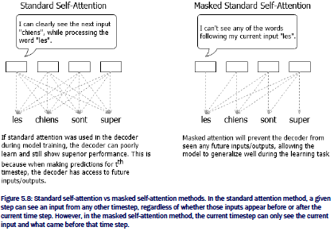

```python
# Masked self-attention
import tensorflow as tf

class SelfAttentionLayer(layers.Layer):
    """ Defines the computations in the self attention layer """
    
    def __init__(self, d):        
        super(SelfAttentionLayer, self).__init__()
        # Feature dimensionality of the output
        self.d = d
    
    def build(self, input_shape):
        # Query weight matrix
        self.Wq = self.add_weight(
            shape=(input_shape[-1], self.d), initializer='glorot_uniform',
            trainable=True, dtype='float32'
        )        
        # Key weight matrix
        self.Wk = self.add_weight(
            shape=(input_shape[-1], self.d), initializer='glorot_uniform',
            trainable=True, dtype='float32'
        )
        # Value weight matrix
        self.Wv = self.add_weight(
            shape=(input_shape[-1], self.d), initializer='glorot_uniform',
            trainable=True, dtype='float32'
        )
    
    def call(self, q_x, k_x, v_x, mask=None):
        # Computing query, key and value
        q = tf.matmul(q_x,self.Wq) #[None, t, d]
        k = tf.matmul(k_x,self.Wk) #[None, t, d]
        v = tf.matmul(v_x,self.Wv) #[None, t, d]
        
        # Computing the probability matrix
        p = tf.matmul(q, k, transpose_b=True)/math.sqrt(self.d) # [None, t, t]
                
        if mask is None:
            p = tf.nn.softmax(p)
        else:
            # Creating the mask
            p += mask * -1e9
            p = tf.nn.softmax(p)
                
        # Computing the final output
        h = tf.matmul(p, v) # [None, t, t] . [None, t, d] => [None, t, d]
        return h,p

layer = SelfAttentionLayer(512)
mask = 1 - tf.linalg.band_part(tf.ones((7, 7)), -1, 0) # Create triangular matrix
h, p = layer(x, x, x, mask)
print(h.shape)
```

#### Multi-head attention

* Multi-head attention creates multiple parallel self-attention heads

  * When the model is given the opportunity to learn multiple attention patterns, it performs better

  ```python
  multi_attn_head = [SelfAttentionLayer(64) for i in range(8)]
  outputs = [head(x, x, x)[0] for head in multi_attn_head]
  outputs = tf.concat(outputs, axis=-1)
  print(outputs.shape)
  ```

#### Fully-connected layer

```python
# Section 5.2
# Code listing 5.3
import tensorflow as tf

class FCLayer(layers.Layer):
    """ The computations of a fully connected sublayer """
    def __init__(self, d1, d2):
        super(FCLayer, self).__init__()
        # Dimensionality of the first hidden layer
        self.d1 = d1
        # Dimensionality of the second hidden layer
        self.d2 = d2
    
    def build(self, input_shape):
        # First layer's weights and biases
        self.W1 = self.add_weight(
            shape=(input_shape[-1], self.d1), initializer='glorot_uniform',
            trainable=True, dtype='float32'
        )
        self.b1 = self.add_weight(
            shape=(self.d1,), initializer='glorot_uniform',
            trainable=True, dtype='float32'
        )        
        # Second layer's weights and biases
        self.W2 = self.add_weight(
            shape=(input_shape[-1], self.d2), initializer='glorot_uniform',
            trainable=True, dtype='float32'
        )
        self.b2 = self.add_weight(
            shape=(self.d2,), initializer='glorot_uniform',
            trainable=True, dtype='float32'
        )  
    
    def call(self, x):
        # Computing the first fully connected output
        ff1 = tf.nn.relu(tf.matmul(x,self.W1)+self.b1)
        # Computing the second fully connected output
        # Note that the second layer doesn't use an activation
        ff2 = tf.matmul(x,self.W2)+self.b2
        return ff2
    
# Creating a dummy fully connected layer
ff = FCLayer(2048, 512)(h)
print(ff.shape)
```

