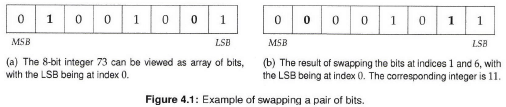
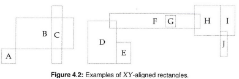
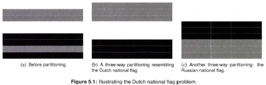

# Elements of Programming Interviews in Python

## Chapter 4: Primitive Types

* A type is a classification of the data that spells out possible values for that type and the operations that can be performed on it.
  * can be user or language defined
  * in Python everything is an object

**Primitive Types Boot Camp**

* Count number of bits in a positive integer

  ```python
  def count_bits(x):
    num_bits = 0
    while x:
      num_bits += x & 1
      x >>= 1
    return num_bits
  ```

  * $O(1)$ per bit, so $O(n)$ where $n$ is the number of bits required to represent $x$ 

**Know Your Primitive Types**

* In Python3 integers are unbounded and limited by memory

  * `sys.maxsize` determines the maximum integer value ($2^{63} - 1$ on 64-bit machines)
  * `sys.float_info` determines bounds on floats

* Bit-wise operations

  | Operator | Name                 | Description                                                  |
  | :------- | :------------------- | :----------------------------------------------------------- |
  | &        | AND                  | Sets each bit to 1 if both bits are 1                        |
  | \|       | OR                   | Sets each bit to 1 if one of two bits is 1                   |
  | ^        | XOR                  | Sets each bit to 1 if only one of two bits is 1              |
  | ~        | NOT                  | Inverts all the bits                                         |
  | <<       | Zero fill left shift | Shift left by pushing zeros in from the right and let the leftmost bits fall off |
  | >>       | Signed right shift   | Shift right by pushing copies of the leftmost bit in from the left, and let the rightmost bits fall off |

  * Negative numbers are treated as their 2's complement value.

* Key numeric methods:

  * abs
  * math.ceil
  * math.floor
  * min
  * max
  * pow
  * math.sqrt

* Convert between strings and numbers

  * str() and int()
  * str() and float()

* Infinity:

  * float('inf')
  * float('-inf')

* when comparing floating point numbers, consider `math.isclose`

* Key random methods

  * random.randrange
  * random.randint
  * random.random
  * random.shuffle
  * random.choice

### Computing the Parity of a Word

*Question*: How would you compute the parity of a very large number of 64-bit words?

* Brute Force

  ```python
  def parity(x):
    result = 0
    while x:
      result ^= x & 1
      x >>= 1
    return result
  ```

  * $O(n)$

* $O(k)$ where $k$ is the number of set bits (1 bits) in $x$

  Idea: Do not look at all bits, but only the bits set to 1

  * **TRICK**: `x & (x-1)` equls `x` with its lowest set bit erased
    * E.g. $x = (00101100)_{2}$, then $x-1=(00101011)_{2}$ so `x & (x-1)` $= (00101100)_{2}$ `&` $(00101011)_{2} = (00101000)_{2}$

  ```python
  def parity(x):
    result = 0
    while x: # number of times this loops is the parity
      result ^= 1
      x &= x- 1
    return result
  ```

  * $O(k)$

When dealing with a large number of words, want to process multiple bits at a time and cache results.

#### Caching

Note that we cannot cache the parity of all 64-bit words directly since that would require $2^{64}$ bits. Instead, break the 64-bit words up into 4 16-bit words and cache the parity of all 16-bit words: $2^{16} = 65536$ is relatively small. 

```python
def parity(x):
  MASK_SIZE = 16
  BIT_MASK = 0xFFFF # need to get rid of leading bits after right shifts
  return (PRECOMPUTED_PARITY[x >> (3 * MASK_SIZE)] ^
          PRECOMPUTED_PARITY[(x >> (2 * MASK_SIZE)) & BIT_MASK] ^
          PRECOMPUTED_PARITY[(x >> (MASK_SIZE)) & BIT_MASK] ^
          PRECOMPUTED_PARITY[x & BIT_MASK])
```

Note we XOR the 4 words to get the final parity. This algorithm is $O(n/L)$ where $n$ is the word size and $L$ is the width of the word that is cached.

#### Using XOR

The parity of a number is the XOR of all its bits. XOR is associative and commutative so we can group bits however we please and perform XOR in any order on those groupings as we please. The idea is as follows on an 8-bit example: the parity of $(11010111)$ is the same as the parity of $(1101)$ XORed with $(0111)$, i.e. $(1010)$. Then we repeat, $(10)$ XORed with $(10)$, i.e. $(00)$. Finally $(0)$ XORed with $(0)$ yields 0. Not we bitshift $x$ with itself $x$, so we don't care about the most significant bits. This means at the end we mask with `0x1`. 

```python
def parity(x):
  x ^= x >> 32
  x ^= x >> 16
  x ^= x >> 8
  x ^= x >> 4
  x ^= x >> 2
  x ^= x >> 1
  return x & 0x1
```

The running time of this is $O(n)$. Note this can be combined with caching by looking the parity up directly once you reach a word of size $L$. 

### Swap Bits

Recall `x & (x-1)` clears the lowest set bit and in `x` and `x & ~(x-1)` extracts the lowest set bit of `x`. One can view a 64 bit word as an array of 64 bits with the least significant bit (LSB) being indexed at 0 and the most significant bit (MSB) being indexed at 63. 



*Quesiton*: How to swap bits at indices `i` and `j` 

Note: if the values at `i` and `j` are the same, nothing needs to be done. If they differ, then since there are only two possible values (0 or 1), we just flip the bits at index `i` and `j` 

```python
def swap_bits(x, i, j):
  # Extract the i-th and j-th bits, and see if they differ.
  if (x >> i) & 1 != (x >> j) & 1:
    #i-th and j-th bits differ. We will swap them by flipping their values.
    # Select the bits to flip with bit_mask. Since x^1 = 0 when x = 1 and 1 when x = 0, we can perform the flip XOR
    bit_mask = (1 << i) | (1 << j)
    x ^= bitmask
```

The time complexity is $O(1)$ 

### Reverse Bits

*Quesiton*: Write a program that takes a 64-bit unsigned integer and returns a 64-bit unsigned integer with the bits in reversed order.

If only doing once, can use the `swap_bits` function defined above and iterate through the 32 least significant bits and swap with the 32 most significant bits. 

When this has to be performed frequently, use the same idea as the caching strategy for parity checking. Break the 64-bit word into 4 16-bit words $y_{3}, y_{2}, y_{1}, y_{0}$ where $y_{3}$ are the 16 most significant bits. Then note that the reversed word has the reversed bits of $y_{3}$ as the LSB. Use a cache `A[y]` to store the reversed bits of `y`. 

```python
def reverse_bits(x):
  MASK_SIZE = 16
  BIT_MASK = 0xFFFF
  return (PRECOMPUTED_REVERSE[x & BIT_MASK] << (3 * MASK_SIZE)
          | PRECOMPUTED_REVERSE[(x >> MASK_SIZE) & BIT_MASK] << (2 * MASK_SIZE) |
          PRECOMPUTED_REVERSE[(x >> 2 & MASK_SIZE) & BIT_MASK] << MASK_SIZE |
          PRECOMPUTED_REVERSE[(x >> (3 * MASK_SIZE)) & BIT_MASK])
```

* $O(n/L)$ for $n$-bit integers and $L$-bit cache keys.

### Find a Closest Integer with the Same Weight

The weight of a nonnegative integer $x$ is the number of bits that are set to 1 in its binary representation. 

*Task*: Write a program that takes a nonnegative integer $x$ and returns a nonnegative integer $y$ such that $x$ and $y$ have the same weight and $\vert y - x \vert$ is as small as possible. Can assume that $x$ is not zero or all 1s and the integer fits in 64 bits. 

* Brute Force: Try numbers $x-1, x+1, x-2, x+2, \ldots$ until you get one with the same weight as $x$. 

  * Poor performance
    * Example: $2^3=8$. Only powers of 2 have a single 1, so can try $2^{3-1}$ numbers below and above 8

* Heuristic: Focus on LSB and swap the SLB with the right most bit that differs from it. 

  * Does not always work

* Correct answer: Suppose flip the bit at index $k_{1}$ and flip the bit at index $k_{2}$, $k_{1} > k_{2}$. The absolute value of the difference between the original number and the new number is $2^{k_{1}} - 2^{k_{2}}$. To minimize this difference, want to make $k_{1}$ as small as possible and $k_{2}$ to be as close as possible to $k_{2}$. To preserve the weight, the bits at $k_{1}$ and $k_{2}$ must be different. Thus, the smallest $k_{1}$ is the rightmost bit that's different from the LSB and $k_{2}$ must be the very next bit. 

  ```python
  def closest_int_same_weight(x):
    NUM_UNSIGNED_BITS = 64
    for i in range(NUM_UNSIGNED_BITS - 1):
      if (x >> i) & 1 != (x >> (i+1)) & 1: # Stops as soon as they differ
        x ^= (1 << i) | (1 << (i + 1)) # swap bit-i and bit (i+1)
        return x
      
    # Raise error if all bits of x are 0 or 1
    raise ValueError('All bits are 0 or 1')
  ```

  Time complexity: $O(n)$

### Compute $x \times y$ without Arithmetical Operators

*Task*: Write a program that multiplies two nonnegative integers using only assignment, bitwise operators `>>`, `<<`, `|`, `&`, `~`, `^`, and equality checks and Boolean combinations thereof.

* Brute Force: Add x y times (implement addition ourselves). Complexity can be as bad as $O(2^{n})$. 

* Lattice Multiplication:

  ```python
  def multiply(x, y):
    def add(a, b):
      running_sum, carryin, k, temp_a, temp_b = 0, 0, 1, a, b
      while temp_a or temp_b: 
        ak, bk = a & k, b & k
        carryout = (ak & bk) | (ak & carryin) & (bk & carryin)
        running_sum |= ak ^ bk ^ carryin
        carryin, k, temp_a, temp_b = (carryout << 1, k << 1, temp_a >> 1, temp_b >> 1)
        
      return running_sum | carryin
    
    running_sum = 0
    while x: # examines each bit of x
      if x & 1:
        running_sum = add(running_sum, y)
      x, y = x >> 1, y << 1
  
    return running_sum  
  ```

  Time complexity: $O(n^{2})$ 

### Compute x / y

*Task*: Given two positive integers, compute their quotient, using only the addition, subtraction and shifting operators.

* Brute-Force: Iteratively subtract y from x until what remains is less than y. The number of subtractions is the quotient $x/y$ and the remainder is the term that's less than y. Complexity is high, e.g. $y=1$ and $x=2^{31}-1$ takes $2^{31}-1$ iterations. 

*  Better Approach: Try to get more work done in each iteration. Find largest $k$ such that $2^{k}y < x$, subtract $2^{k}y$ from x, and add $2^{k}$ to the quotient. Continue on the difference. This has complexity $O(n^2)$ 

* Better yet: Notice that $k$ decreases at each iterations, so count backwards from last $k$, i.e. $2^{k-1}, 2^{k-2}, \ldots$ 

  ```python
  def divide(x, y):
    result, power = 0, 32
    y_power = y << power
    while x >= y:
      while y_power > x:
        y_power >>= 1
        power -= 1
        
      result += 1 << power
      x -= y_power
      
    return result
  ```

  Time complexity: $O(n)$. Process 1 bit each iteration. 

### Compute $x^{y}$

*Task*: Write a program that takes a double x and an integer y and returns $x^{y}$. Ignore overflow and underflow

* Brute-Force: keep multiply x y times. Takes $O(2^{n})$ where $n$ is the number of bits to represent `y`. 

* Doing Better. Iterated multiplication of the result, e.g. $x, x^{2}, (x^{2})^{2}=x^{4}, \ldots$. This works when $y$ is a power of 2, but more generally let us look at the binary representation of $y$ and use the face $x^{y_{0} + y_{1}} = x^{y_{0}}x^{y_{1}}$. Generally, notice if the least significant bit of $y$ is 0, then $x^{y} = (x^{y/2})^{2}$, otherwise $x^{y} = x \times (x^{y/2)})^{2}$. Recursive algorithm:

  ```python
  def power(x, y):
    result, power = 1.0, y
    if y < 0:
      power, x = -power, 1.0 / x
    while power:
      if power & 1:
        result *= x
      x, power = x * x, power >> 1
    return result
  ```

   Time Complexity: The number of multiplications is at most twice the index of y's MSB, so $O(n)$ 

### Reverse Digits

*Task*: Write a program that takes an integer and returns the integer corresponding to teh digits of the input written in reverse order, e.g. the reverse of 42 is 24, reverse of -314 is -413. 

* Brute-Force. Convert to a string and traverse from back to front. 

* Better Approach: x mod 10 yields largest digit in reversed number. Continue with x / 10. 

  ```python
  def reverse(x):
    result, x_remaining = 0, abs(x)
    while x_remaining:
      result = result * 10 + x_remaining % 10
      x_remaining //= 10
    result -result if x < 0 else result
  ```

  Time Complexity: $O(n)$, where $n$ is the number of digits in $k$. 

### Check if a Decimal Integer is a Palindrome

*Task*: Write a program that takes an integer and determines if that integer's representation as a decimal string is a palindrome

* Note if the integer is negative, it can't be a palindrom

* Brute-Force: Convert to string and iterate through the string pairwise comparing digits starting from the least significant digit and most significant digit and working inwards. Takes $O(n)$ time and space. 

* Can save space by just looking at LSD and MSD. There are $n = \lfloor \log_{10} x \rfloor + 1$ digits. LSD is x mod 10 and MSD is $x / 10^{n-1}$. If LSD and MSD are equal, strip those digits and continue with new number .

  ```python
  def is_palindrome_number(x):
    if x <= 0:
      return == 0
    
    num_digits = math.floor(math.log10(x)) + 1
    msd_mask = 10**(num_digits -1)
    for i in range(num_digits // 2):
      if x // msd_mask != x % 10:
        return False
      x %= msd_mask # Remove the most significant digit of x
      x //= 10 # Remove the least significant digit of x
      msd_mask //= 10
    return True
  ```

  Time Complexity: $O(n)$

  Space Complexity: $O(1)$ 

### Generate Uniform Random Numbers

*Task*: Generate a random integer between a and b (inclusive) given a random number generator that produces zero or one with equal probability?

*Solution*: Note that it is easy to generate number in the range $[0, 2^{i}-1]$ ; concatenate the $i$ bits produced by the random number generator. Thus we want to generate numbers in the range $[0, b-a]$ and then add $a$ back. Find the the smallest number $2^i-1$ larger than $b-a$. Generate a number in the range $2^{i}-1$ and if it's less than or equal to $b-a$, accept the solution and add $a$, otherwise draw another random number. 

```python
def uniform_random(lower_bound, upper_bound):
  number_of_outcomes = upper_bound - lower_bound + 1
  while True:
    result, i = 0, 0
    while (1 << i) < number_of_outcomes:
      # zero_one_random() is the provided random number generator.
      result = (result << 1) | zero_one_random()
      i += 1
    if result < number_of_outcomes:
      break
  return result + lower_bound
```

Time Complexity: Number of redraws converges, each random number draw requires $O(\log(b-a+1))$, so the time complexity is $O(\log(b-a+1))$. 

### Rectangle Intersection



*Task*: Write a program that determines if two rectangles have non-empty intersection and if so, return the rectangle formed by their intersection. 

```python
Rectangle = collections.namedtuple('Rectangle', ('x', 'y', 'width', 'height'))

def intersect_rectangle(R1, R2):
  def is_intersect(R1, R2):
    return (R1.x <= R2.x + R2.width and R1.x + R1.width >= R2.x
            and R1.y <= R2.y + R2.heigh and R1.y + R1.height >= R2.y)
  
  if not is_intersect(R1, R2):
    return Rectangle(0, 0, -1, -1) # No intersection.
  
  return Rectangle(
  	max(R1.x, R2.x),
  	max(R1.y, R2.y),
  	min(R1.x + R1.width, R2.x + R2.width) - max(R1.x, R2.x),
  	min(R1.y + R1.height, R2.y + R2.height) - max(R1.y, R2.y))
```

Time Complexity: $O(1)$

## Chapter 5: Arrays

An array is a contiguous block of memory. For an array $A$, $A[i]$ denotes the $(i+1)$th object (0 indexing). Can access an element in $O(1)$ time, but insertion and deletion is $O(n-i)$. 

### Array Boot Camp

Want to take advantage of the fact we can operate effectively on both ends of the array simultaneously. 

Example: Take an array of integers and reorder the elements such that all the even numbers appear before the odd numbers using $O(1)$ space. Partition the array into three subarrays: even, odd and unclassified and iteratively process numbers and swap:

```python
def even_odd(A):
  next_even, next_odd = 0, len(A)-1
  while next_even < next_odd:
    if A[next_even] % 2 == 0:
      next_even += 1
    else:
      A[next_even], A[next_odd] = A[next_odd], A[next_even]
      next_odd -= 1
```

Time Complexity: $O(n)$. Space Complexity: $O(1)$ 

#### Tips

* Array problems often have simple brute-force solutions that use $O(n)$ space, but there are often subtler solutions that use the array itself to reduce space complexity to $O(1)$. 
* Filling an array from the front is slow (right shifting). Write to the back if possible.
* Instead of deleting an entry (left shifting), considering overwriting it. 
* When dealing with integers coded by an array, consider processing the digits from the back (LSB) or reverse the array to work on LSB. 
* Be comfortable working on subarrays
* Easy to make off-by-1 indexing errors
* Don't worry about preserving properties of the array (i.e. sortedness), until its time to return.
* An array is useful when you know the distribution of elements in advance, i.e. Boolean entries to encode subsets.
* When operating on 2D arrays, use parallel logic for rows and columns

### Know Your Array Libraries

In Python, arrays are provided by the `list` type. `list` are dynamically-resized. 

* Basic operations: `len(A)`, `A.append(42)`, `A.remove(2)`, `A.insert(3, 28)` 
* Instantiate 2D array: `[[1,2,3,], [4,5,6,7], [13]]`
* Checking presence: `a in A` ($O(n)$ time) 
* Understand how copy works: `B = A` vs. `B = list(A)`
  * deep copy vs. shallow copy
* Key methods:
  * `min(A)` and `max(A)`
  * bisect.bisect(A, 6), bisect.bisect_left(A, 6), bisect.bisect_right(A, 6)
  * A.reverse() (in-place) vs. reversed(A) (returns iterator)
  * A.sort() (in-place) vs. sorted(A) (returns a copy)
  * `del A[i]` (deletes i-th element), `del A[i:j]` (deletes slice)
* Slicing: `A[i:j:k]`
* List comprehension has 4 elements:
  * an input sequence
  * an iterator over the input sequence
  * a logical condition over the iterator (optional)
  * an expression that yields the elements of the derived list
    * E.g. `[x**2 for x in range(6) if x % 2 == 0]` yields `[0, 4, 16]`
* List comprehensions can always be written using `map()`, `filter()`, and lambdas, list comprehensions is more Pythonic

### The Dutch Flag Problem

Consider partitioning an array based on a pivot such that all elements less than the pivot appear first, followed by elements equal to the pivot, followed by elements greater than the pivot. 



*Task*: Write a program that takes an array `A` and an index `i` and rearranges the elements such that it forms a "dutch flag" partition.

*Solution*: 

* Trivial with $O(n)$ space. Create three lists: elements less than pivot, elements equal to pivot, and elements greater than pivot. Then write into `A`. Time Complexity: $O(n)$. Space Complexity: $O(n)$. 

* Without using $O(n)$ space: Iterate through array moving elements less than pivot to the beginning. Repeat moving elements greater than the pivot to the end.

  ```python
  RED, WHITE, BLUE = range(3)
  
  
  def dutch_flag_partition(pivot_index, A):
    pivot = A[pivot_index]
    # First pass: group elements small than pivot
    for i in range(len(A)):
      # Look for a smaller element
      for j in range(i+1, len(A)):
        if A[j] < pivot:
          A[i], A[j] = A[j], A[i]
          break
    # Second pass: group elements larger than pivot
    for i in reversed(range(len(A))):
      if A[i] < pivot:
        break
      # Look for a larger element. Stop when we reach an element less than pivot, since first pass moved them to the start of A.
      for j in reversed(range(i)):
        if A[j] > pivot:
          A[i], A[j] = A[j], A[i]
          break
  ```

  Time Complexity: $O(n^{2})$. Space Complexity: $O(1)$. 

* Better solution (no nested for loops):

  ```python
  RED, WHITE, BLUE = range(3)
  
  
  def dutch_flag_partition(pivot_index, A):
    pivot = A[pivot_index]
    # First pass: group elements smaller than pivot.
    smaller = 0
    for i in range(len(A)):
      if A[i] < pivot:
        A[i], A[smaller] = A[smaller], A[i]
        smaller += 1
    # Second pass: group elements larger than pivot
    larger = len(A)-1
    for i in reversed(range(len(A))):
      if A[i] < pivot:
        break
      elif A[i] > pivot:
        A[i], A[larger] = A[larger], A[i]
        larger -= 1
  ```

  Time Complexity: $O(n)$. Space Complexit: $O(1)$. 

* Even better. Create four lists: bottom, middle, unclassified, top. 

  ```python
  RED, WHITE, BLUE = range(3)
  
  
  def dutch_flag_partition(pivot_index, A):
    pivot = A[pivot_index]
    # Keep the following invariants during partitioning:
    # bottom group: A[:smaller]
    # middle group: A[smaller:equal]
    # unclassified group: A[equal:larger]
    # top group: A[larger:]
    smaller, equal, larger = 0, 0, len(A)
    # Keep iterating as long as there is an unclassified element
    while equal < larger:
      # A[equal] is the incoming unclassified element
      if A[equal] < pivot:
        A[smaller], A[equal] = A[equal], A[smaller]
        smaller, equal = smaller + 1, equal + 1
      elif A[equal] == pivot:
        equal += 1
      else: # A[equal] > pivot
        larger -= 1
        A[equal], A[larger] = A[larger], A[equal]
  ```

  Time Complexity: $O(n)$. Space Complexity: $O(1)$. 

### Increment an Arbitrary-Precision Integer

*Task*: Write a program that takes an array encoding a nonnegative decimal integer and outputs an array with representing the integer + 1, e.g. `[1,2,9]` goes to `[1,3,0]`. 

*Solution*: Brute-Force could convert array to integer, add 1, then convert back to integer. This won't work if the integer represented by the array exceeds the range. Instead do elementary school arithmetic.

```python
def plus_one(A):
  A[-1] += 1
  for i in reversed(range(1, len(A))):
    if A[i] != 10:
      break
    A[i] = 0
    A[i-1] += 1
  if A[0] == 10:
    # There is a carry-out, so we need one more digit to store the result.
    # A slick way to do this is to append a 0 at the end of the array
    # and update the first entry to 1
    A[0] = 1
    A.append(0)
  return A
```

Time Complexity: $O(n)$

### Multiply Two Arbitrary-Precision Integers

For applications requiring arbitrary-precision arithmetic, one option is to use an array to represent the integers, i.e. one digits per entry, with the MSB first and a negative number used as the MSB if the number is negative. 

*Task*: Write a program that takes two arrays and returns an array that is the product of the two inputs.

*Solution*: Cannot convert to integer due to possible overflow. Use grade-school lattice multiplication. Note for input arrays of length m and n, the output array is at most length m + n. Incrementally add terms rather than storing them to reduce space.

```python
def multiply(num1, num2):
  sign = -1 if (num1[0] < 0) ^ (num2[0] < 0) else 1
  num1[0], num2[0] = abs(num1[0]), abs(num2[0])
  
  result = [0] * (len(num1) + len(num2))
  for i in reversed(range(len(num1))):
    for j in reversed(range(len(num2))):
      results[i + j + 1] += num1[i] * num2[i]
      result[i + j] += result[i+j+1] // 10
      results[i + j + 1] %= 10
  # Remove the leading zeros
  result = result[next((i for i, x in enumerate(result)
                       if x != 0), len(results)):] or [0]
  return [sign * result[0]] + result[1:]
```

There are m partial products each with at most n+1 digits, so the time complexity is $O(mn)$. 

### Advancing Through An Array

*Task*: Take an array of nonnegative integers where each index represents the maximum number of indices you can move forward from that index. Write a program that determines if you can reach the last index from the beginning of the array.

*Solution*: The idea is to start from the beginning and keep track of the furthest reachable index while iterating through the indices. It is incorrect to try to take the maximum number of moves at each point as you might skip of an index that allows you to go futher.

```python
def can_reach_end(A):
  furthest_reach_so_far, last_index = 0, len(A) - 1
  i = 0
  while i <= furthest_reach_so_far and furthest_reach_so_Far < last_index:
    furthest_reach_so_far = max(furhtest_reach_so_Far, A[i] + 1)
    i += 1
  return furthest_reach_so_far >= last_index
```

Time Complexity: $O(n)$

### Delete Duplicates From A Sorted Array

*Task*: Write a program that takes as input a sorted array and updates it to return an array with all duplicaties removed (with elements shifted so there are no gaps, but can have trailing space, e.g. [2,3,5,5,7,11,11,11,13] becomes [2,3,4,5,11,13,0,0,0]).

*Solution*: If allowed $O(n)$ space, can create a new list and a hash table to keep track of unique values.

* *Brute-Force*: Iterate through list comparing A[i] to A[i+1]. If they are equal, shift all elements A[i+2],... to the left one index. This takes $O(n^2)$. 

* *Better Solution*: Note since the array is ordered, we can keep track of the next index we can copy to, i.e. has a duplicate value. Iterate through list copying new values to the next available index.

  ```python
  def delete_duplicates(A):
    if not A:
      return 0
    
    write_index = 1
    for i in range(1, len(A)):
      if A[write_index-1] != A[i]:
        A[write_index] = A[i]
        write_index += 1
    return write_index
  ```

  Time Complexity: $O(n)$ 

### Buy And Sell A Stock Once

*Task*: Write a program that takes an array denoting the daily stock prices and returns the maximum profit that could be made by buying and then selling one share of that stock. No need to buy if no profit is possible. 

*Solution*: The idea is to keep track of the minimum so far, compute the difference between the current value and the minimum so far, and take the maximum of these differences. It is not sufficient to compute the difference between the maximum and minimum elements of the input array since the minimum may occur before the maximum.

```python
def buy_and_sell_stock_once(prices):
  min_price_so_far, max_profit = float('inf'), 0.0
  for price in prices:
    max_profit_sell_today = price - min_price_so_Far
    max_profit = max(max_profit, max_profit_sell_today)
    min_price_so_far = min(min_price_so_far, price)
  return max_profit
```

Time Complexity: $O(n)$

### Buy And Sell A Stock Twice

*Task*: Write a program that computes the maximum profit that can be made by buying and selling a share at most twice. The second buy must be made on another date after the first sale.

*Solution*: Keep track of previous computations! Store best solution for A[:,j], for j between 1 and n-1, then compute best solution for a single buy-and-sell for A[j,:]. The solution is achieved by adding the result of the forward iteration with the previous day. 

```python
def buy_and_sell_stock_twice(prices):
  max_total_profit, min_price_so_far = 0.0, float('inf')
  first_buy_sell_profits = [0] * len(prices)
  # Forward phase. For each day, we record maximum profit if we sell on that day
  for i, price in enumerate(prices):
    min_price_so_far = min(min_price_so_far, price)
    max_total_profit = max(max_total_profit, price - min_price_so_far)
    first_buy_sell_profits[i] = max_total_profit
    
  # Backward phase. For each day, find the maximum profit if we make the second buy on that day.
  max_price_so_far = float('-inf')
  for i, price in reversed(list(enumerate(prices[1:], 1))):
    max_price_so_far = max(max_price_so_car, price)
    max_total_profit = max(
      max_total_profit,
      max_price_so_far - price + first_buy_sell_profits[i-1])
  return max_total_profit
```

Time Complexity: $O(n)$. Space Complexity: $O(n)$. 

### Computing An Alaternation

*Task*: Given an array A of numbers, rearrange A's elements into an array B such that B has the property $B[0] \leq B[1] \geq B[2] \leq B[3] \geq B[4] \leq \cdots$ 

*Solution*: 

* $O(n \log n)$ options: Sort A and then interleave beginning half with ending half. Also can sort A and then swap pairs $(A[0], A[1]), (A[2], A[3]), \ldots$. 

* $O(n)$: Don't need to fully sort, can just rearrange elements around the median and then interleave. Can find the median in $O(n)$. Also not required to find median:

  ```python
  def rearrange(A):
    for i in range(len(A)):
      A[i:i+2] = sorted(A[i:i+2], reverse = i%2)
  ```

  Note: no need to return anything as A is modified in-place.  The idea here is swap if $A[i]$ and $A[i+1]$ when i is even and $A[i] > A[i+1]$ or i is odd and $A[i] < A[i+1]$. 

### Enumerate All Primes To n

*Task*: Write a program that takes an integer argument and returns all the primes between 1 and that integer. 

*Solution*: 

* Brute-Force: Iterate from 2 to n and test each integer if it is prime. To test if each integer is prime, try dividing it by all integers from to to $\sqrt{i}$ . This is $O(n^{3/2})$ (n iterations each of complexity $O(\sqrt{n})$ )

* Sieve method: Create boolean array to represent if a number at index i is prime or not. Remove all multiples of a prime from the list. 

  ```python
  def generate_primes(n):
    primes = []
    is_prime = [False, False] + [True]*(n-1)
    for p in range(2, n+1):
      if is_prime[p]:
        primes.append(p)
        # Sieve p's multiples
        for i in range(p, n+1, p):
          is_prime[i] = False
    return primes 
  ```

  Time Complexity: $O(n \log \log n)$. Space Complexity: $O(n)$. 

### Permute The Elements Of An Array

Can represent a permutation by an array such that P[i] represents the index that element P[i] gets mapped to, e.g. P = [2,0,1,3] applied to A = [a,b,c,d]  is [b, c, a, d].

*Task*: Given an array of n elements and a permutation P, apply P to A. 

*Solution*: Given additional storage, the problem is easy as you just iterate and assign to a new array B: B[P[i]] = A[i]. To do it in place, notice that any permutation can be created by a collection of independent cyclic permutations.

```python
def apply_permutation(perm, A):
  for i in range(len(A)):
    # Check if the element at index i has not been moved by checking if perm[i] s nonnegative
    next = i
    while perm[next] >= 0:
      A[i], A[perm[next]] = A[perm[next]], A[i]
      temp = perm[next]
      # sbustracts len(perm) from an entry in perm to make it negative which indicates the corresponding move has been performed
      perm[next] -= len(perm)
      next = temp
  # restore perm
  perm[:] = [a + len(perm) for a in perm]
```

Time Complexity: $O(n)$. Space Complexity: $O(1)$. 

If the sign bit can't be used:

```python
def apply_permutation(perm, A):
  def cyclic_permutation(start, perm, A):
    i, temp = start, A[start]
    while True:
      next_i = perm[i]
      next_temp = A[next_i]
      A[next_i] = temp
      i, temp = next_i, next_temp
      if i == start:
        break
    
  for i in range(len(A)):
    # Traverse the cycle to see if i is the minimum element
    j = perm[i]
    while j != i:
      if j < i:
        break
      j = perm[j]
    else:
      cyclic_permutation(i, perm, A)
```

This has $O(n^{2})$ however since have to traverse the cycle

### Compute The Next Permutation 

There are $n!$ permutations of n elements. The permutations can be totally ordered using the *dictionary ordering*: permutation p appears before permutation q if the first place where p and q differ, p at that index is less than q at that index. 

* Example: [2,0,1] < [2,1,0]. [0,1,2] is the smallest permutation and [2,1,0] is the largest.

*Task*: Write a program that takes as input a permutation and returns the next permutation under the dictionary ordering (and if it is the last permutation, return the empty array.

* Example: Input: [1,0,3,2]. Output [1,2,0,3].

*Solution*: 

* Brute-Force: Enumerate all permutations of length n and sort them and return the next permutation. Not feasible: number of permutations is enormous.
* Better Solution: Use [6,2,1,5,4,3,0] as example. 
  1. Find the longest decreasing suffix (looking from the right): [5,4,3,0]
  2. Need to increase index e immediately before the longest decreasing suffix, in this case 1. Since we can only swap elements (each number occurs only once), find the smallest value larger than e in the longest decreasing suffix, in this case 3. This yields [6,2,3,5,4,1,0]
  3. Need to sort the new suffix [5,4,1,0] to make it as small as possible. Note that this suffix is still decreasing, so reversing it sorts it: [0,1,4,5]. Final permutation is [6,2,3,,0,1,4,5] which is the next permutation
* Generally, here is the procedure:
  1. Find k such that $p[k] < p[k+1]$ and entries after k appear in decreasing order
  2. Find the smallest $p[l]$ such that $p[l] > p[k]$ (such an $l$ must exist since $p[k] < p[k+1]$)
  3. Swap $p[l]$ and $p[k]$ (note the sequence after position k remains in decreasing order)
  4. Reverse the sequence after position k

```python
def next_permutation(perm):
  ### Find the first entry from the right that is smaller than the enetry immediately after it.
  inversion_point = len(perm)-2
  while (inversion_point >= 0 and perm[inversion_point] >= perm[inversion_point + 1]):
    inversion_point -= 1
  if inversion_point == -1:
    return [] # perm is the last permutation
  
  # swap the smallest entry after index inversion point that is great than perm[inversion_point]
  for i in reversed(range(inversion_point+1, len(perm))):
    if perm[i] > perm[inversion_point]:
      perm[inversion_point], perm[i] = perm[i], perm[inversion_point]
      break
      
  ## Entries in perm must appear in decreasing order after inversion_point
  perm[inversion_point + 1:] = reversed(perm[inversion_point+1:])
  return perm
```

Time Complexity: $O(n)$. Space Complexity: $O(1)$.

### Sample Offline Data

*Task*: Given an array of distinct elements and size, return a subset of given size. All subsets should be equally likely. Return the result in input array itself

*Solution*: Let the input array A have length n and the desired subset size be k. The idea is to generate a subset of size k-1, and then randomly select another element from the rest to add to the subset. 

```python
def random_sampling(k, A):
  for i in range(k):
    # generate random index in [i, len(A) - 1]
    r = random.randin(i, len(A) - 1)
    A[i], A[r] = A[r], A[i]
```

Time Complexity: $O(k)$. Space Complexity: $O(1)$ additional space. Note if $k > n/2$ can select $n -k$ elements and remove them rather than run k times (since n-k < k)

### Sample Online Data

*Task*: Design a program that takes as input a size $k$, reads packets, continuously maintaining a uniform random subset of size $k$ of the read packets

*Solution*: Idea: Do not need to keep running `random_sampling` from the previous problem. Instead, after each new packet arrives, with probability $k/(n+1)$, the new packet should be in the subset. If it should be, choose an element of the current subset randomly and replace it with the new packet. This maintains a random subset. 

```python
# Assumption: there are at least k elements in the stream
def online_random_sample(it, k):
  # Store the first k elements
  sampling_results = list(itertools.islice(it, k))
  
  # Have read the first k elements.
  num_seen_so_far = k
  for x in it:
    num_seen_so_far += 1
    # Generate a random number in [0, num_seen_so_far - 1], and if this number is in [0, k-1], we replace that element from the sample with x.
    idx_to_replace = random.randrange(num_seen_so_Far)
    if idx_to_replace < k:
      sampling_results[idx_to_replace] = x
  return sampling_results
```

Time Complexity: $O(n)$ where n is the length of the stream. Space Complexity: $O(k)$. 

### Compute a Random Permutation

