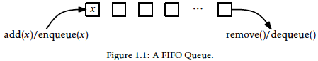
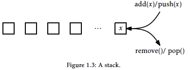
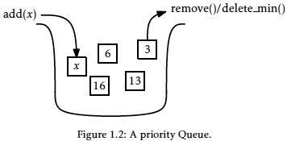

# Open Data Structures

## Chapter 1: Introduction

### Interfaces

* Understand difference between a data structure's interface and its implementation
  * interface: describes what a data structure does
  * implementation: describes how a data structure does it
* **Interface** (a.k.a. **abstract data type**) defines the set of operations supported by a data structure and the semantics (meaning) of those operations
  * Does not tell us how the data structure implements those operations.
* **implementation**: includes the internal representation of the data structure as well as definitions of the algorithms that implement the operations

#### The Queue, Stack, and Deque Interfaces

Queue: add elements and remove the next element

* `add(x)`: add the next value `x` to the Queue

* `remove()`: remove the next (previously added) value `y` from the Queue and return `y` 

* The Queue's **queueing discipline** decides which element should be removed.

  * FIFO (first-in-first-out): removes items in the same order they were added. 

    * `add(x)` sometimes called `enqueue(x)`

    * `remove()` sometimes called `dequeue()`

      

  * LIFO (last-in-first-out): most recently added element is removed.

    * A stack

    * `add(x)` = `push(x)`

    * `remove()` = `pop()` 

       

  * priority: removes the smallest element, breaking ties arbitrarily. 

    * e.g. emergency room treats patients with the most serious conditions

    * `remove()` also called `delete_min()`

      

A Deque is a generalization of both the FIFO and LIFO Queues. 

* A sequence of elements with a front and a back
  * can add and remove from either end
    * `add_first(x)`
    * `remove_first()`
    * `add_last(x)`
    * `remove_last()`
  * Stack can be implemented with `add_first(x)` and `remove_first()`
  * FIFO Queue can be implemented with `add_last(x)` and `remove_first()` 

#### The List Interface: Linear Sequences

List interface includes:

* `size()`: return `n`, the length of the list
* `get(i)`: return the value $x_{i}$ 
* `set(i, x)`: set the value of $x_{i}$ to `x` 
* `add(i, x)`: add `x` at position `i` displacing $x_{i}, \ldots, x_{n-1}$. Set $x_{j+1} = x_{j}$ for all $j \in \{n-1, \ldots, i\}$, increment `n` and set $x_{i} = x$. 
* `remove(i)`: remove the value $x_{i}$, displacing $x_{i+1}, \ldots, x_{n-1}$; Set $x_{j} = x_{j+1}$ for all $j \in \{i, \ldots, n-2\}$ and decrement n   

These operations are sufficient to implement the Deque interface:

* `add_first(x)` $\Rightarrow$ `add(0,x)`
* `remove_first()` $ \Rightarrow$ `remove(0)`
* `add_last(x)` $\Rightarrow$ `add(size(), x)`
* `remove_last()` $\Rightarrow$ `remove(size()-1)` 

#### The USet Interface: Unordered Sets

