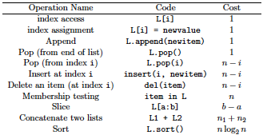
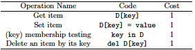
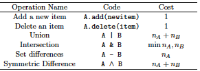

# First Course on Data Structures in Python

## Chapter 2: Basic Python

### Sequence, Selection, and Iteration

* One model for imperative programming: Sequence-Selection-Iteration
  1. **Sequence**: Performing operations one at a time in a specified order
  2. **Selection**: Using conditional statements such as `if` to select which operations to execute
  3. **Iteration**: Repeating some operation using loops or recursion

### Expressions and Evaluation

* **Expressions** get **evaluated** and produce a **value** 
* **Operator precedence** determines order of operations

### Variables, Types and State

* **State**: stored information

* Store information in **variables**

* In Python a variable is created by an **assignment** statement

  * `variable name = some_value`
  * The equal sign is doing something (assignment) rather than describing something (equality)
  * RHS of equal sign is evaluated first
    * thus `x = x+1` works
  * An assignment statement is not an expression: it does not have a value

* Every name is associated with a piece of data called an object

* The name of a variable, by itself, is treated as an expression that evaluates to whatever object it is mapped to.

* Every object has a **type**

  * types often determine what you can do with the variable

* **Atomic types**

  * integers
  * floats
  * booleans

* Can inspect the type of a variable using `type()` 

* Objects have three things:

  * **identity**
  * **type**
  * **value**
  * There's a difference between a variable and the object the variable represents

* Can use the `is` keyword to see if two objects are the same

  ```python
  x = [1, 2, 3]
  y = x
  z = [1, 2, 3]
  
  print(x is y) # True
  print(x is z) # False
  print(x == z) # True
  ```

* An object cannot change its identity

* You cannot change the type of an object

* You can reassign a variable to point to a different object

  ```python
  x = 2
  print('x =', x) # x = 2
  print('float(x) =', float(x)) # float(x) = 2.0
  print('x still has type', type(x)) # x still has type <class 'int'>
  
  print('Overwriting x.') # Overwriting x
  x = float(x)
  print('Now, x has type', type(x)) # Now, x has type <class 'float'>
  ```

* A **string** is a sequence of characters.

  * There is no character class
  * Strings are immutable

* If the value of an object can be changed, it is **mutable**

* If the value of an object cannot be changed, it is **immutable**  

### Collections

#### Strings

* **Strings** are sequences of characters
* You can **concatenate** strings to create a new string with the plus sign
* You can access individual characters using square brackets and an **index**
* The name of the class for strings is **str** 
* You can turn many objects into a string with the `str()` function

#### Lists

* **Lists** are ordered sequences of objects
  * They do not have to be the same type
* The **elements** of the list are separated by commas
* You can append an item to the end of a list `L` by `L.append(newitem)` 
* You can index into a list with square brackets
  * You can use negative indices to count backwards fro the end of the list
* You can overwrite values in a list using regular assignment statements

#### Tuples

* An immutable ordered sequence of objects 
  * Can access items
  * Cannot change what items are in a tuple
    * Same is true of strings

#### Dictionaries

* store key-value pairs
  * key provides value
* Keys can be different types but must be immutable
* Accessing a key that's not in the dictionary is a `KeyError`
* Dictionaries are unordered 
  * **nonsequential collection**

#### Sets

* An unordered collection of items without duplication
  * **nonsequential collection**
* Add an element to a set with the `add` method

### Common things to do with collections

* `len` function gets the number of elements (length) of the collection
* For sequential types (list, tuples, string) can **slice** a subsequence
  * Slices are half-open (do not include the end index)
  * Slicing a collectoin creates a new object

### Iterating Over a Collection

* `for` loop 

### Other Forms of Control Flow

* **Control flow** refers to the commands in a language that affect the order in which operations are executed.
  * `if`
    * Evaluates *predicate* and if `True` then a block of code is executed
    * An example of *selection* 
    * can also have an `else` clause
  * `while` loop
    * repeat block of code until predicate is `False` 
  * `try` block is the way to catch and recover from errors
  * functions change the control flow
    * functions can be treated like any other object (first class)

### Modules and Imports

* A single `.py` file is called a **module** 
* Import a module using the keyword `import` and use the name of the file without the `.py` extension
* The module has its own namespace
  * ``__name__`` attribute to determine how the module is being used
    * `__main__` means its being run directly
    * `__name__` has the name of the module means its being imported
* Modules are only exectued the first time they are imported
* `from module name import thethingIwanted` imports `thethingIwanted` and does not need to be preced by `modulename` and a dot
* Do not use `from modulename import *` 
* Can rename module after importing, e.g. `import numpy as np` 
  * Shorter name
  * avoid naming conflicts

## Chapter 3: Object-Oriented Programming

* A primary goal of **object-oriented programming** is to make it possible to write code that is close to the way you think about the things your code represents.
* A **class** is a data type
  * An **object** is an **instance** of a class
    * E.g. ``myList = []``, myList is an object of type list
  * Can use `isinstance` to return boolean 
  * Can use ``type`` to print type
  * *type* and *class* are (mostly) synonymous in Python
* A function defined in a class is called a **method**. 
  * Standard convention to use `self` as the first parameter to a method which is the object to be operated on by the method
    * Do not need to pass in the `self` parameter explicitly
      * E.g. `u.norm()` is translated to `vector.norm(u)` 
* ``__init__`` methd is called the **initializer** 
* methods that start and end with two underscores are **magic methods** or **dunder methods** 
  * Don't write your own dunder methods
  * Dunder methods are usually invoked via other mechanisms
    * i.e. `__init__` is called by using the class name as a function, e.g. `Vector(3,4)`
* `__add__` implements `+` operator for a class (class on LHS)
* `__str__` is called by `print` 
* Can use older formatting `"(%f, %f)" % (self.x, self.y)` 

### Encapsulation and the Public Interface of a Class

* **Encapsulation** has two related meanings
  * Combining data and methods into a single thing - a class
  * Boundary between inside and outside
* In Python, everything is public
  * Can start things that *ought* to be private with a single underscore
* The collection of public attributes (variables and methods) constitute the **public interface** of the class.
  * Used to help write working code
  * Not security

### Inheritance and "is a" relationships

* **superclass** and **subclass** 

  * Common attributes in superclass

  ```python
  class Polygon:
    def __init__(self, sides, points):
      self._sides = sides
      self._points = list(points)
        if len(self._points) != self._sides:
        raise ValueError("Wrong number of points.")
        
    def sides(self):
    	return self._sides
    
  class Triangle(Polygon):
  	def __init__(self, points):
  		Polygon.__init__(self, 3, points)
  
    def __str__(self):
  		return "I'm a triangle."
  
  class Square(Polygon):
  	def __init__(self, points):
  		Polygon.__init__(self, 4, points)
  	def __str__(self):
  		return "I'm so square."
  ```

  * In the above, `Polygon` is the superclass and `Square` and `Triangle` are the subclasses

* If a method is called and it is not defined in the class, it looks in the superclass.

* The search for the correct function to call is called the **method resolution order** (MRO)

* The initializer of the superclass is not called automatically when we create a new instance of the subclass (unless the subclass doesn't define `__init__`)

* **Inheritance means is a**

* **DRY**: Don't repeat yourself

* The process of removing duplication by putting common code into a superclass is called **factoring out a superclass** 

### Duck Typing

* Python has build in (parametric) **polymorphism**, so we can pass any type of object we want to a function.
* **Duck typing**: using objects with the appropriately defined methods
  * a concept related to dynamic **typing**, where the type or the class of an object is less important than the methods it defines.
* not every "is a" relationship needs to be expressed by inheritance
  * Example: `str` function works on any object that implements `__str__`, so `str(t)` for `Triangle t` calls `t.__str__()` which is equivalent to `Triangle.__str__(t)`

### Composition and "has a " relationships

* **Composition**: one class stores an instance of another class

* **Composition means "has a"** 

  ```python
  class MyLimitedList:
    def __init__(self):
      self._L = []
      
    def append(self, item):
      self._L.append(item)
    
    def __getitem__(self, index):
      return self._L[index[]]
  ```

## Testing

* Use tests to determine two things:
  * **Does it work?**: Does the code do what it's suppose to do?
  * **Does it still work?**: Can one be confident that the changes one makes haven't caused other parts of the code to break?

### Writing Tests

* **Test behavior, not implementation** 

* Simple Case: `assert`

  ```python
  class Doubler:
  	def __init__(self, n):
  		self._n = 2 * n
  
  def n(self):
  	return self._n
  
  if __name__ == '__main__':
  	x = Doubler(5)
  	assert(x.n() == 10)
  	y = Doubler(-4)
  	assert(y.n() == -8)
  ```

  * `assert` is better than print - don't have to rely on visual inspection
  * **BAD IDEA** Deleting tests
  * **OGAE** protocol: Oh Good, An Error!

### Unit Testing with `unittest`

* Unit tests: test a specific behavior of a specific function

* Python includes standard package `unittest`

  * Tests will extend the `unites.TestCase` class
  * Every test method must start with the word `test` 
  * Tests are run by calling `unittest.main` 

* Example:

  ```python
  import unittest
  from dayoftheweek import DayOfTheWeek
  
  class TestDayOfTheWeek(unittest.TestCase):
    def testinitwithabbreviation(self):
      d = DayOfTheWeek('F')
      self.assertEquals(d.name(), 'Friday')
      
      d = DayOfTheWeek('Th')
      self.assertEquals(d.name(), 'Thursday')
      
  unittest.main()
  ```

### Test-Driven Development

* **Test-Driven Development (TDD)** is the idea that you can write the tests before you write the code.

* Writing tests first forces two things:

  * Decide how you want to be able to use some function. What should the parameters be? What should it return?
  * Write only the code that you need. If there is code that doesn't support some desired behavior with tests, then you don't need to write it.

* The TDD mantra is **Red-Green-Refactor**. 

  * **Red**: The tests fail. They should as nothing has been written yet.
  * **Green**: You get the tests to pass by changing the code.
  * **Refactor**: You clean up the code, removing duplication. 

* **Refactoring** is the process of cleaning up code, most often referring to the process of removing duplication.

  * Example

    ```python
    avg1 = sum(L1) / len(L1)
    avg2 = sum(L2) / len(L2)
    
    # Need to handle empty list
    if len(L1) == 0:
      avg1 = 0
    else:
      avg1 = sum(L1) / len(L1)
      
    if len(L2) == 0:
      avg2 = 0
    else:
      avg2 = sum(L2) / len(L2)
     
    # Refactored code
    def avg(L):
      if len(L) == 0:
        return 0
     	else:
        return sum(L) / len(L)
      
    avg1 = avg(L1)
    avg2 = avg(L2)
    ```

### What to Test

* Ask:
  * What should happen when I run this code?
  * How do I want to use this code?
* Write tests that use the code the way it ought to be used
  * Then write tests that use the code incorrectly to test that the code fails gracefully.
    * Does it give clear error messages
* Test edge cases. 
  * Try to break code.
* Turn bugs into tests.
  * Don't want the same error to reappear.
* Test the public interface.

### Testing and Object-Oriented Design

* Public methods of a class are the **interface** to the class
* To start design, look at the problem and identify nouns (classes) and verbs (methods)
  * What should happen
    * If then language, i.e. if I call this method with these parameters, then this will happen
    * Unit test to encode this expectation
* **It is faster to go slow**
  * If debugging is slow. Stop. Pitck one piece. Test it. Repeat.

## Running Time Analysis

* Major goal of programming is to write code that is *correct, efficient and readable*. 
* We want to give a nuanced description of the efficiency of a program that adapts to different inputs and different computers.
  * Achieve this through **asymptotic analysis**

### Timing Programs

* Functions with the same behavior are said to have the same **semantics**. 

#### Testing For Duplicates

```python
# First implementation
# O(n^2)
def duplicates1(L):
	n = len(L)
	for i in range(n):
		for j in range(n):
			if i != j and L[i] == L[j]:
				return True
	return False

assert(duplicates1([1,2,6,3,4,5,6,7,8]))
assert(not duplicates1([1,2,3,4]))
```

```python
# timing function
import time

def timetrials(func, n, trials = 10):
  totaltime = 0
  for i in range(trials):
    start = time.time()
    func(list(range(n)))
    totaltime += time.time() - start
  print('average = %10.7f for n = %d' % (totaltime/trials, n))
```

```python
# Using timing function with first implementation
for n in [50, 100, 200, 400, 800, 1600, 3200]:
  timetrials(duplicates1, n)
```

* Can improve on `duplicates1` by not checking the same index twice:

```python
# Still O(n^2)
def duplicates2(L):
  n = len(L)
  for i in range(1,n):
    for j in range(i):
      if L[i] == L[j]:
        return True
  return False

# rewrite duplicates2 with any
# Still O(n^2)
def duplicates3(L):
  n = len(L)
  return any(L[i] == L[j] for i in range(1, n) for j in range(i))
```

* Try sorting and then checking adjacent indices

```python
# Sorting and then for-loop
# O(n log n)
def duplicates4(L):
  n = len(L)
  L.sort() # in-place sort
  for i in range(n-1):
    if L[i] == L[i+1]:
      return True
  return False

# Sorting and then any
def duplicates5(L):
  n = len(L)
  L.sort()
  return any(L[i] == L[i+1] for i in range(n-1)) # generator expression

# Set implementation
def duplicates6(L):
  s = set()
  for e in L:
    if e in s:
      return True
    s.add(e)
  return False

# Shorter set implementaiton
def duplicates7(L):
  return len(L) != len(set(L))

# Set implementation with any
# Doesn't have to create the whole set
# stops when first duplicate is created?
def duplicates8(L):
  s = set()
  return any(e in s or s.add(e) for e in L) # Generator expression
```

### Adding the first k numbers

```python
# First implementation
# O(n)
def sumk(k):
  total = 0
  for i in range(k+1):
    total = total + i
  return total
```

Exploit formula $\sum_{i=1}^{n} i = \frac{n(n+1)}{2}$ 

```python
# O(1) in k
# Could be worse for huge numbers as a function of the number of digits?
def sumk2(k):
  return k*(k+1)//2
```

### Modeling the Running Time of a Program

* Cannot model running time on the number of lines of code
  * Different lines can do a lot of different things!
* Want to count number of atomic operations.
  * arithmetic and boolean operations
  * variable assignment
  * branching
  * calling a function
  * returning from a function
* Do not confuse run time with running time
* Be aware of which operations create new copies (which are expensive)

#### List Operations:



#### Dictionary Operations:



#### Set Operations:

Sets are like dicts with no values, only keys. 



### Asymptotic Analysis and the Order of Growth

Want to know how the algorithm running time will scale as a function of the input. The exact time and constant of proportionality are not important. The size of the input refers to the number of bits needed to encode it. Since we ignore the constant of proportionality, we can refer to the size in other units, such as the number of words (64 bits). 

### Focus on the Worst Case

Look for upper bounds on the running time. 

### Big-O

**Definition**: Given (nondecreasing) functions $f$ and $g$, we say $f(n) = O(g(n))$ if there exists constants $c$ and $n_{0}$ such that for all $n > n_{0}$ we have $f(n) \leq c g(n)$. 

### The most important feature of big-O usage

1. The big-O *hides constant factors*. Any terms that does not depend on the size of the input is considered a constant and will be suppressed in the big-O.
2. The big-O tells us about what will eventually be true *when the input is sufficiently large*. 

In the definition, the constant $c$ is the constant that stands in for all other constant factors and allows us to suppress lower order terms. The constant $n_{0}$ is the threshold after which the inequality is true.

### Practical Use of the Big-O and Common Functions

* **Constant Functions**: $O(1)$
* **Logarithmic Functions**: $O(\log n)$
* **Linear Functions**: $O(n)$
* **n Log n**: $O(n \log n)$ 
* **Quadratic Functions**: $O(n^2)$
* **Polynomial Functions**: $O(n^k)$
* **Exponential Functions**: $O(2^n)$
* **Factorial Functions**: $O(n!)$ 

### Bases for Logarithms

* $\log_{a}(n) = O(\log_{b}(n))$ where a and b are any two constants

  * **Proof**: Let $c = 1/\log_{b}(a)$ and $n_{0} = 0$, then
    $$
    \log_{a}(n) = \frac{\log_{b}(n)}{\log_{b}(a)} \leq c \log_{b}(n) \textrm{ for all } n > n_{0}
    $$

## Chapter 6: Stacks and Queues

### Abstract Data Types

An **abstract data type** (ADT) answers two main questins:

1. What is the data to be stored or represented?
2. What can we do with the data?

The answer to these questions describe the **behavior** or **semantics** of the data structure.

* provide list of names of the methods
* the input the methods take
* the expected output of the methods

A **data structure** is an implementation of an ADT. (a.k.a. a **concrete data structure**). An ADT **does not** give hints or prescriptions on how the data structure is implemented.

* **The ADT should be independent of all concerns about its implementation.**

### The Stack ADT

* **push**: add a new item to the stack
* **pop**: remove and return the next item in the Last In First Out (LIFO) ordering
* **peek**: return the next item in the LIFO ordering
* **size**: returns the number of items in the stack
* **isempty**: return `True` if the stack has no items and return `False` otherwise

#### List implementation of stack

```python
class ListStack:
  def __init__(self):
    self._L = []
    
  def push(self, item):
    self._L.append(item)
    
  def pop(self):
    return self._L.pop()
  
  def peek(self):
    return self._L[-1]
  
  def __len__(self):
    return len(self._L)
  
  def isempty(self):
    return len(self) == 0
```

This implementation uses the **Wrapper Pattern** since it uses a list. Note it is cheap to add and remove from the end, but expensive to add and remove from the beginning of a list since all the elements in memory have to be moved.

### The Queue ADT

* **enqueue**: add a new item to the queue
* **dequeue**: remove and return the next item in the First In First Out (FIFO) ordering
* **peek**: return (without removing) the next item in the queue in FIFO order
* **__len__**: return the number of items in the queue
* **isempty**: return True if the queue has no items and return False otherwise

#### List implementation of queue

Recall we do not want to add and remove from the front of a list as this is expensive.

```python
class ListQueueFakeDelete:
  def __init__(self):
    self._L = []
    self._head = 0
    
  # Choosing to append to the end
  def enqueue(self, item):
    self._L.append(item)
    
  def peek(self):
    return self._L[self._head]
  
  def dequeue(self):
    item = self.peek()
    self._head += 1
    return item
  
  def __len__(self):
    return len(self._L) - self._head
  
  def isempty(self):
    return len(self) == 0
```

The above implementation never gets rid of old values. Idea is to resize if half the array gets empty.

```python
class ListQueue(ListQueueFakeDelete):
  def dequeue(self):
    item = self._L[self._head]
    self._head += 1
    if self._head > len(self._L) // 2:
      self._L = self._L[self._head:]
      self._head = 0
    return item
```

"on average" the cost per item is constant since the resizing operations happens infrequently enough.

#### Dealing with errors

```python
from ds2.stack import ListStack

class AnotherStack(ListStack):
  def pop(self):
    try:
      return self._L.pop()
    except IndexError:
      raise RuntimeError("pop from empty stack")
```

## Chapter 7: Deques and Linked Lists

A **deque** (pronounced "deck") is a doubly-ended queue. Acts as both a stack and a queue.

### The Deque ADT

* **addfirst(item)**: add `item` to the front of the deque
* **addlast(item)**: add `item` to the end of the deque
* **removefirst(item)**: remove and return the first item in the deque
* **removelast(item)**: remove and return the last item in the deque
* **len**: return the number of items in the deque

#### List Deque

```python
class ListDeque:
  def __init__(self):
    self._L = []
    
  def addfirst(self, item):
    self._L.insert(0, item)
    
  def addlast(self, item):
    self._L.append(item)
    
  def removefirst(self):
    return self._L.pop(0)
  
  def removelast(self):
    return self._L.pop()
  
  def __len__(self):
    return len(self._L)
```

In this implementation `addfirst` and `removefirst` are $O(n)$ operations.

### Linked Lists

The idea is to store individual items in objects called **nodes**. 

Look at nouns to define types and verbs to define methods:

```python
class ListNode:
  def __init__(self, data, link = None):
    self.data = data
    self.link = link
```

Idea: want to abstract the nodes (i.e. the user doesn't know they exist)

```python
class LinkedList:
  def __init__(self):
    self._head = None
    
  def addfirst(self, item):
    self._head = ListNode(item, self._head)
    
  def removefirst(self):
    item = self._head.data
    self._head = self._head.link
    return item
```

### Implementing a Queue with a LinkedList

```python
class LinkedList:
  def __init__(self):
    self._head = None
    self._tail = None # keep track of tail so we can add directly to the end
    self._length = 0
  
  def addfirst(self, item):
    self._head = ListNode(item, self._head)
    if self._tail is None: self._tail = self._head
    self._length += 1
      
  def addlast(self, item):
    if self._head is None:
      self.addfirst(item)
    else:
      self._tail.link = ListNode(item)
      self._tail = self._tail.link
      self._length += 1
      
  def removefirst(self):
    item = self._head.data
    self._head = self._head.link
    if self._head is None: self._tail = None
    self._length -= 1
    return item
  
  def removelast(self):
    if self._head is self._tail:
      return self.removefirst()
    else:
      currentnode = self._head
      while currentnode.link is not self._tail:
        currentnode = currentnode.link
      item = self._tail.data
      self._tail = currentnode
      self._tail.link = None
      self._length -= 1
      return item
    
  def __len__(self):
    return self._length
    
# Implement queue with the above linked list
class LinkedQueue:
  def __init__(self):
    self._L = LinkedList()
    
  def enqueue(self, item):
    self._L.addlast(item)
    
  def dequeue(self):
    return self._L.removefirst()
  
  def peek(self):
    item = self._L.removefirst()
    self._L.addfirst(item)
    return item
  
  def __len__(self): # delegate length to linked list
    return len(self._L)
  
  def isempty(self):
    return len(self) == 0
```

Above implementation still requires traversal to remove the last element (this will require doubly linked list).

### The Main Lessons

* Use the public interface as described in an ADT to test your class
* You can use inheritance to share functionality between classes
* Inheritance means **"is a"** 

### Design Patterns: The Wrapper Pattern

* **Composition**: the class stored an object of another class, and then **delegate** most of the operations to the other class. 
  * This is an example of a **Wrapper Pattern**
  * Adds a **layer of abstraction**
* **Design Patterns** are a way of organizing classes to solve common programming problems.
* Take-aways:
  * Use design patterns where appropriate to organize your code and improve readability
  * The Wrapper Pattern gives a way to provide an alternative interface to (a subset of) the methods in another class
  * Composition means **"has a"** 

## Chapter 8: Doubly-Linked Lists

* Idea: store links in each node pointing forward and backwards to enable traversing the list in both directions.
* Invariant: `b == a.link` iff `a == b.prev` for any two nodes `a` and `b` 
  * To help ensure this invariant, we set `self.prev.link = self` and `self.link.prev = self` unless `prev` or `link` are `None`

```python
class ListNode:
  def __init__(self, data, prev = None, link = None):
    self.data = data
    self.prev = prev
    self.link = link
    if prev is not None:
      self.prev.link = self
    if link is not None:
      self.link.prev = self
```

Consider more general problem of adding a node between two other nodes for more refactoring:

```python
class DoublyLinkedList:
  def __init__(self):
    self._head = None
    self._tail = None
    self._length = 0
    
  def __len__(self):
    return self._length
  
  def _addbetween(self, item, before, after):
    node = ListNode(item, before, after)
    if after is self._head:
      self._head = node
    if before is self._tail:
      self._tail = node
    self._length += 1
    
  def addfirst(self, item):
    self._addbetween(item, None, self._head)
    
  def addlast(self, item):
    self._addbetween(item, self._tail, None)
    
  def _remove(self, node):
    before, after = node.prev, node.link
    if node is self._head:
      self_head = after
    else:
      before.link = after
    if node is self._tail:
      self._tail = before
    else:
      after.prev = before
    self._length -= 1
    return node.data
  
  def removefirst(self):
    return self._remove(self._head)
  
  def removelast(self):
    return self._remove(self._tail)
```

### Concatenating Doubly Linked Lists

For lists, concatenating two lists takes time proportional to the length of the newly created list and doesn't modify the original two lists. If you're allowed to modify the list, then concatenation can be achieved by pointing the tail of the first list to the head of the second list:

```python
def __iadd__(self, other):
  if other._head is not None:
    if self._head is None:
      self._head = other._head
    else:
      self._tail.link = other._head
      other._head.prev = self._tail
    self._tail = other._tail
    self._length = self._length + other._length
    
  	# Clean up the other list
  	other.__init__()
  return self
```

With concatenation of doubly linked list, the second list is emptied. It does this so that we don't have multiple doubly-linked lists with the same `ListNode`s. This would be a problem if we tried to edit just one of the lists, because the change would be reflected in the other list as well.

## Chapter 9: Recursion

* At its simplest, one can think of **recursion** as: *when a function calls itself*.
  * Think of self-calls as black boxes.

### Recursion and Induction

There is a strong connection between induction and recursion. 

Example: sum of first k natural numbers is $\frac{k(k+1)}{2}$:

​	Base Case: $f(0) = 0 = \frac{0*(0+1)}{2}$

​	Induction Step: Assume it holds for k-1
$$
f(k) = f(k-1) + k = \frac{(k-1)(k-1+1)}{2} + k = \frac{(k-1)k + 2k}{2} = \frac{k(k+1)}{2}
$$


### Some Basics

1. Have a base case. 
2. Recursive calls should move towards the base case.

### The Function Call Stack

Interesting example:

```python
A = [2]
B = [2]
A.append(A)
B.append(B)
A == B
```

This leads to a `RecursionError`. Second element of A points back to itself and the same with B. 

### The Fibonacci Sequence

```python
# Slow recursive version
def fib(k):
  if k in [0, 1] return k
	return fib(k-1) + fib(k-2)

# Loop version
def fibloop(k):
  a, b = 0, 1
  for i in range(k):
    a, b, = b, a + b
  return a
```

### Euclid's Algorithm

```python
def gcd(a, b):
  if a == b:
    return a
  if a > b:
    a, b = b, a
  return gcd(a, b - a)
```

**Deep idea**: division is iterated subtraction, multiplication is iterated addition, exponentiation is iterated multiplication, logarithms are iterated divisions.

```python
def gcd2(a, b):
  if a > b:
    a, b = b, a
  if a == 0:
    return b
  return gcd(a, b % a)
```

## Chapter 10: Dynamic Programming

**Dynamic programming** refers to an approach to writing algorithms in which a problem is solved using solutions to the same problem on smaller instances. 

* Common to arrive at a dynamic programming algorithm by starting with a recursive algorithm that is inefficient because it makes repeated recursive calls to a function with the exact same parameters, wasting time. 

Example: Making change. Provided a list of coin amounts, provide change using the fewest coins.

### A Greedy Algorithm

```python
def greedyMC(coinvalueList, change):
  coinvalueList.sort()
  coinvalueList.reverse()
  numcoins = 0
  for c in coinvalueList:
    # Add in as many cons as possible from the next largest value
    numcoins += change // c
    # update the amount of change left to return
    change = change % c
  return numcoins
```

The greedy algorithm does not work!

### A Recursive Algorithm

